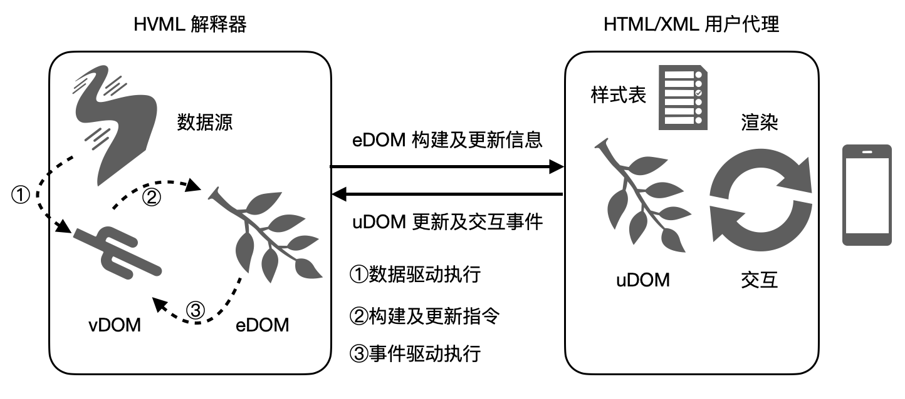
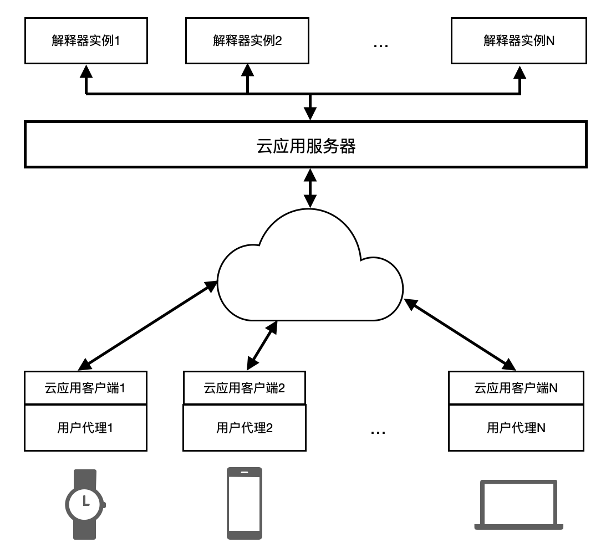

# 基于 HVML 的远程应用：一种支持远程应用的方法及装置

版权所有 &copy; 2020, 2021 北京飞漫软件技术有限公司  
保留所有权利

此文档不受 HVML 相关软件开源许可证的管辖。

飞漫软件公开此文档的目标，用于向开发者解释 HVML 相关设计原理或者相关规范。在未获得飞漫软件书面许可之前，任何人不得复制或者分发本文档的全部或部分内容，或利用本文档描绘的技术思路申请专利、撰写学术论文等。

本文提及的飞漫软件或其合作伙伴的注册商标或商标之详细列表，请查阅文档末尾。

- [0) 基本信息](#0-基本信息)
- [1) 背景技术](#1-背景技术)
- [2) 现有技术的缺陷和不足](#2-现有技术的缺陷和不足)
- [3) 技术方案描述](#3-技术方案描述)
   + [3.1) 云应用示例](#31-云应用示例)
   + [3.2) 整体结构](#32-整体结构)
   + [3.3) 隐藏的句柄属性](#33-隐藏的句柄属性)
   + [3.4) 从 eDOM 到 uDOM](#34-从-edom-到-udom)
   + [3.5) 处理 uDOM 事件](#35-处理-udom-事件)
   + [3.6) 会话管理](#36-会话管理)
   + [3.7) 云应用通讯协议](#37-云应用通讯协议)
   + [3.8) 用户代理](#38-用户代理)
- [4) 本发明创造的优点](#4-本发明创造的优点)
- [5) 替代方案](#5-替代方案)
- [6) 本发明的关键点和欲保护点](#6-本发明的关键点和欲保护点)
- [7) 附图及简要说明](#7-附图及简要说明)
   + [7.1) 附图1 解释器和用户代理的关系](#71-附图1-解释器和用户代理的关系)
   + [7.2) 附图2 云应用服务器和客户端的关系](#72-附图2-云应用服务器和客户端的关系)
- [8) 有关专利查重结果的补充说明](#8-有关专利查重结果的补充说明)
- [附：商标声明](#附商标声明)

## 0) 基本信息

- 发明创造名称  
  一种支持远程应用的方法及装置
- 权利人  
  北京飞漫软件技术有限公司
- 发明人  
  魏永明、耿岳、薛淑明
- 撰写人  
  魏永明

## 1) 背景技术

云应用的概念目前尚处于混乱状态，大部分文献中所指云应用是指云服务厂商提供的 SaaS 服务。本发明所指云应用（Cloud App），是指在控制应用逻辑的程序在云端运行，但用户通过终端设备（如智能手表、智能音箱等）和该应用交互的一种应用程序形式。这一概念和目前云服务厂商正在推广的云游戏类似。顾名思义，云游戏运行在云端，游戏玩家通过电脑、手机等连入云端服务器，使用电脑上的键盘、鼠标或者手机上的触摸屏和云端的服务器程序交互，云端服务器则将渲染好的场景（包括图像、声音等）传到电脑或者手机展示出来。

云游戏带来的好处是明显的。第一，游戏的渲染效果，尤其是复杂三维场景的渲染效果不再受制于玩家使用的电脑或者手机的硬件配置，因为所有的场景渲染均在云端完成；第二，玩家不需要下载安装体量巨大的游戏 App；第三，游戏开发者开发成本将大幅降低，不再需要针对不同的操作系统平台开发不同的版本，而只需要开发一个云端的版本即可；第四，对于云服务厂商来讲，有助于开拓新的收入来源。和云游戏类似，普通的应用也可以使用这种形式运行，从而获得和云游戏一样的好处。

另外，和本发明所指云应用类似的应用场景早在多年前就已存在。比如基于 Windows 或者 Unix 系统的远程桌面构造的瘦客户机。这类系统往往用于特定的办公场所，比如银行、学校等。用户通过一台瘦客户机连接到远程服务器上，用户通过瘦客户机运行的所有应用，比如桌面、办公软件等，均在服务器上运行，瘦客户机将用户的鼠标、键盘输入通过网络发送到服务器，而服务器将这些应用绘制的内容通过网络发送到瘦客户机，瘦客户机中运行的软件负责将绘制的内容展示在屏幕上。

目前云游戏的实现原理是将渲染好的游戏画面转换为视频流，加上声音等多媒体数据，以 H.264 等码流的形式发送到最终的设备上展示，由于 H.264 使用的有损压缩算法，故而会带来一定的图像清晰度损失。远程桌面的实现原理类似，但由于通常运行在局域网中，带宽并不是问题，所以传输的并不是压缩的多媒体流，而是更新的局部位图信息，但会使用无损压缩技术，如 GIF、PNG 图片格式或者自定义的位图格式。

本发明提出了一种全新的用于支持云应用的方法及装置，这一方法使用了改进的 Web 技术，相关的技术标准或规范罗列如下：

- HTML 及其规范。HTML 和 CSS 等规范和标准是由 W3C <https://www.w3.org> 组织制定的，用来规范 Web 页面内容的编写和渲染行为。关键规范如下：
   * HTML：超文本标记语言（HyperText Markup Language），用于表述网页内容结构的标准。最新的发布标准是 HTML 5.3：<https://www.w3.org/TR/html53/index.html>；
   * CSS：级联样式表（Cascading Style Sheets），用于定义 HTML 页面元素布局、渲染效果等的规范。在 CSS 2.2 <https://www.w3.org/TR/CSS22/> 之后，CSS 规范开始按照模块划分，各模块分头演进，目前普遍支持到 Level 3。在如下网页中可以看到 CSS 各模块的规范进展情况：<https://drafts.csswg.org>；
   * JavaScript/ECMAScript：一种符合 ECMAScript 规范的脚本编程语言，最初由网景公司设计给浏览器使用，用于操控 HTML 页面中的内容和渲染行为，现在由欧洲计算机制造商协会和国际标准化组织负责制定相关标准，最新的标准为 ECMA-262：<http://www.ecma-international.org/publications/standards/Ecma-262.htm>。
   * DOM：文档对象模型（Document Object Model），用于 XML/HTML 文档结构的内部表达。一个 XML/HTML 文档，会被 XML/HTML 解析器解析并生成一个 DOM 树，XML/HTML 文档中的每个元素构成 DOM 树上的元素结点，而每个元素的子元素、属性、文本内容等，又构成了这个元素节点的子节点。有关 DOM 的最新的规范可见：<https://dom.spec.whatwg.org/>。
   * JSON：JavaScript 对象表述法（JavaScript Object Notation）是一种轻量级的信息互换格式。最初被用于 JavaScript 对象的字符串表达，易于被 JavaScript 脚本代码使用，现在被广泛使用在不同编程语言之间的数据交换。有关 JSON 的描述，可见：<https://json.org/>。
- 用户代理（User Agent）是 HTML 规范的一个术语，用来指代可以解析 HTML、CSS 等 W3C 规范，并对 HTML 文档内容进行渲染，进而呈现给用户并实现用户交互的计算机程序。我们熟知的浏览器就是用户代理。但用户代理不限于浏览器，可以是一个软件组件，也可以是一个应用框架。比如，内嵌到电子邮件客户端程序中，用以解析和渲染 HTML 格式邮件的软件组件，本质上也是 HTML 用户代理。
- XML：可扩展标记语言（The Extensible Markup Language）是由 W3C 组织制定的，用来表述结构化信息的一种简单文本格式。和 HTML 相比，XML 使用类似的结构，但更加严格且更为通用。XML 是当今共享结构化信息的最广泛使用的格式之一，不论是在程序之间，人与人之间，计算机与人之间，也不论是在本地还是跨网络共享信息。有关 XML 的介绍和规范可参阅：<https://www.w3.org/standards/xml/>。
- 脚本语言。指类似 JavaScript 的高级计算机编程语言，通常解释执行，具有动态特征。除 JavaScript 之外，常见的脚本语言有 Python、Lua 等。

另外，本发明提出的支撑云应用运行的方法，采纳了近几年发展出来的虚拟 DOM 的思想。

从 2019 年开始，基于虚拟 DOM 技术的框架又受到前端开发者的青睐，比如著名的 React.js（<https://reactjs.org/>）、Vue.js（<https://cn.vuejs.org>）等。值得注意的是，微信小程序、快应用等，也不约而同使用了这种虚拟 DOM 技术来构建应用框架。

所谓“虚拟 DOM” 是指前端应用程序通过 JavaScript 来创建和维护一个虚拟的文档对象树，应用脚本并不直接操作真实的 DOM 树。在虚拟 DOM 树中，通过一些特别的属性实现了基于数据的一些流程控制，如条件、循环等。虚拟 DOM 技术提供如下一些好处：

1. 由于脚本并不使用脚本程序直接操作真实的 DOM 树，故而一方面通过现有的框架简化了前端开发的复杂性，另一方面通过优化对真实 DOM 数的操作而减少了由于动态修改页面内容而对 DOM 树的频繁操作，从而提高页面的渲染效率和用户体验。
1. 通过虚拟 DOM 技术，程序对某个数据的修改，可以直接反应到该数据绑定的页面内容上，开发者无需主动或直接地调用相关接口来操作 DOM 树。这种技术提供了所谓的“响应式”编程，极大降低了开发者的工作量。

为支撑本发明提出的方法，权利人提出了一种全新的数据驱动的编程语言，我们称为 HVML（Hybrid Virtual Markup Language）。HVML 采用类似 XML/HTML 的语法描述虚拟 DOM，可用于生成实际的 XML/HTML 文档内容，并处理页面产生的各种交互事件以及动态数据生成事件。具体的规范可见：

<https://github.com/HVML/hvml-docs/blob/master/zh/hvml-overview-zh.md>

## 2) 现有技术的缺陷和不足

### 2.1) 云游戏方案

目前的云游戏实现原理是将渲染好的游戏画面转换为视频流，加上声音等多媒体数据，以 H.264 等码流的形式发送到最终的设备上展示。当我们使用云游戏方案来支撑云应用的运行室，存在如下弊端：

- 由于多媒体码流通常采用有损压缩算法来压缩变化的画面。这对场景变化频繁的游戏画面来讲并不成为问题，但对于画面不频繁变化的普通图形用户界面应用来讲，则会在文字边缘等色彩变化剧烈的部位出现明显的马赛克效应，从而影响用户的体验。
- 尽管我们可以使用 H.264 等高压缩比、低码流的视频流压缩算法，但多媒体流仍然要占据较高的带宽，这对使用 NBIoT 等窄带传输通讯的物联网设备来讲无法接受。
- 设备端需要一个多媒体流，尤其是视频流的解码器，这通常意味着更高的成本以及更高的耗电，不适合智能手表等低功耗物联网产品。

### 2.2) 远程桌面方案

远程桌面方案主要用于高带宽的局域网环境，当我们在物联网场景中运行云应用时，存在带宽不足的问题。

当我们在互联网上使用远程桌面的技术方案来支撑云应用时，为降低带宽的使用，也可使用如云游戏一样的多媒体流形式来传输图形界面的画面，这时，其缺点或不足同云游戏方案。

### 2.3）基于 Web 技术

由于 Web 浏览器中显示的所有内容通常都来自运行在云端的 HTTP、WebSocket 等服务器，故而我们也可以将 Web 页面看作是一种云应用。比如谷歌 ChromeOS 使用的就是这种技术：所有的 Chrome App 本质上就是网页。

在过去的数十年间，浏览器的 JavaScript 脚本解释器有了重大的改进，其性能得到了数百倍的改善。然而，随之而来的问题则是浏览器本身占用的系统内存和体积也有了相应的增加。比如 Chrome 浏览器所使用的 V8 JavaScript 引擎，体积高达 30MB，运行时的内存占用则至少要占用 512MB（一个页面）。

因此，在设备侧运行 JavaScript 脚本，一方面需要较好的硬件配置和系统内存，才能获得较好的性能，另一方面，并不符合严格的云应用定义：即将所有的程序逻辑运行在云端。

## 3) 技术方案描述

### 3.1) 云应用示例

为了更好地理解本发明提出的方法和实现装置，我们首先看一个简单的示例。

我们假设一个智能手环上显示当前时间、当地气温、佩戴者的心跳信息和步数信息等信息，而这个智能手环通过 MQTT（一种轻量级消息通讯协议）和云端服务器交换信息，比如向云端服务器发送佩戴者的心跳和步数信息、地理位置信息，获得时间以及当前位置的气象条件等信息。在传统的实现方式中，我们一般需要开发一个在智能手环上运行的 GUI 系统，然后和云端通讯获得数据，界面的修改完全由设备端代码负责。如果要改变界面的样式，大部分情况下需要升级整个智能手环的固件（firmware）。

但如果我们使用 HVML，则可以通过云端来控制设备的界面显示。我们使用权利人提出的 HVML 编程语言来开发这个应用，则运行在云端的 HVML 代码如下所示：

```html
<!DOCTYPE hvml>
<hvml target="html" script="python">
    <head>
        <listen on="mqtt://foo.bar/bracelet" as="braceletInfo">

        <init as="_TIMERS" uniquely on="id">
            [
                { "id" : "clock", "interval" : 1000, "active" : "yes" },
            ]
        </init>

        <link rel="stylesheet" type="text/css" href="/foo/bar/bracelet.css">
    </head>

    <body>
        <div class="clock" id="clock">
            <observe on="$_TIMERS" for="clock">
                <update on="#clock" textContent="$_SYSTEM.time('%H:%m')" />
            </observe>
        </div>

        <div class="temperature" id="temperature">
            <observe on="$braceletInfo" for="temperature">
                <update on="#temperature" textContent="$?.value ℃" />
            </observe>
        </div>

        <div class="heartbeat" id="heartbeat">
            <observe on="$braceletInfo" for="heartbeat">
                <update on="#heartbeat" textContent="$?.value BPM" />
            </observe>
        </div>

        <div class="steps" id="steps">
            <observe on="$braceletInfo" for="steps">
                <update on="#steps" textContent="$?.value" />
            </observe>
        </div>

        <observe on="$braceletInfo">
            <choose on="$?" to="noop" by="CLASS: CDumpEvent" />
        </observe>
    </body>
</hvml>
```

其要点如下：

1. 该代码运行在云端，云端的 HVML 解释器执行该代码生成 HTML 文档，并在数据和用户交互的驱动下，更新 HTML 文档内容。
1. 该代码生成的 HTML 文档或者对 HTML 文档的改变，将通过类似 WebSocket 的长连接发送给设备，设备根据此信息渲染用户界面或者更新用户界面。
1. 该代码监听智能手环（设备）通过 MQTT 发送给云端的数据，包括心跳、气温、步数等信息，并更新相应的标签内容。
1. 该代码设定了一个定时器，每隔 1 秒运行一次，并更新时钟对应的标签内容。
1. 该代码使用了一个外部选择执行器 `CDumpEvent` 将所有来自 `mqtt` 的事件转储到了云端数据库中。

这带来了如下显著的改变：

1. 复杂的逻辑代码将全部运行在云端，设备端只要有一个足够功能的 HTML/XML 用户代理即可，通常只需要包含一个根据 DOM 树和 CSS 渲染最终用户界面的渲染器。
1. 当我们需要调整设备端的显示效果或者功能时，我们只需要修改服务器端的 HVML 代码，而不需要更新设备端固件。
1. 我们还可以通过外部脚本，将运行在云端的其他功能，如数据库存储、数据的分析以及人工智能等要素有机整合在一起。

### 3.2) 整体结构

为了实现前述的云应用执行逻辑，我们将整个软件系统划分为两个主要的构成部分，分别运行在云端和设备端：

- HVML 解释器。HVML 解释器的实现，在权利人提交的另外一个发明申请《一种数据驱动的动态标记语言的解释器实现》中阐述。
- 简化的 HTML/XML 用户代理。该用户代理仅根据 HVML 解释器提供给它的最终 HTML/XML 文档和配套的 CSS 样式信息渲染 DOM 树并展示在屏幕上，而不会执行任何 JavaScript 脚本程序。这样，该 HTML/XML 用户代理相比全功能的浏览器来讲，是一个简化的用户代理，跟早期的字符终端一样，属于哑设备（dumb device）。由于不再在设备端运行 JavaScript 脚本，因此安全性也将大为提高。

附图1 给出了 HVML 解释器和设备端用户代理之间的关系。为方便描述，以下分别简称“解释器”和“用户代理”。



云端解释器和设备端的用户代理之间的互操作过程大致可以描述为如下一个过程：

- 由于解释器和用户代理运行在不同的计算机设备上，因此通过一个基于网络套接字的通讯机制建立联系，比如 WebSocket，或者 MQTT、XMPP 等消息通讯协议。我们将这类通讯协议统称为`桥梁`。
- 解释器解析 HVML 定义的动作标签，根据动作标签规定的动作生成最终的 XML/HTML 文档（或片段），并通过桥梁将文档或者 DOM 树及其变化传递给用户代理。
- 解释器负责监听在 HVML 头部中定义的数据源，并执行 `observe` 标签定义的操作。
- 用户代理将用户在真实文档上产生的交互事件（比如按钮的单击事件）以及用户操作导致文档节点发生的变化（如输入框的内容变化、列表框的选择变化等），通过桥梁发送给在云端运行的解释器。
- 解释器监听来自用户代理的交互事件或者文档节点的变化通知，并执行 `observe` 标签定义的操作。
- 当 HVML 的操作修改了真实文档的某个节点时，解释器通过桥梁将该修改发送给用户代理，用户代理根据文档的改变信息重新渲染更新后的文档。

在上述过程中，关键点在于解释器和用户代理各自维护一个最终文档对应的 DOM 树，并通过桥梁同步两个 DOM 树之间的差异。

1. 解释器维护 HVML 对应的虚拟 DOM 树，其中包括模板标签、动作标签等定义的元素以及数据。为方便描述，我们将虚拟 DOM 称为 vDOM（virtual DOM）。
1. 解释器同时维护一个由其本身动态生成和修改的有效 DOM 树，其中不包含任何 HVML 标签定义的元素。为方便描述，我们将有效 DOM 称为 eDOM（effective DOM）。
1. 用户代理根据解释器动态生成或修改的文档信息维护一个最终的 DOM 树，用于渲染用户界面，并根据和用户的交互情况修改这个 DOM 树。为方便描述，我们将最终 DOM 称为 uDOM（ultimate DOM）。
1. 解释器和用户代理通过桥梁通讯保持 eDOM 和 uDOM 的一致性。

### 3.3) 隐藏的句柄属性

在 HVML 中，eDOM 树中的每个元素节点都会有一个隐藏的 `handle` 属性。这个属性相当于每个节点的标识符，用于唯一确定某个特定的元素节点，可以理解为句柄。用户代理需要在 uDOM 树中记录这个值，并在和解释器交换数据时提供这个属性值。这里，我们并不使用在 HTML 中常用的 `id` 属性，因为该属性值并不能保证唯一，且某些节点不存在这个属性值。

如下情形下，我们使用 `handle` 属性值：

- 当解释器改变某个元素时，比如删除、修改属性值或内容等。
- 当用户代理通知解释器某个元素上发生特定事件时，如用户点击按钮、输入框的内容变化、选择框的选中值发生变化、提交表单等。

解释器可使用下面的某个规则确定每个节点的 `handle` 属性值（或节点句柄）：

1. 用于存储节点数据的内存地址，用十六进制字符串表达。在 C/C++ 语言中，相当于用来存储节点信息的数据结构之指针值。这样，我们利用这个值可以在解释器中快速定位节点对象。
1. 使用某种唯一性标识符，比如 UUID，为每一个新创建的节点赋予一个唯一的 UUID。

使用上述规则，只有新建一个节点时，才会产生新的 `handle` 值。注意，使用第一种方法时，由于内存通常使用堆（heap）来管理小单元内存，因此，删除一个节点然后再新建一个节点时，可能使用相同的 `handle` 属性值，但此时旧的节点已经被删除，因此在解释器这侧不会导致问题。但是，用户代理需要正确处理这种情形。

### 3.4) 从 eDOM 到 uDOM

当解释器第一次生成 eDOM 树之后，可以选择将 eDOM 转储（dump）为目标标记语言描述的源文档发送给用户代理，也可以选择把 eDOM 树通过桥梁整个传输给用户代理。而之后，解释器和用户代理之间仅就 DOM 树的改变进行通讯。

如果选择传输 eDOM 树而不是原始的 HTML/XML 源文档，可省去用户代理侧的文档解析工作，从而可以大大降低用户代理的工作量。这尤其适合用户代理运行在较低硬件配置（如物联网设备）的情形。另外，通过传输 eDOM 树的改变而不是完整的 eDOM 树，可节约桥梁上的传输负载，从而加快用户代理的响应时间。因此，本发明将重点描述通过桥梁传输 eDOM 树或者改变 eDOM 树的传输协议。

本质上，创建 DOM 树的过程就是从根节点开始创建一个个子节点的过程，而创建某个子节点的过程本身就是对 DOM 树的改变行为。因此，创建一个新的 DOM 树，归根结底就是在一个空的 DOM 树上做若干改变的过程。因此，从 eDOM 到 uDOM，我们如下设计传输协议：

1. 始终使用 JSON 格式来表示一个对 DOM 树的改变操作。
1. 始终使用由解释器生成的节点句柄来指代某个特定的节点。
1. 始终使用 `root` 来指代根节点的句柄。

比如，针对如下 HVML 文档：

```html
<!DOCTYPE hvml>
<hvml target="html" script="python">
    <head>
        <title>Hello, world!</title>
    </head>

    <body>
        <archetype id="footer-zh">
            <h1>世界，您好！</h1>
        </archetype>

        <archetype id="footer-en">
            <h2>Hello, world!</h2>
        </archetype>

        <div>
            <test on="$_REQUEST.locale">
                <match for="~zh*" to="displace" with="#hello-cn" exclusively>
                </match>
                <match for="*" to="displace" with="#hello-en">
                </match>

                <except on="KeyError">
                    No valid locale defined.
                </except>
            </test>
        </div>

    </body>
</hvml>
```

当装载这个文档时传入的请求参数 `locale` 为 `zh_CN` 时，对应的 HTML 文档快照为：

```html
<!DOCTYPE html>
<html>
    <head>
        <title>Hello, world!</title>
    </head>

    <body>
        <div>
            <h1>世界，您好！</h1>
        </div>
    </body>
</html>
```

解释器向用户代理发送如下的数据：

```javascript
{
    "session": 0,
    "sequence", 1,
    "handle": "root",
    "operation": "append",
    "payload" : [
        {
            "handle": "40890000",
            "tag": "head",
            "children": [
                {
                    "handle": "40890100",
                    "tag": "title",
                    "children": [
                        {
                            "handle": "40890200",
                            "tag": "txt",
                            "content": "Hello, world!"
                        }
                    ]
                }
            ]
        },
        {
            "handle": "40890300",
            "tag": "body",
            "children": [
                {
                    "handle": "40890400",
                    "tag": "div",
                    "children": [
                        {
                            "handle": "40890500",
                            "tag": "p",
                            "children": [
                                {
                                    "handle": "40890600",
                                    "tag": "txt",
                                    "content": "世界，您好！"
                                }
                            ]
                        }
                    ]
                }
            ]
        }
    ]
}
```

上述 JSON 对象由如下键值对组成：

- `session`：用于表示会话标识符，零或正整数。用来表示操作 eDOM/uDOM 所属的会话。会话可用来管理在用户代理侧展示的多个页面，亦可用来在解释器侧识别不同的页面。
- `sequence`：依次增加的序列号，正整数。
- `handle`： 用于指定要操作的目标节点；这里取 `root` 表示在根节点上执行操作。
- `operation`： 指定操作类型，字符串；这里取 `append` 表示在根节点上追加 `payload` 指定的节点。可取的操作类型有：
   - `append`：在指定节点内追加（append）一个子节点。
   - `prepend`：在指定节点内前置（prepend）一个子节点。
   - `insertBefore`：在指定节点之前插入一个节点。
   - `insertAfter`：在指定节点之后插入一个节点。
   - `displace`：置换指定节点的内容。
   - `update`：更改指定节点的属性或内容。
   - `remove`：删除指定节点，包括子节点。
   - `empty`：清空指定节点的内容，将删除所有子节点。当我们需要重置当前会话页面时，可在 `root` 节点上执行 `empty` 操作。
- `payload`：指定操作的附加信息；上例中包括了要在根节点上创建的多个子元素，通常是一个字典数组。注意，上例中用于表述新创建子元素的 JSON 数据，和 HVML 规范文档中用来描述 HTML 片段的 JSON 表达一致。

需要注意的是，每个新创建的子节点均有一个全局唯一的句柄，通过 `handle` 指定。

之后，当我们需要在 `div` 标签中再增加一个 `p` 元素时，我们可以发送如下的数据给用户代理：

```javascript
{
    "session": 0,
    "sequence", 2,
    "handle": "40890400",
    "operation": "append",
    "payload" : [
        {
            "handle": "40890700",
            "tag": "p",
            "children": [
                {
                    "handle": "40890800",
                    "tag": "txt",
                    "content": "HVML，您好！"
                }
            ]
        }
    ]
}
```

再比如，当我们需要修改第一个 `p` 元素的 `class` 属性和文本内容时，我们可以发送如下的数据给用户代理：

```javascript
{
    "session": 0,
    "sequence", 3,
    "handle": "40890500",
    "operation": "update",
    "payload" : [
        {
            "handle": "40890500",
            "attr.class": "text-info",
        },
        {
            "handle": "40890600",
            "content": "Hello, world!",
        }
    ]
}
```

注意，本节给出的基于 JSON 格式的 eDOM 变化表达方式，仅仅是一种可选途径，在实际的解释器和用户代理实现中，我们还可以使用不同于 JSON 的二进制表达来降低用户代理因解析 JSON 格式数据带来的负担，另外在某种程度上还可以降低数据跨网络的传输量。

### 3.5) 处理 uDOM 事件

uDOM 事件是由用户代理和用户交互产生的通知，用于通知解释器执行可能的后续动作，比如当用户点击了页面上的一个按钮时，用户代理将发送一个事件到解释器。若解释器使用 `observe` 标签监听该按钮上的事件，则会触发后续的操作。

用户代理产生的事件可被打包成如下的 JSON 格式数据从用户代理发送到解释器。比如常见的按钮点击事件可以表述为：

```javascript
    {
        "session": 0,
        "sequence": 0,
        "handle": "40890F00",
        "event": "click",
        "payload": ...
    }
```

其中，

- `session`：会话标识符。
- `sequence`: 当前会话中从用户代理发送到解释器的数据包序列号；从 0 依次增加。
- `handle`：发生事件的节点句柄。
- `event`：事件名称，字符串。
- `payload`：事件数据。具体内容因事件而异。

再比如，当用户在一个输入框中输入内容时，将在该输入框上产生一个 `change` 事件，可用 JSON 表达为：

```javascript
    {
        "session": 0,
        "sequence": 10,
        "handle": "40890F00",
        "event": "change",
        "payload": {
            "content": "HVML is great!"
        }
    }
```

在上面的事件数据中，使用了 `payload` 指定了当前输入框中的内容。需要注意的是，输入框事件的实现方式有两种。一种是如上所示，每次发送用户编辑后的完整内容；一种是发送修改信息，比如在某个位置增加一个字符，在某个位置删除一个或者多个字符等。前者比较简单，但不利于监控用户的每个编辑动作，后者比较复杂，但有利于监控用户的每个编辑动作，且在用户编辑大段文本时可以传递更少的数据量。在实际应用中，应优先使用第二种方案。

若采用第二种方案，输入框的改变事件可打包成如下的 JSON 数据包：

```javascript
    {
        "session": 0,
        "sequence": 10,
        "handle": "40890F00",
        "event": "insert",
        "payload": {
            "paragraph": 0,
            "position": 0,
            "content": "HVML"
        }
    }
```

在上面事件数据中，我们使用 `insert` 作为事件名称，用来表示在指定输入框上的插入操作。在 `payload` 键值中，我们使用了 `paragraph` 表示被编辑的段落索引值，使用了 `position` 表示插入位置，`content` 表示插入的内容。

需要注意的是，当解释器和用户代理之间的通讯桥梁建立在低带宽情形下，并不能保证用户的所有编辑操作都可以精确发送，此种情况下，用户代理可能会在一个数据包中打包多个同样的编辑操作。比如，上面的编辑操作应该是用户分别键入了 H、V、M、L 四个字符，但被打包到了一个事件中发送。

类似地，我们可以将所有可能的用户交互事件通过上面的方式发送到解释器一侧，以便解释器可以根据 vDOM 中的 `observe` 元素执行后续的操作。

出于性能和节省网络带宽的考虑，我们不能将所有用户交互事件发送给解释器，比如用户移动鼠标光标移动到某个按钮上时，鼠标形状会发生变化。这种不导致后续动作的事件，应该通过 CSS 样式来控制，这样就可以由用户代理直接处理，而不是首先发送给解释器，由解释器处理后再通知用户代理做相应的改变。

解释器在收到来自用户代理的交互事件后，将做如下后续处理：

1. 如果需要，调整 eDOM 中相应节点的属性或内容。比如，对 HTML 的 `input` 元素，接收到输入改变时，要调整其 `value` 属性值。
1. 如果解释器监听了该节点上的相关事件，则根据 vDOM 做后续处理。

### 3.6) 会话管理

根据 HVML 规范，装载新的 HVML 文档可能会创建一个新的会话（类似 HTML 超链接的 `target` 属性为 `blank` 的情形），新的页面在新的会话中展示，其效果相当于在浏览器中打开一个新的窗口（或标签页）。此时，解释器可以创建一个新的进程或者线程来处理新的会话，而在用户代理侧，则会创建新的窗口或者新的标签页来渲染新的页面。

为方便起见，用户代理默认会创建一个会话，该会话的标识符始终为 0。上面的例子均使用了这一默认会话。

当解释器需要用户代理创建新的会话时，发送如下的指令：

```javascript
{
    "sessionOp": "create",
    "sessionId": 1,
    "modal": [true | false],
    "parentId": 0,
    "title": "Window 1",
}
```

其中，

- `sessionOp` 用来指定会话操作，可取如下值：
   + `create`：创建指定的会话。
   + `destroy`：销毁指定的会话。
   + `activate`：设置指定会话为活动会话。
- `sessionId` 用来表示会话标识符，该会话标识符始终由解释器实例负责维护。
- `modal` 用来表示是否为模态页面。
- `parentId` 用来表示新会话的父会话，即新会话被销毁后默认返回的会话。
- `title` 用来表示新会话的标题。

用户和用户代理的交互发生会话返回、切换等情形时，由用户代理通过 3.5) 中的事件通知解释器。

### 3.7) 云应用通讯协议

云应用的运行环境，不同于在同一台计算机上运行解释器和用户代理的情形，需要考虑一些特殊之处。

在针对 HTTP 这种无状态的协议设计云端服务器软件时，一般采取的方案是使用进程池或者线程池。服务器软件对来自设备侧的每个请求从进程池或者线程池中挑选一个空闲的进程来提供具体的请求处理，然后将来自请求处理进程的响应数据转发给设备侧。

然而，这种设计并不能满足云应用的情形。云应用服务器要处理的设备侧连接请求和 HTTP 等无状态的连接请求不同，云应用的连接是有状态的。理论上，每个在设备侧运行的用户代理都需要一个对应的解释器实例运行在云端。一般情况下，这个解释器实例以单个进程的形式存在，其中包含了当前的 vDOM、eDOM 快照以及当前的 vDOM 执行上下文信息。为应对海量设备的情形，云端服务器可以采取集群等方案提供服务。

但是，我们仍然要考虑一种情形，即云应用会话的中断和恢复，包括设备侧的启动、关机等情形，或者设备侧主动断开连接又恢复的情形（如设备进入休眠状态）。这些情况是云应用特有的。设想一个一直在云端运行的 HVML 程序，该程序不停地运行并更新设备侧界面上的时间，当设备侧和云端的网络断开时，对应的解释器进程以及设备侧该作何处理？

因此，云应用环境下，我们需要就如下情形做特殊处理：

1. 设备侧的启动、关机；
1. 设备侧主动断开、恢复连接；
1. 设备侧丢失连接时的停机处理；
1. 设备侧重新连接后的恢复处理。

我们可以将解释器实例看成一台物理的计算机系统，和物理计算机系统类似，我们可以对解释器实例执行如下四种操作：

1. 开机（start）。
1. 暂停（pause）。
1. 恢复（resume）。
1. 关机（shutdown）。

为此，我们引入云应用服务器（软件）作为设备和解释器实例之间的中介，其作用和 HTTP 服务器类似，负责如下事宜：

1. 监听来自设备侧的启动解释器实例的请求，验证设备身份，启动解释器实例（进程），装载指定的 HVML 文档。
1. 用封装的数据包转发解释器实例发送给设备侧用户代理的通讯数据。
1. 向设备侧发送心跳数据包。心跳数据包应该在解释器和用户代理之间无任何 eDOM/uDOM 同步数据时每隔固定的时间（如30秒）发送一次。
1. 处理设备侧发送来的数据包，将 uDOM/eDOM 同步数据转发给解释器实例。
1. 设备侧正常关机的情形下，通知解释器实例退出。
1. 在设备侧丢失连接的情形下，或者设备侧主动要求暂停的情形下，通知解释器实例转储当前的解释器状态到持久存储介质（如磁盘、数据库等）后退出。
1. 在设备侧重新连接的情形下，或者设备侧主动要求恢复的情形下，启动一个新的解释器实例，并使用已转储的解释器状态数据恢复当前的解释器，然后继续执行。

云应用服务器应该维护如下信息：

1. 设备标识符和活动解释器实例（进程标识符）之间的映射关系表。
1. 最近一次收到设备侧数据包的时间。当超过给定时间（如 60 秒）未收到来自设备侧的数据包（包括心跳应答数据包），则认为连接已丢失。
1. 设备状态（正常连接、连接丢失等）。
1. 所有从解释器实例发送给设备侧的、且未收到应答回复的 eDOM/uDOM 同步数据。一旦和云应用客户端的连接恢复，服务器应重新发送这些数据包给设备侧。

相应地，我们在设备侧引入云应用客户端（软件）作为设备侧用户代理和云应用服务器之间的中介，其负责如下事宜：

1. 在开机时向云应用服务器发送开机数据包，相当于启动解释器实例的请求。
1. 用封装的数据包转发用户代理发送给解释器的数据。
1. 处理云服务器发送的心跳数据包并应答。
1. 设备侧正常关机的情形下，发送关机数据包。
1. 通知用户代理处理丢失连接等异常情形。

云应用客户端需要维护如下信息：

1. 最近一次收到来自云应用服务器的数据包时间。当超过给定时间（如 60 秒）未收到来自云应用服务器的数据包（包括心跳数据包），则认为连接已丢失。
1. 所有发送给解释器、但未收到应答回复的 uDOM/eDOM 同步数据。一旦和云应用服务器的连接恢复，客户端应重新发送这些数据包。

附图2 给出了云应用服务器和客户端之间的关系。



以上所述内容形成了云应用的通讯协议。该协议除了封装正常的解释器和用户代理之间的同步数据之外，还处理终端开关机、连接的丢失及恢复、暂停和恢复解释器实例等一系列的云应用特有操作。

作为示例，我们使用 JSON 格式来描述该协议，实际的实现可采用其他方便处理的格式。

从设备侧发送给云应用服务器的数据包具有如下固定的格式：

```javascript
{
    "deviceId": "<device_identifier>",
    "packageId": "<package_identifier>",
    "action": "[connect | start | stop | pause | resume | update | pong | ack]",
    "status": <integer_status_value>,
    "extra": "<extra_message>",
    "data": XXX
}
```

其中各字段的含义解释如下：

- `deviceId`：设备的唯一性标识符，通常使用字符串。
- `packageId`：当前数据包的标识符，可在设备标识符、数据包生成时间、序列号、随机值等的基础上使用 MD5 等哈希算法生成。当服务器侧需要就某个动作做应答时，该数据包标识符将作为 `data` 字段发送回来，以表明应答对应的源数据包（source package）。
- `action`：当前数据包代表的动作，可取 `connect`、`start`、`stop`、`pause`、`resume` 等控制解释器实例的动作；或者 `update`，用于更新 eDOM；或者 `pong`，用来应答心跳数据包；或者 `ack`，用于对来自解释器实例的会话管理请求以及 uDOM 更新请求做应答。
- `status`：当 `action` 为 `ack` 时，用来表示状态码，和 HTTP 状态码类似，比如 200 表示正常，400 表示不存在的设备标识符，500 表示资源受限等。其他动作可取空值。
- `extra`：当 `action` 为 `ack` 时，用来表示额外的可打印字符串消息，用于附加的状态信息。其他动作可取空值。
- `data`：动作对应的数据。当 `action` 为 `update` 时，包含 3.5) 节中描述的用来同步 eDOM/uDOM 的数据或者交互事件数据；当 `action` 为 `ack` 时，包含源数据包标识符。其他动作情形下，该字段可取空值，或者包含用于验证设备身份的数据。

从服务器侧发送给云应用客户端的数据包具有如下固定的格式：

```javascript
{
    "deviceId": "<device_identifier>",
    "packageId": "<package_identifier>",
    "action": "[response | create | destroy | activate | update | ping | ack]",
    "status": <integer_status_value>,
    "extra": "<extra_message>",
    "data": XXX
}
```

其中各字段的含义解释如下：

- `deviceId`：设备的唯一性标识符，通常使用字符串。
- `packageId`：是当前数据包的标识符，可在设备标识符、数据包生成时间、序列号、随机值等的基础上使用 MD5 等哈希算法生成。当设备侧需要就某个动作做应答时，该数据包标识符将作为 `data` 字段发送回来，以表明应答对应的源数据包（source package）。
- `action`：当前数据包代表的动作，可取 `response`，用于对来自设备侧的解释器控制请求（`start`、`stop`、`pause`、`resume`）做出响应；或者取 `create`、`destory`、`activate` 之一，用来执行会话管理；或者取 `update`，用于更新 uDOM；或者 `ping` 表示心跳数据包；或者 `ack`，用于对来自设备侧的 eDOM 更新数据或者用户交互事件做应答。
- `status`：当 `action` 为 `response` 或者 `ack` 时，用来表示响应或应答的状态码，和 HTTP 状态码类似，比如 200 表示正常，400 表示不存在的设备标识符，500 表示资源受限等。其他动作可取空值。
- `extra`：当 `action` 为 `response` 或者 `ack` 时，用来表示额外的可打印字符串消息，用于附加的状态信息。其他动作可取空值。
- `data`：动作对应的数据。当 `action` 为 `update` 时，包含 3.4) 节中描述的用来同步 eDOM/uDOM 的数据；当 `action` 为 `ack` 时，包含源数据包标识符。其他动作情形下，该字段可取空值。

#### 3.7.1) 连接请求

连接请求数据包从设备侧发送到云应用服务器，该请求应该在和云服务器建立物理连接后立即发送，用于从云服务器端获取一个用来验证设备身份的令牌（token）。服务器侧收到该请求后，正常情况下可通过 `response` 数据包返回一个用于身份验证的令牌。当服务器遇到资源不足等情形时，可返回拒绝服务等响应。

用于身份验证的令牌通常是一个具有足够长度的随机字符串。在本方案中，我们使用非对称加密算法生成的签名来验证设备身份。在设备中，我们使用加密芯片保存一个在出厂时写入的密钥（非对称加密算法中的公钥），设备侧获得身份验证令牌后，使用公钥执行签名，并将签名信息通过随后的 `start`、`resume` 请求发送给服务器侧。服务器侧使用公钥对应的密钥对签名进行验证（验签）。如果签名验证通过，则可确认设备身份。如此，可完成设备的身份验证。

#### 3.7.2) 开机请求

开机请求数据包从设备侧发送到云应用服务器，其中包括对身份验证令牌的签名信息，云应用服务器据此验证设备身份，可返回拒绝服务或者启动解释器实例进程并装载默认的 HVML 文档等，之后发送相应的 `response` 动作数据包给设备侧。

在部署云应用服务器时，可通过一个配置文件来指定需要装载的默认 HVML 文件位置，这通常是一个保存在云端的 HVML 文件路径，如使用 INI 文件格式来指定手环应用的默认 HVML 文件：

```
[bracelet]
default_hvml=/srv/bracelet/hvml/index.hvml
```

#### 3.7.3) 关机请求

关机请求数据包从设备侧发送到云应用服务器，云应用服务器可根据设备身份验证信息做相应的处理，比如拒绝服务或者杀死解释器实例进程等，之后发送相应的 `response` 动作数据包给设备侧。

#### 3.7.4) 暂停请求

暂停请求数据包从设备侧发送到云应用服务器，云应用服务器可根据设备身份验证信息做相应的处理，比如拒绝服务或者转储解释器实例进程的执行上下文信息并杀死解释器实例进程，之后发送相应的 `response` 动作数据包给设备侧。

#### 3.7.5) 恢复请求

恢复请求数据包从设备侧发送到云应用服务器，云应用服务器可根据设备身份验证信息做相应的处理，比如拒绝服务或者启动新的解释器实例进程，装载已转储的执行上下文信息，之后发送相应的 `response` 动作数据包给设备侧。

#### 3.7.6) 会话请求

会话请求数据包从云应用服务器发送到设备侧，用来创建、销毁或者激活某个会话，设备侧执行相应的操作之后发送相应的 `ack` 动作数据包给服务器。

#### 3.7.7) eDOM 到 uDOM 同步数据

当解释器装载了默认的 HVML 文档，将产生 eDOM 的同步数据，服务器从解释器实例收到该数据后，封装为 `update` 数据包，然后由云应用服务器发送到设备侧，设备侧客户端应解开数据包并将其中的数据发送给用户代理，若用户代理工作正常，则发送相应的 `ack` 应答数据包给服务器。只有云服务器接受到来自设备侧对该源数据包的 `ack` 数据包之后，服务器才会发送下一个 `update` 数据包，否则新的 `update` 数据包将被服务器缓存到待发送队列中。

#### 3.7.8) uDOM 到 eDOM 同步数据

当设备侧用户代理根据用户交互更新了 uDOM 之后，用户代理将发送同步数据到客户端，客户端封装为 `update` 数据包，然后由客户端发送给云应用服务器。云应用服务器在接收到 `update` 数据包之后，应解开数据包并将其中的同步数据发送给解释器实例，若解释器工作正常，则发送相应的 `ack` 应答数据包给设备侧。只有设备侧客户端接受到来自服务器侧对该源数据包的 `ack` 数据包之后，客户端才会发送下一个 `update` 数据包，否则新的 `update` 数据包将被客户端缓存到待发送队列中。

#### 3.7.9) 心跳数据

当云应用服务器监测到和设备侧的最后一次通讯时间超过给定的时间（如 30 秒）时，将发送 `ping` 数据包给设备侧。设备侧在收到该数据包之后，应发送一个 `pong` 数据包。服务器收到 `pong` 数据包之后，更新和该设备的最近一次通讯时间。若超过给定时间（如 60 秒）未收到 `pong` 数据包，则可认为发生故障（如网络连接丢失，设备侧用户代理停止响应等）。

对设备侧，超过给定时间（如 60 秒）未收到来自服务器的 `update` 数据包或者 `ping` 数据包，亦可认为发生故障（如丢失网络连接，服务器故障等）。

#### 3.7.10) 故障处理

在服务器侧，检测到网络故障时，服务器应：

1. 通知解释器实例暂停执行并转储当前执行上下文。
1. 杀死解释器实例进程。
1. 转储未收到 `ack` 数据包对应的 `update` 数据包。
1. 更新设备状态为暂停状态。
1. 监听恢复请求。

在服务器侧，当检测到由于资源受限（如内存不足）无法创建解释器实例等情形时，或者解释器意外退出等情形时，应向设备侧用户代理发送失败应答，用户代理展示故障信息页面。

在设备侧，当检测到网络故障时，设备侧客户端应：

1. 出现网络连接故障时，通知用户代理出现故障，正在尝试恢复。
1. 尝试重新建立到服务器的连接。
1. 若连接恢复，则发送 `resume` 请求，并重新发送未收到 `ack` 数据包的 `update` 数据包。
1. 若多次尝试后连接仍未恢复，则通知用户代理进入离线状态，等待用户主动发起重试操作。

在设备侧，当检测到由于资源受限（如内存不足）无法完成指定的 uDOM 更新操作或者会话操作时，应向解释器实例返回失败应答，必要时展示资源受限操作无法完成的信息。

### 3.8) 用户代理

如前所述，在使用 HVML 实现的云应用环境中，我们可以在开源浏览器引擎的基础上裁剪出一个用于设备侧的简化的 HTML 用户代理。

一个典型的 Web 浏览器包含有许多复杂的模块，如：

- HTML/XML 解析器
- JavaScript 解释及执行引擎
- DOM 管理
- CSS 解析器
- 渲染引擎
- 网络协议（如 HTTP 等）支持
- 多媒体（音视频解码）支持

而简化后的用户代理可将 HTML/XML 解析器、JavaScript 解释及执行引擎移除掉：

- DOM 管理（eDOM 和 uDOM 同步模块）
- CSS 解析器
- 渲染引擎
- 网络协议（如 HTTP 等）支持，用于获取图片、CSS 文件等外部资源
- 多媒体（音视频解码）支持
- 内建故障展示及处理界面

其中，eDOM 和 uDOM 同步模块是新增的。另外，用户交互产生的超链接跳转、表单提交等事件，均应该做相应的调整发送给云应用服务器做处理，而不能由用户代理直接处理。

以 WebKit 为例，当我们将 JavaScript 引擎、HTML/XML 解析器移除之后，其编译后的二进制代码体积将缩小 30MB，而运行时内存占用可缩小 256MB（每页面）。此时的用户代理，本质上就是一个 DOM/CSS 的渲染器。

在设备侧，我们还可以在传统的 GUI 支持系统之上实现更为简单高效的用户代理，但需要做一些改进，如：

- 使用 XML 描述界面。
- 增加 eDOM 和 uDOM 同步模块，并支持界面的动态调整。
- 使用类似 CSS 的技术来描述界面组件（Widget）的样式、布局、动画效果等。

由于用户代理的实现不属于本发明的关键点，故而本文档不做详细描述。

# 4) 本发明创造的优点

本发明提出的基于 HVML 语言实现云应用的方法及其装置，其主要优点可总结如下：

1. 通过仅在云端和设备端交换 DOM 树节点及其变化，大幅度降低了使用云游戏、远程桌面等方案时存在的高带宽要求。在不需要处理多媒体视频流的情形下，终端设备无需集成高耗能、高成本的多媒体视频硬件解码器，这有助于降低终端设备的硬件成本。
1. 通过 eDOM 和 uDOM 之间的同步机制和事件传递机制，将 HTML/XML 解析器转移到了 HVML 解释器侧实现，从而降低了用户代理的复杂性。
1. 通过将交互事件的处理置于云端执行，移除了 HTML/XML 用户代理侧的脚本解释器，进一步降低了对终端硬件的要求。

总之，在物联网应用环境中，通过 eDOM 和 uDOM 的基于网络连接的同步和交互机制，提出了一种将用户代理和控制逻辑分别运行在设备端和云端的机制和方法，提供了一种有效实现云应用的装置，可有效降低物联网应用的开发工作量，并降低物联网终端的硬件成本。

## 5) 替代方案

（暂无）

## 6) 本发明的关键点和欲保护点

1. vDOM、eDOM、uDOM 的互操作：
   - 使用隐藏 `handle` 属性保持 eDOM 和 uDOM 同步的方法和装置。
   - 用户在用户代理侧的交互事件到解释器的传递方法和装置。
   - eDOM 和 uDOM 保持一致性的同步协议。
1. 通过网络远程连接解释器和用户代理实现基于 HVML 的云应用方案：
   - 云应用服务器和设备侧客户端之间的通讯协议。
   - 云应用服务器处理解释器实例开机、停机、暂停、恢复等的处理。
   - 云应用服务器及设备侧客户端处理异常的方案。

## 7) 附图及简要说明

### 7.1) 附图1 解释器和用户代理的关系


附图1 给出了 HVML 解释器和 XML/HTML 用户代理之间的关系：

1. 解释器维护 HVML 对应的 vDOM 树，其中包括模板标签、动作标签等定义的元素以及数据。
1. 解释器同时维护一个由其本身动态生成和修改的 eDOM 树，其中不包含任何 HVML 标签定义的元素。
1. 用户代理根据解释器动态生成或修改的文档信息维护一个 uDOM 树，用于渲染用户界面。
1. 解释器和用户代理通过通讯桥梁保持 eDOM 和 uDOM 的一致性。
    - 当 HVML 的操作修改了 eDOM 中的某个节点时，解释器通过桥梁将该修改发送给用户代理，用户代理更新 uDOM，并根据 uDOM 重新渲染整个或部分界面。
    - 用户代理将用户在真实文档上产生的交互事件（比如按钮的单击事件）以及用户操作导致文档节点发生的变化（如输入框的内容变化、列表框的选择变化等），通过桥梁发送给解释器。
1. 解释器负责监听在 HVML 头部中定义的数据源，并执行 `observe` 定义的操作。
1. 解释器监听来自用户代理的交互事件或者文档节点的变化通知，并执行 `observe` 标签定义的操作。

### 7.2) 附图2 云应用服务器和客户端的关系


附图2 给出了云应用服务器和客户端的关系。

云应用服务器作为设备和解释器实例之间的中介，其作用和 HTTP 服务器类似，负责如下事宜：

1. 监听来自设备侧的启动解释器实例的请求，验证设备身份，启动解释器实例（进程），装载指定的 HVML 文档。
1. 用封装的数据包转发解释器实例发送给设备侧用户代理的通讯数据。
1. 向设备侧发送心跳数据包。心跳数据包应该在解释器和用户代理之间无任何 eDOM/uDOM 同步数据时每隔固定的时间（如30秒）发送一次。
1. 处理设备侧发送来的数据包，将 uDOM/eDOM 同步数据转发给解释器实例。
1. 设备侧正常关机的情形下，通知解释器实例退出。
1. 在设备侧丢失连接的情形下，或者设备侧主动要求暂停的情形下，通知解释器实例转储当前的解释器状态到持久存储介质（如磁盘、数据库等）后退出。
1. 在设备侧重新连接的情形下，或者设备侧主动要求恢复的情形下，启动一个新的解释器实例，并使用已转储的解释器状态数据恢复当前的解释器，然后继续执行。

设备侧的云应用客户端作为设备侧用户代理和云应用服务器之间的中介，负责如下事宜：

1. 在开机时向云应用服务器发送开机数据包，相当于启动解释器实例的请求。
1. 用封装的数据包转发用户代理发送给解释器的数据。
1. 处理云服务器发送的心跳数据包并应答。
1. 设备侧正常关机的情形下，发送关机数据包。
1. 通知用户代理处理丢失连接等异常情形。

## 8) 有关专利查重结果的补充说明

### 8.1) CN201610808984.5：网页资源加载方法及网页资源加载装置

该发明申请本质上提供了一种节约 HTML 页面内容传输量的方法。其原理是让服务器仅返回和预先保存的模板文件的差异。为此，

1. 该发明申请需要在设备端（客户终端）预先保存可能被用户访问的所有网页的一个副本（文档模板）。
1. 当用户请求某个网页的内容时，服务器返回和文档模板之间的差异，而不是整个网页内容。

于是达到了节约网页内容在网络上传输量的目的。该发明申请有如下不足：

1. 现代 Web 页面的内容繁多，除了 HTML 标记语言描述的部分之外，还有 CSS 以及 JavaScript 代码。仅传输 HTML 文档内容和预存模板的差异部分，对降低网络传输的流量所起到的作用有限。
1. 该方法仅适合于有限的应用场景，尤其是 CSS、JavaScript 等固定不变的情形。

该发明申请所述的预存模板和本发明所述的 vDOM 有本质不同。为了说明该发明专利的工作原理，看如下 HTML 文档：

```html
<!DOCTYPE html>
<html>
    <head>
        <title>
        </title>
    </head>

    <body>
        <p>
        </p>
    </body>
</html>
```

该文档就是一个预存模板，而我们所需要的最终 HTML 文档可能是下面这个样子的：

```html
<!DOCTYPE html>
<html>
    <head>
        <title>
问候页
        </title>
    </head>

    <body>
        <p>
世界，您好！
        </p>
    </body>
</html>
```

为了达到减少网络传输量的目的，该方面的方法是仅传输两个网页的差异部分。使用 Unix 中的 `diff` 命令，可获得前后两个 HTML 文档的差异部分：

```
4a5
> 问候页
9a11
> 世界，您好！
```

以上差异内容，表示最终的文档在预存模板的基础上，有如下改变：

1. `4a5` 表示预存模板文档的第 4 行和最终文档的第 5 行存在差异，增加了一行，内容为`问候页`。
1. `9a11` 表示预存模板文档的第 9 行和最终文档的第 11 行存在差异，增加了一行，内容为`世界，您好！`。

有了上面这个例子，就可以很清楚地理解`预存模板`和 vDOM 之间的区别：

1. 预存模板是静态的 HTML 文件；而 vDOM 是根据 HVML 构造的一个虚拟 DOM 树。
1. HTML 是文档的标记语言，不含有任何动态成分；而 HVML 是由权利人提出的一种新的数据驱动编程语言。
1. 预存模板是静态的；vDOM 表述的是可动态执行操作并生成对 eDOM 的更改指令。

### 8.2) CN201810679854.5：一种基于云端服务器的渲染方法及系统

该发明申请所述的方案，是将浏览器整个运行在云端，然后将浏览器渲染完成的页面图像编码为 PNG 或者 JPEG 格式，然后发送到客户端（电视棒）显示。

该方案和本发明申请 `2.1) 云游戏方案` 中描述的传输 H.264 编码的视频流本质上一样的。只是该方案传输的是一帧一帧的 JPEG 或者 PNG 图片，而云游戏传输的经过编码的运动图像码流。

顺便提一下该方案存在的不足：

### 8.3) CN201310099842.2：基于云计算的浏览器架构与解析方法

从发明要解决的问题上看，该发明申请所述的方案比较接近本发明申请。遗憾的是，该发明申请没有公开必要的技术细节，所以大概只能算是一种构思。

从有限的技术方案描述中可以看出，该发明申请（前者）和本发明申请（后者）所述方案之间主要存在如下差异：

1. 前者未描述经过云端浏览器解析后的`网页元素`具体包含哪些内容；而后者给出了 eDOM 到 uDOM 数据传递方法。
1. 前者未定义运行在本地终端的浏览器渲染模块，如何处理和用户的交互；而后者给出了 uDOM 到 eDOM 的交互事件处理方法。

### 8.4) 其他

有关补充建议，已在本技术交底书的相应内容中做了补充。主要见新增的 3.7.1) 小节及 3.7.2) 小节。

## 附：商标声明

本文提到的产品、技术或者术语名称，涉及北京飞漫软件技术有限公司在中国或其他地区注册的如下商标：

1) 飛漫


2) FMSoft


3) 合璧


4) HybridOS


5) HybridRun


6) MiniGUI


6) xGUI


7) miniStudio


8) HVML


9) 呼噜猫


10) Purring Cat


