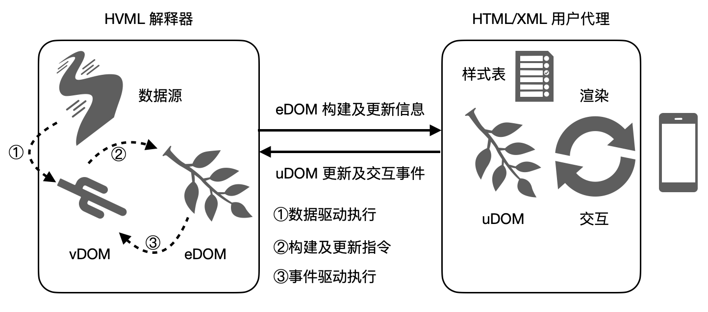
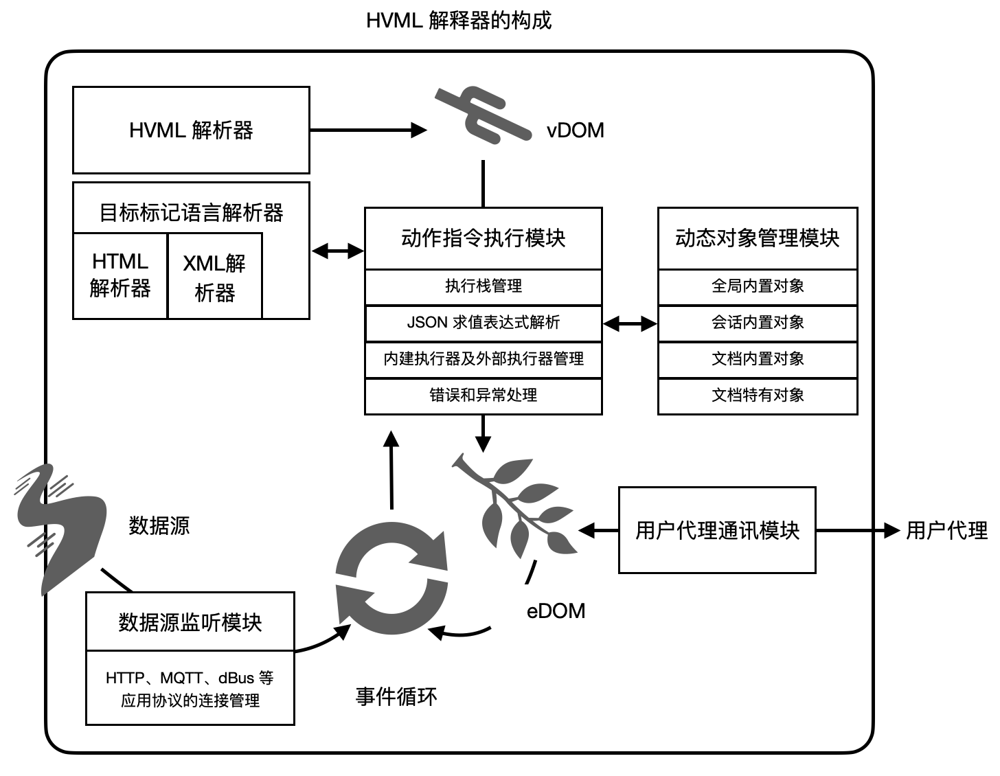
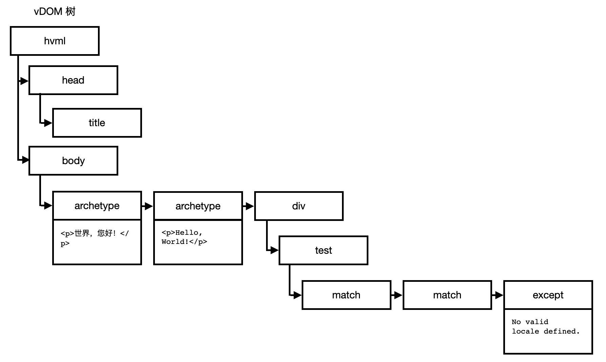
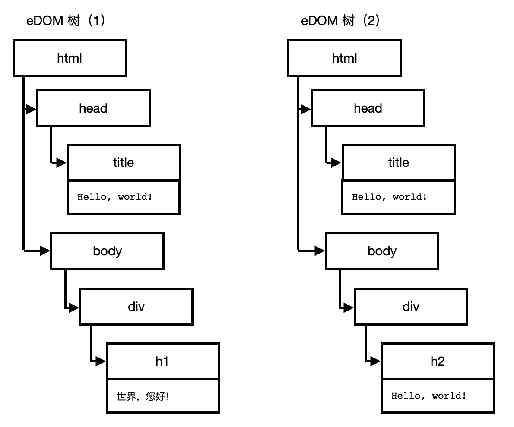
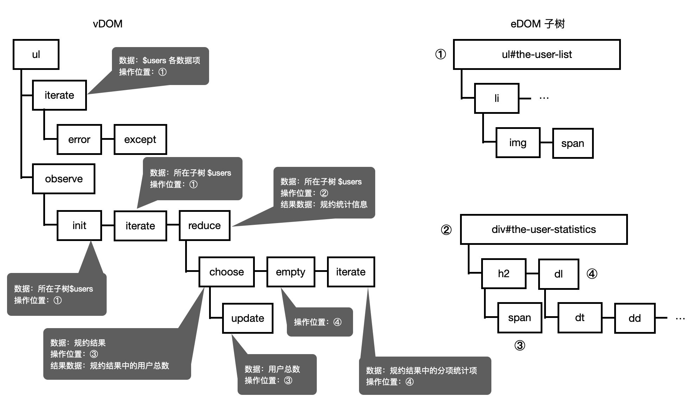
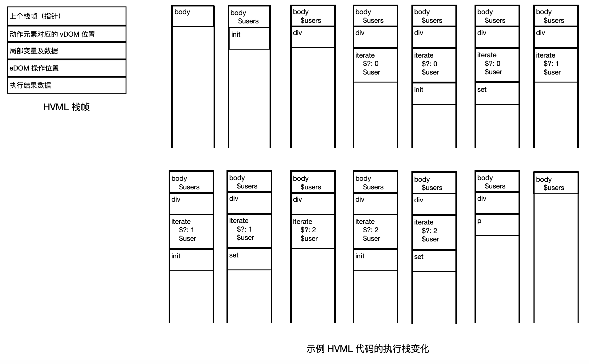

# HVML 动态标记语言的解释器实现

版权所有 &copy; 2020, 2021 北京飞漫软件技术有限公司  
保留所有权利

此文档不受 HVML 相关软件开源许可证的管辖。

飞漫软件公开此文档的目标，用于向开发者解释 HVML 相关设计原理或者相关规范。在未获得飞漫软件书面许可之前，任何人不得复制或者分发本文档的全部或部分内容，或利用本文档描绘的技术思路申请专利、撰写学术论文等。

本文提及的飞漫软件或其合作伙伴的注册商标或商标之详细列表，请查阅文档末尾。


- [0) 基本信息](#0-基本信息)
- [1) 背景技术](#1-背景技术)
- [2) 现有技术的缺陷和不足](#2-现有技术的缺陷和不足)
   + [2.1) HVML 和 Vue.js 等的区别](#21-hvml-和-vuejs-等的区别)
   + [2.2) HVML 和常见编程语言的区别](#22-hvml-和常见编程语言的区别)
   + [2.3) HVML 解释器和常见脚本语言解释器的区别](#23-hvml-解释器和常见脚本语言解释器的区别)
- [3) 技术方案描述](#3-技术方案描述)
   + [3.1) 整体描述](#31-整体描述)
   + [3.2) HVML 解释器的构成](#32-hvml-解释器的构成)
   + [3.3) HVML 解析器](#33-hvml-解析器)
   + [3.4) 动作指令执行模块](#34-动作指令执行模块)
      * [3.4.1) 变量及其作用域](#341-变量及其作用域)
      * [3.4.2) 内建执行器](#342-内建执行器)
      * [3.4.3) 调用外部执行器](#343-调用外部执行器)
      * [3.4.4) 克隆模板](#344-克隆模板)
      * [3.4.5) 动态 JSON 的实现](#345-动态-json-的实现)
      * [3.4.6) JSON 求值表达式解析器](#346-json-求值表达式解析器)
      * [3.4.7) 错误和异常处理](#347-错误和异常处理)
   + [3.5) 目标标记语言解析器](#35-目标标记语言解析器)
   + [3.6) 数据源监听模块](#36-数据源监听模块)
   + [3.7) 动态 JSON 对象管理模块](#37-动态-json-对象管理模块)
   + [3.8) 用户代理通讯模块](#38-用户代理通讯模块)
- [4) 本发明创造的优点](#4-本发明创造的优点)
- [5) 替代方案](#5-替代方案)
- [6) 本发明的关键点和欲保护点](#6-本发明的关键点和欲保护点)
- [7) 附图及简要说明](#7-附图及简要说明)
   + [7.1) 附图1 解释器和用户代理的关系](#71-附图1-解释器和用户代理的关系)
   + [7.2) 附图2 HVML 解释器的模块构成](#72-附图2-hvml-解释器的模块构成)
   + [7.3) 附图3 vDOM 示意图](#73-附图3-vdom-示意图)
   + [7.4) 附图4 不同数据给出的不同 eDOM 树](#74-附图4-不同数据给出的不同-edom-树)
   + [7.5) 附图5 vDOM 动作元素的上下文及执行路径](#75-附图5-vdom-动作元素的上下文及执行路径)
   + [7.6) 附图6 HVML 栈帧及执行栈](#76-附图6-hvml-栈帧及执行栈)
- [附：商标声明](#附：商标声明)

## 0) 基本信息

- 发明创造名称  
  一种数据驱动的动态标记语言的解释器实现
- 权利人  
  北京飞漫软件技术有限公司
- 发明人  
  魏永明、耿岳、薛淑明
- 撰写人  
  魏永明

## 1) 背景技术

随着互联网技术和 Web 应用的发展，围绕 HTML/CSS/JavaScript 发展出来的 Web 前端开发技术发展迅猛，甚至可以用“一日千里”来形容。五年前，基于 jQuery 和 Bootstrap 的前端框架大行其道，而从 2019 年开始，基于虚拟 DOM 技术的框架又受到前端开发者的青睐，比如著名的 React.js（<https://reactjs.org/>）、Vue.js（<https://cn.vuejs.org>）等。值得注意的是，微信小程序、快应用等，也不约而同使用了这种虚拟 DOM 技术来构建应用框架。

所谓“虚拟 DOM” 是指前端应用程序通过 JavaScript 来创建和维护一个虚拟的文档对象树，应用程序并不直接操作真实的 DOM 树。在虚拟 DOM 树中，通过一些特别的属性实现了基于数据的一些流程控制，如条件、循环等。虚拟 DOM 技术提供如下一些好处：

1. 由于脚本并不使用脚本程序直接操作真实的 DOM 树，故而一方面通过现有的框架简化了前端开发的复杂性，另一方面通过优化对真实 DOM 数的操作而减少了由于动态修改页面内容而对 DOM 树的频繁操作，从而提高页面的渲染效率和用户体验。
1. 通过虚拟 DOM 技术，程序对某个数据的修改，可以直接反应到该数据绑定的页面内容上，开发者无需主动或直接地调用相关接口来操作 DOM 树。这种技术提供了所谓的“响应式”编程，极大降低了开发者的工作量。

在以上虚拟 DOM 思想基础上，在开发一款针对物联网及云环境中使用的新一代操作系统的过程中，权利人提出了一种全新的数据驱动的动态标记语言，我们称为 HVML。HVML 属于一种全新的 DSL（domain specific language，领域特定语言）。有关 HVML 的完整描述可见：

<https://github.com/HVML/hvml-docs/blob/master/zh/hvml-overview-zh.md>

尽管 HVML 的思想主要来源于虚拟 DOM 技术，但和 Vue.js、小程序、快应用等不同，HVML 采用类似 XML/HTML 的语法描述虚拟 DOM，通过具有特定语义的动作标签来定义如何生成实际的 XML/HTML 文档内容，以及如何更新 XML/HTML 内容。另外，HVML 是一种可以脱离浏览器环境使用的编程语言，比如在 Python 或者 C/C++ 程序中内嵌 HVML 代码，从而可以让除 JavaScript 语言之外的其他编程语言可以操作 XML/HTML 页面内容。

本发明阐述 HVML 的一种解释器之实现，这一软件装置解析 HVML 文档，生成对应的虚拟 DOM 树，通过作用不同的数据而动态生成最终的 HTML/XML 文档（或片段），并可通过监听数据或者用户的交互事件而动态修改最终的 HTML/XML 文档。

本发明涉及的标准和规范罗列如下：

- HTML 及其规范。HTML 和 CSS 等规范和标准是由 W3C <https://www.w3.org> 组织制定的，用来规范 Web 页面内容的编写和渲染行为。关键规范如下：
   * HTML：超文本标记语言（HyperText Markup Language），用于表述网页内容结构的标准。最新的发布标准是 HTML 5.3：<https://www.w3.org/TR/html53/index.html>；
   * CSS：级联样式表（Cascading Style Sheets），用于定义 HTML 页面元素布局、渲染效果等的规范。在 CSS 2.2 <https://www.w3.org/TR/CSS22/> 之后，CSS 规范开始按照模块划分，各模块分头演进，目前普遍支持到 Level 3。在如下网页中可以看到 CSS 各模块的规范进展情况：<https://drafts.csswg.org>；
   * JavaScript/ECMAScript：一种符合 ECMAScript 规范的脚本编程语言，最初由网景公司设计给浏览器使用，用于操控 HTML 页面中的内容和渲染行为，现在由欧洲计算机制造商协会和国际标准化组织负责制定相关标准，最新的标准为 ECMA-262：<http://www.ecma-international.org/publications/standards/Ecma-262.htm>。
   * DOM：文档对象模型（Document Object Model），用于 XML/HTML 文档结构的内部表达。一个 XML/HTML 文档，会被 XML/HTML 解析器解析并生成一个 DOM 树，XML/HTML 文档中的每个元素构成 DOM 树上的元素结点，而每个元素的子元素、属性、文本内容等，又构成了这个元素节点的子节点。有关 DOM 的最新的规范可见：<https://dom.spec.whatwg.org/>。
   * JSON：JavaScript 对象表述法（JavaScript Object Notation）是一种轻量级的信息互换格式。最初被用于 JavaScript 对象的字符串表达，易于被 JavaScript 脚本代码使用，现在被广泛使用在不同编程语言之间的数据交换。有关 JSON 的描述，可见：<https://json.org/>。
- 用户代理（User Agent）是 HTML 规范的一个术语，用来指代可以解析 HTML、CSS 等 W3C 规范，并对 HTML 文档内容进行渲染，进而呈现给用户并实现用户交互的计算机程序。我们熟知的浏览器就是用户代理。但用户代理不限于浏览器，可以是一个软件组件，也可以是一个应用框架。比如，内嵌到电子邮件客户端程序中，用以解析和渲染 HTML 格式邮件的软件组件，本质上也是 HTML 用户代理。
- XML：可扩展标记语言（The Extensible Markup Language）是由 W3C 组织制定的，用来表述结构化信息的一种简单文本格式。和 HTML 相比，XML 使用类似的结构，但更加严格且更为通用。XML 是当今共享结构化信息的最广泛使用的格式之一，不论是在程序之间，人与人之间，计算机与人之间，也不论是在本地还是跨网络共享信息。有关 XML 的介绍和规范可参阅：<https://www.w3.org/standards/xml/>。
- 脚本语言。指类似 JavaScript 的高级计算机编程语言，通常解释执行，具有动态特征。除 JavaScript 之外，常见的脚本语言有 Python、Lua 等。

## 2) 现有技术的缺陷和不足

### 2.1) HVML 和 Vue.js 等的区别

以 React.js、Vue.js 为代表的前端框架取得了巨大成功，但存在如下缺陷和不足：

- 这些技术建立在已有成熟的 Web 标准之上，需要完整支持相关前端规范的浏览器才能运行，因此无法应用于其他场合。比如要在 Python 脚本中使用这类技术，目前没有任何解决方案；再比如在传统的 GUI 应用编程中，也无法使用这一技术带来的好处。
- 这些技术通过引入 `v-if`、`v-else`、`v-for` 等虚拟属性实现了基于数据的条件和循环流程控制，但这种方法带来代码可读性的极具下降，代码可读性的下降带来代码可维护性的下降。如下面 Vue 的一个示例：

```html
<div v-if="Math.random() > 0.5">
  Now you see "{{ name }}"
</div>
<div v-else>
  Now you don't
</div>
```

### 2.2) HVML 和常见编程语言的区别

和常见的编程语言（C/C++、Python、JavaScript）相比，HVML 语言具有如下显著不同的特征：

1. 数据驱动编程。通过基于数据的迭代、插入、更新、清除等操作，开发者不需要编写程序或者只要少量编写程序即可动态生成最终的 XML/HTML 文档。通过观察新的数据或文档本身的变化以及用户交互事件，HVML 可实现 XML/HTML 文档或数据的动态更新。我们将这种编程方式称为数据驱动的编程（data-driven programming）。
1. 抽象的数据操作。HVML 为数据的操作提供了更接近最终用途的操作，比如集合的合并、字符串或者整数上的迭代等，开发者无需自行编写代码来实现具体的数据操作。
1. HVML 动作标签使用介词和副词属性来定义动作依赖的数据、目标对象以及执行条件等，和常见的编程语言有很大不同，HVML 的描述方式更加贴近自然语言，从而可以大幅降低学习门槛。
1. 通过对数据和文档结构的抽象，HVML 提供了为数不多的几种动作标签，通过这些标签的嵌套使用，可组合成更为复杂的操作逻辑。

作为 HVML 的一个简单示例，如下的 HVML 代码实现了一个根据当前的系统 Locale（语言和地区信息）显示不同版本的“Hello, world!”的功能：

```html
<!DOCTYPE hvml>
<hvml target="html">
    <head>
        <title>Hello, world!</title>

        <init as="messages">
            {
              "zh_CN" : "世界，您好！",
              "en_US" : "Hello, world!"
            }
        </init>
    </head>

    <body>
        <p>
            <choose on="$messages" to="update" by="KEY: $_SYSTEM.locale">
                <update on="$@" textContent="$?" />
                <except on="KeyError">
                    No valid locale defined.
                </except>
            </choose>
        </p>
    </body>
</hvml>
```

其中，`init`、`choose`、`update` 使用的都是动词，是 HVML 定义的动作标签，分别用于初始化数据、选择数据和更新文档（或数据）；`execpt` 是 HVML 定义的异常处理标签，用于处理代码异常。

以上代码，根据系统内置变量 `$_SYSTEM.locale` 的值，从 `$messages` 键值数组中挑选对应的字符串，然后更新当前位置（`$@`），也就是 `p` 元素的内容。假如当前系统 Locale 为 `zh_CN`，则上述 HVML 代码生成的最终 HTML 文档内容为：

```html
<!DOCTYPE html>
<hvml>
    <head>
        <title>Hello, world!</title>
    </head>

    <body>
        <p>
            世界，您好！
        </p>
    </body>
</hvml>
```

假如使用 Python 语言来生成这个页面，最简单直接的写法如下：

```python
    print ('<!DOCTYPE html>')
    print ('<hvml>')
    print ('    <head>')
    print ('        <title>Hello, world!</title>')
    print ('    </head>')
    print ('')
    print ('    <body>')
    print ('        <p>')

    if locale == `zh_CN':
        print ('世界，您好！')
    else:
        print ('Hello, world!')

    print ('        </p>')
    print ('    </body>')
    print ('</hvml>')
```

从上面两段代码中，我们可以清晰看出 HVML 和其他常见编程语言的不同。

### 2.3) HVML 解释器和常见脚本语言解释器的区别

由于 HVML 语言和常见编程语言有很大的不同。主要有如下几点：

1. 由于 HVML 代码本身是可以动态装载，或者对应的虚拟 DOM 是可以动态修改的，故而 HVML 是一种类似 Python、JavaScript 的动态语言，只能解释执行，无法像类似 C/C++ 或者 Java 语言那样编译执行。
1. 由于 HVML 是数据驱动的，没有通常脚本语言中常见的流程控制语句，故而其解释器的实现和其他脚本语言也会有很大的不同。

目前，尚没有任何一种流行的编程语言和 HVML 类似，所以也没有可参考的解释器实现。由于 HVML 是一种数据驱动的动态标记语言，和传统的编程语言或者脚本语言有本质的不同，故而其解释器的实现也和传统的脚本语言解释器有很大的不同。

本发明根据权利人提出的动态标记语言 HVML 的规范，描述了一种 HVML 解释器的实现方法和装置。注意，由于 HVML 是一种比 Python 等脚本语言更高级（指抽象层次更高）的编程语言，理论上也可以翻译成其他编程语言的代码，比如 Python，然后再使用 Python 解释器来解释执行。对此方案，本发明申请不做描述。

## 3) 技术方案描述

### 3.1) 整体描述

基于 HVML 的软件系统划分为两个主要的构成部分：

- HVML 解释器。
- HTML/XML 用户代理。

在基于 HVML 软件系统中，HTML/XML 用户代理可以是一个符合 W3C 标准和规范的全功能浏览器或者支持 XML 的 GUI 系统，也可以是一个简化的用户代理。简化的 HTML/XML 用户代理，可以不需要执行任何 JavaScript 脚本程序，而直接使用最终的 DOM 树以及 CSS 样式表来渲染页面。

附图1 给出了 HVML 解释器和 XML/HTML 用户代理之间的关系。为方便描述，以下分别简称“解释器”和“用户代理”。



解释器和用户代理之间的互操作过程大致可以描述为如下一个过程：

- 当解释器和用户代理运行在同一个计算机设备上时，一般通过一个基于本机套接字（或者管道）的本机进程间通讯机制建立联系。在不支持多进程的操作系统上，可使用类似消息循环的机制建立联系。当解释器和用户代理运行在不同的计算机设备上时，可通过一个基于网络套接字的通讯机制建立联系，比如 WebSocket，或者 MQTT、XMPP 等消息通讯协议。不论基于网络套接字、本机套接字还是管道，我们将这类通讯协议统称为`桥梁`。
- 解释器解析 HVML 定义的动作标签，根据动作标签规定的动作生成最终的 XML/HTML 文档（或片段），并通过桥梁将文档或者 DOM 树及其变化传递给用户代理。
- 解释器负责监听在 HVML 头部中定义的数据源，并执行 `observe` 标签定义的操作。
- 用户代理将用户在真实文档上产生的交互事件（比如按钮的单击事件）以及用户操作导致文档节点发生的变化（如输入框的内容变化、列表框的选择变化等），通过桥梁发送给在云端运行的解释器。
- 解释器监听来自用户代理的交互事件或者文档节点的变化通知，并执行 `observe` 标签定义的操作。
- 当 HVML 的操作修改了真实文档的某个节点时，解释器通过桥梁将该修改发送给用户代理，用户代理根据文档的改变信息重新渲染更新后的文档。

如下是几个关键点：

1. 解释器维护 HVML 对应的虚拟 DOM 树，其中包括模板标签、动作标签等定义的元素以及数据。为方便描述，我们将虚拟 DOM 称为 vDOM（virtual DOM）。
1. 解释器同时维护一个由其本身动态生成和修改的有效 DOM 树，其中不包含任何 HVML 标签定义的元素。为方便描述，我们将有效 DOM 称为 eDOM（effective DOM）。
1. 用户代理根据解释器动态生成或修改的文档信息维护一个最终的 DOM 树，用于渲染用户界面。为方便描述，我们将最终 DOM 称为 uDOM（ultimate DOM）。
1. 解释器和用户代理通过桥梁通讯保持 eDOM 和 uDOM 的一致性。或者，当解释器和用户代理运行在同一物理计算机上时，可对 eDOM 和 uDOM 使用同一个副本，以便节约内存使用。

本文档主要描述 HVML 解释器的构成和关键实现细节。在权利人提交的另外一项发明专利申请《一种支持云应用的方法及装置》中，阐述了 eDOM 和 uDOM 的互操作以及用户代理相关的实现。

### 3.2) HVML 解释器的构成

HVML 解释器可使用常见的脚本语言实现，但更一般的情形是使用 C/C++ 语言实现，并通过本地（native）绑定机制为相应的脚本语言提供接口，这样可以获得最佳的性能。

本文档以 Python 语言以及 HTML 作为目标标记语言为准阐述解释器的实现细节。但不论使用那种编程语言或者目标标记语言，其内部结构或者主要算法都是一致的。

附图2 给出了 HVML 解释器内部的模块构成。



从附图2 可以看出，HVML 解释器包括如下几个主要的功能模块：

1. HVML 解析器。该模块主要用于解析 HVML 文档构造 vDOM。
1. 动作指令执行模块。该模块主要用于执行动作标签指定的数据操作动作，克隆文档模板或者数据模板并生成文档片段或者数据，并更新 eDOM 或者数据。该模块主要包含如下功能：
   - 执行栈管理。
   - JSON 求值表达式的解析，包括对动态 JSON 对象的支持。
   - 内建执行器及外部执行器的管理。
   - 错误和异常处理。
1. 目标标记语言解析器。该模块按照目标文档标签语言（HTML、XML 或者其他 XML 变种标记语言，如 QML）的规则解析文档或者文档片段，负责生成或者更新 eDOM。
1. 用户代理通讯模块。该模块围绕 eDOM 的更新和用户代理保持通讯，并接收来自用户代理的事件通知，将其翻译成事件数据包发送到事件队列中。
1. 数据源监听模块。监听来自数据源数据，翻译成相应的事件数据包发送到事件队列中。该模块包括对各种通讯协议的支持功能，如 HTTP、hiBUS、MQTT、WebSocket、XMPP 等。该模块获取来自数据源的数据或者发起请求并等待应答。和现代 Web 浏览器类似，这一模块通常被设计为独立的网络进程。
1. 事件循环模块。该模块管理事件队列，按先进先出的原则获取一个待处理的事件数据包，在 vDOM 中找到观察该事件的 vDOM 元素节点，并通知动作指令执行模块执行新的操作。

以上模块中有关解析 HVML、HTML、XML 等标记语言生成 vDOM 或者 eDOM 的过程，以及应用请求协议处理模块的实现，常见于各种开源软件尤其是浏览器引擎（如 WebKit、Chromium 等）的实现中，故而略去不谈。本文档主要阐述 HVML 解释器和传统脚本语言不同之处，主要包括：

- 用于操作元素或者数据的动作执行路径及执行栈。
- 变量及其作用域。
- 动作标签的内建执行器。
- 克隆文档片段模板或数据项模板。
- 错误和异常处理。
- 监听数据源和事件。

### 3.3) HVML 解析器

HVML 解析器将输入的 HVML 文档进行解析，并生成对应的 vDOM。将 HVML 文档进行解析并生成 vDOM 的过程和解析一个普通的 XML 文件或者 HTML 文件生成对应的 DOM 树的过程，并无本质的不同，只在细微处有所不同。故而本发明申请不做详细描述，仅给出主要区别。

对如下简单的 HVML 文档，经过 HVML 解析器解析后，将生成如附图3 所示的 vDOM 树。

```html
<!DOCTYPE hvml>
<hvml target="html" script="python">
    <head>
        <title>Hello, world!</title>
    </head>

    <body>
        <archetype id="footer-zh">
            <h1>世界，您好！</h1>
        </archetype>

        <archetype id="footer-en">
            <h2>Hello, world!</h2>
        </archetype>

        <div>
            <test on="$_REQUEST.locale">
                <match for="~zh*" to="displace" with="#hello-cn" exclusively>
                </match>
                <match for="*" to="displace" with="#hello-en">
                </match>

                <except on="KeyError">
                    <p>No valid locale defined.</p>
                </except>
            </test>
        </div>

    </body>
</hvml>
```



本质上，vDOM 树和普通的 DOM 树并无本质区别，但解释器在处理 HVML 文档时，会做如下特殊处理：

1. HVML 元素的内容（content）可能是 JSON 格式表达的数据，我们称为 `jsonContent`。比如 `init` 和 `listen` 标签，其内容必定是 JSON 表达的数据。
1. `archetype`、`archedata`、`error`、`except` 标签的内容，会整个记录为对应元素的文本内容（textContent）。在后续依照 vDOM 执行 HVML 代码时，当动作标签克隆对应的模板时，或者在处理错误或者异常时，其中的内容才会被解析为目标标记语言的片段或者 JSON 数据，这时候，会根据变量的值置换其中的变量。也就是说，这些元素的内容不会被解析为 vDOM 树的一部分。如上例中的 `except` 元素，其文本内容为 `<p>No valid locale defined.</p>`，其中的 `p` 标签不会被解析为 `except` 元素的子元素。
1. 在 `head` 和 `body` 中出现的使用目标标记语言标签定义的元素（如上例中的 `div` 元素），在 vDOM 中存在有相应的元素节点。这类标签定义的元素不定义任何操作数据或元素的动作（或者其定义的操作为 `noop`）。但这类元素会定义 eDOM 的骨架，故而我们把这类元素称为`骨架（skeleton）`元素。本质上，骨架元素定义了隐含的 eDOM 操作位置。
1. HVML 中可以存在多个嵌套的骨架元素，但需要满足如下规则：骨架元素不可出现在 HVML 动作元素中，或者骨架元素的父元素必定是一个骨架元素，而不能是一个 HVML 动作元素。不符合该规则的 HVML 文档，将被 HVML 解析器视为非法。

HVML 解析器通常装载一个完整的 HVML 文档，进行解析并生成 vDOM 交给其他模块进行后续处理。但 HVML 解析器并不立即解析 `jsonContent` 和 `textContent` 的内容，也不解析 HVML 介词属性中的 JSON 求值表达式，而只是将这些内容作为文本字符串记录下来。

### 3.4) 动作指令执行模块

HVML 解析器正确生成 vDOM 树之后，将交由动作指令执行模块处理 vDOM 树，并生成相应的 eDOM。

我们可以将 eDOM 看成是 vDOM 在不同数据集下的一个文档快照。比如，就上面的 HVML 文档，当装载这个文档时传入的请求参数 `locale` 为 `zh_CN` 时，对应的 HTML 文档快照为：

```html
<!DOCTYPE html>
<html>
    <head>
        <title>Hello, world!</title>
    </head>

    <body>
        <div>
            <h1>世界，您好！</h1>
        </div>
    </body>
</html>
```

当装载这个文档时传入的请求参数 `locale` 为 `en_US` 时，则对应的 HTML 文档快照为：

```html
<!DOCTYPE html>
<html>
    <head>
        <title>Hello, world!</title>
    </head>

    <body>
        <div>
            <h2>Hello, world!</h2>
        </div>
    </body>
</html>
```

附图4 给出了这两种情况下的 eDOM 树示意图。当然，复杂的 HVML 文档，根据不同的数据，可能获得差异非常大的 eDOM 树，而且可能动态改变。



如附图5 所示，HVML 标签形成的 vDOM 树中，存在六类元素节点：

1. 由 HVML 动词标签 `init` 和 `listen` 定义的数据初始化及数据源监听元素。这类元素不能包含子元素，其文本内容将被视作 JSON 格式表达的数据，并被用来初始化变量。
1. 由 HVML 名词标签 `archetype` 和 `archedata` 定义的文档片段模板或者数据模板。这类元素不能定义子元素；在其内部使用目标标记语言书写的代码，将被视作这两类元素的文本内容，在 vDOM 中不存在对应的元素节点。
1. 由 HVML 名词标签 `error` 和 `except` 定义的错误或异常处理元素，用于定义错误或异常情况下的文档片段模板。这类元素中使用目标标记语言书写的代码，将被视作错误或异常元素的文本内容，在 vDOM 中不存在对应的元素节点。
1. 由 HVML 动词标签 `choose` 和 `iterate` 等定义的元素或数据操作元素，这类元素可包含其他动作元素以及 `error` 或 `except` 元素。
1. 在 `head` 和 `body` 中出现的使用目标标记语言标签定义的元素，在 vDOM 中有相应的元素节点，最终作为 eDOM/uDOM 的文档骨架存在。这类标签定义的元素不定义任何操作数据或元素的动作，但会定义隐含的上下文（context）信息。这类元素，我们称为`骨架（skeleton）`元素。
1. 由 `observe` 元素定义的观察元素，只有当被观察的事件到达时，才会被执行，而且可能多次执行。由 `define` 元素定义的操作组，只有代码显式使用 `include` 或者 `call` 元素时才会被执行。

HVML 文档定义的动作，沿着 vDOM 树，以深度优先的顺序执行。比如如下的 HVML 文档片段：

```html
        <ul id="the-user-list" class="user-list">
            <iterate on="$users" to="append" in="#the-user-list" with="#user-item" by="CLASS: IUser">
                <error on="notready">
                    
                </error>
                <except on="StopIteration">
                    <p>Bad user data!</p>
                </except>
            </iterate>

            <observe on="#the-user-list" for="change" to="iterate">
                <init as="users">
                    [ ]
                </init>

                <iterate on="$@" to="append" in="$users" with="#item-user" by="TRAVEL: BREADTH">
                </iterate>

                <reduce on="$users" to="choose empty iterate" in="#the-user-statistics" by="class: RUserRegionStats">
                    <choose on="$?.count" to="update" in="> h2 > span">
                        <update on="$@" textContent="$?" />
                    </choose>
                    <empty in="> dl" />
                    <iterate on="$?.regions" to="append" in="> dl" with="#region-to-users" by="KEY: ALL" descendingly>
                    </iterate>
                </reduce>
            </observe>

        </ul>
```

这段 HVML 文档的执行路径如下：

1. `ul` 是一个骨架元素，该元素将被完整克隆到 eDOM 的当前插入位置。此后，该 eDOM 位置将作为该骨架元素子元素的默认 eDOM 操作位置。
1. 执行 `iterate` 元素指定的迭代操作。该操作将 `$users` 变量定义的数据项追加到 eDOM 相应的位置。
1. `observe` 元素定义的操作将被延后，只有在 eDOM 的 `ul` 元素上出现 `change` 事件时执行。

上例中的 `observe` 元素在 `id` 属性为 `the-user-list` 的 `ul` 元素上观察 `change` 事件（任何在 `ul` 元素及其后代元素上的改变将产生该事件）。当 HVML 解释器观察到该事件出现时，将执行 `observe` 元素定义的动作子树，然后按照如下路径执行各动作元素：

1. 执行 `init` 标签初始化 `$users` 局部变量，是一个空的数组。
1. 在当前的操作位置（由 `$@` 指定，也就是 `ul` 元素）上执行广度优先遍历并迭代。本质上，就是遍历 `ul` 元素的所有直接子元素，并根据子元素的属性值和内容信息一个个追加到 `$users` 数组中。
1. 在 `$users` 对应的数据上执行 `reduce` 动作。该动作将使用外部执行器统计 eDOM 中的用户数量以及按照用户所在地区分组的数量；重置当前操作位置到 `#the-user-statistics`。
1. 在规约动作获得的结果基础之上，执行 `choose` 动作，并重置当前操作位置到 `> h2 > span`，即 `#the-user-statistics > h2 > span`。
1. 执行 `update` 动作，更新目标元素的文本内容，即用户总数。
1. 执行 `empty` 动作，清空目标元素 `#the-user-statistics > h2 > span` 的内容。
1. 重复执行 `iterate` 动作，在目标元素 `#the-user-statistics > dl` 中追加使用文档片段模板 `#region-to-users` 生成的子元素（本质上是一个 eDOM 子树）。

根据 HVML 规范的要求，每个动作元素被执行时，均需要包括如下的上下文信息：

1. 动作的初始输入数据，默认为 vDOM 父动作元素的执行结果。
1. 动作元素所在的 vDOM 子树，以其直接父元素为根元素确定，可用来查找在当前动作中引用的局部变量。
1. 动作元素为子元素定义的局部变量。
1. eDOM 中对应的当前操作位置。
1. 动作执行结果数据。

注意，某些动作元素可能执行多次，比如 `observe`、`iterate` 定义的动作元素（及其子元素）以及 `define` 定义的操作组。每执行一次，将产生一个新的执行结果并作为其子动作元素的输入数据。注意，每次执行 `observe` 或者 `iterate` 动作时，其子树中包含的所有子动作元素将按照以上执行路径重新执行。

附图5 给出了上述 HVML 代码片段构成的 vDOM 树各动作元素的上下文以及当前操作位置和 eDOM 之间的对应关系。



为支持同一动作元素的多次执行，甚至递归执行（比如在 `define` 定义的操作组中使用 `call` 调用当前操作组本身），我们需要使用执行栈（stack）来维护执行路径。执行路线中的每个动作元素的上下文就是构成执行栈的一个个栈帧（stack frame）。

在 HVML 动作指令执行模块中，可能会存在多个执行栈：

- 主执行栈：其栈顶为 vDOM 根节点，即 `body` 元素；沿深度优先的 vDOM 树遍历顺序执行每个骨架元素或者动作元素，每执行一个动作做一次压栈（push stack）操作，当一个动作及其子动作全部执行结束后，做一次出栈（pop stack）操作。当出栈操作达到栈顶时，解释器会检查事件队列，若有被监听的事件到达，则执行对应的 `observe` 元素定义的动作子树，按同样的策略执行压栈和出栈操作；当出栈操作到栈顶时，循环此过程。
- 异步执行栈。对所有异步执行的操作组，解释器创建一个单独的执行栈，并在一个独立的线程中执行操作组。该执行栈以 `body` 元素作为栈顶，按照 `define` 元素定义的动作子树，按深度优先的遍历顺序执行每个动作，并执行相应的压栈和出栈操作。当出栈操作到栈顶时，结束执行，等待执行结果被 `call` 动作获取，之后销毁异步执行栈和异步执行线程。

注意，在 HVML 解释器中，所有的 `iterate` 动作及其子动作元素、后代动作元素，会被重复执行多次，直到迭代结束才会继续遍历其他的兄弟动作元素。每执行一次，其栈帧内容会相应变化。

为了说明执行栈的构造和执行变化情况，看如下的 HVML 代码片段：

```html
    <body>
        <init as="users" uniquely by="id">
            [ ]
        </init>

        <div>
            <iterate on="0" by="ADD: BY 1, NOT BEYOND 3">
                <init name="user">
                    { "id": "$?", "avatar": "/img/avatars/$?.png" }
                </init>

                <set on="$users" to="merge" with="$user">
                </set>
            </iterate>

            <p>
            </p>
        </div>

    </body>
``

以上代码在 `div` 骨架元素内执行了 3 次迭代操作，将动态生成的 `user` 对象合并到了集合 `users` 中，最终生成的 `users` 变量值如下：

```json
    [
        { "id": "0", "avatar": "/img/avatars/0.png" },
        { "id": "1", "avatar": "/img/avatars/0.png" },
        { "id": "2", "avatar": "/img/avatars/0.png" }
    ]
```

附图6 给出了一个栈帧中包含的上下文信息，以及上述 HVML 代码每执行一次动作元素的主执行栈变化情况，其中给出了每个栈帧的关键信息。



#### 3.4.1) 变量及其作用域

在 HVML 中，使用 `init` 动作标签定义的命名变量、使用 `listen` 动作标签监听的数据源，以及使用 `bind` 动作标签绑定的命名变量，其作用域均只在其所在的 vDOM 子树中有效。对定义在 `head` 元素中的变量，则全局有效，相当于全局变量。

```html
<hvml>
    <head>
        <init as="users" with="https://company.com/get-user-list?start=0&count=10" asynchronously>
        </init>
    </head>
    <body>

        <div id="wait-data">
            
        </div>

        <ul id="the-user-list" class="user-list">
        </ul>

        <observe on="$users" for="ready">
            <remove on="#wait-data" />

            <iterate on="$users" to="append" in="#the-user-list" with="#user-item" by="CLASS: IUser">
                <error on="notready">
                    
                </error>
                <except on="StopIteration">
                    <p>Bad user data!</p>
                </except>
            </iterate>
        </observe>

        <observe on="#the-user-list" for="change" to="iterate">
            <init as="users">
                [ ]
            </init>
            ...

        </observe>
    </body>
</hvml>
```

上面的示例 HVML 代码在 `head` 元素中使用 `init` 元素定义了通过数据源异步获得 `$users` 变量，该变量是全局的。由于该数据是异步获取的，因此，上述 HVML 使用 `observe` 标签观察该变量上的 `ready` 事件，并根据获得的数据迭代生成了用户清单。

在第二个 `observe` 动作中，该代码观察 `ul` 元素上的 `change` 事件，然后在其中使用 `init` 动作标签定义了一个仅在第二个 `observe` 元素子树中有效的变量，是一个空的数组。

根据变量名称确定具体使用哪个数据时，HVML 遵循如下简单的规则：

1. 当 HVML 的动作元素遇到一个命名变量时，会首先在当前上下文（即动作元素的直接父元素定义的 vDOM 子树）向前寻找对应的变量；如果没有找到，
1. 则上溯父元素一直到 vDOM 的 `body` 元素；若仍未找到，
1. 则按全局变量（包括内置全局变量）处理；若仍未找到，
1. 则产生 `nodata` 错误。

#### 3.4.2) 内建执行器

如 HVML 规范文档中描述，内建执行器一般由一个符合特定语法要求的语句构成，然后根据所在标签的动作完成相应的数据过滤、选择、排序以及规约等操作。因此，一个内建执行器一般由如下两个模块构成：

1. 用于解析执行语句的解析器（parser）。
1. 用于操作数据完成过滤、选择、排序或规约的数据生成器（generator）。

本节我们将以 `KEY` 执行器为例说明一个内建执行器的实现细节。其他内建执行器，都可以参照 `KEY` 执行器做类似实现，所以不再赘述。注意，`SQL` 执行器的解析器部分要复杂一些，但可参考开源内嵌式数据库 SQLite（<https://www.sqlite.org/index.html>）中有关 SQL 语句的解释模块实现。

如 HVML 规范文档所示，`KEY` 执行的语法如下：

```
    KEY: ALL | <key_name_list>
    
    <key_name_list>: <key_list_expression>[, <key_list_expression>[, ...]]
    <key_list_expression>: LIKE <key_pattern_expression> | <key_name_expression>
    <key_pattern_expression>: '<literal_wildcard_string>' | '<regular_expression>' | <string_evaluation_expression>
    <key_name_expression>: '<literal_string>' | <string_evaluation_expression>
    <string_evaluation_expression>: <json_evaluation_expression>
```

本质上，使用 `KEY` 执行器依赖于一个键名列表：

- `ALL` 关键词表示全部键名。
- `LIKE` 关键词表示匹配正则表达式或者通配符（wildcard）模式的所有键名。正则表达式或者模式字符串可使用 JSON 求值表达式求值获得，也可以是一个字面的（literal）字符串。
- 不使用 `LIKE` 关键词时表示一个普通的键名。一个普通键名可使用 JSON 求值表达式求值获得，也可以是一个字面的（literal）字符串。

故而，`KEY` 执行语句的解析器最终会输出两个字符串集合。

1. 用于正则表达式匹配或者模式匹配的字符串集合。使用 `ALL` 关键词时，该集合中只有一个字符串：`*`。
1. 用于精确匹配的字符串集合。使用 `ALL` 关键词或者只有 `LIKE` 分句时，该集合为空。

比如解析下面这个 KEY 执行语句：`KEY: 'zh_CN', 'zh_TW', LIKE 'en_*'`，将对应生成下面这两个集合：

1. `["en_*"]`
1. `["zh_CN", "zh_TW"]`

接下来，创建 `KEY` 执行器的对象，并根据该执行器所在的动作元素的动作要求调用其中的一个方法即可完成对应的动作。

使用 Python 时，`KEY` 执行器的一个简单实现如下所列：

```python
# 导入正则表达式支持包
import re

# 导入通配符匹配模块
from fnmatch import fnmatch

import sys

class KeyExecutor (object):

    def __init__ (self, on_value, pattern_list, literal_list):
        # 使用集合保存模式列表和字面列表，用于去除重复项
        self.patterns = set (pattern_list)
        self.literals = set (literal_list)

        # 获得键名列表
        self.keys = on_value.keys ()
        # 初始化当前迭代位置
        self.idx = 0

    def reset ():
        self.idx = 0

    def does_match (k):
        if k in self.literals:
            return True
        for p in self.patterns:
            if p.startswith ('/'):  # 正则表达式
                if re.match (p, k): # 是否匹配正则表达式
                    return True
            else:                   # 通配符匹配
                if fnmatch (k, p):
                    retrun True

        return False

    # 在执行迭代操作时调用该方法，一次返回一个匹配数据项（键名及键值）
    def iterate():
        while self.idx < len (self.keys):
            k = self.keys[self.idx]
            self.idx += 1

            # 检查键名是否匹配
            if self.dose_match(k):
                # 匹配时返回键名和键值作为迭代结果
                return k, self.on_value[k]

        # 迭代结束
        return None, None

    # 在执行选择操作时调用该方法，返回所有的匹配键名以及对应的键值
    def choose():
        v = {}
        for k in self.keys:
            if self.does_match(k):
                v[k] = self.on_value[k]

        return v

    # 在执行规约操作时调用该方法。
    def reduce():
        v = {}
        v['count'] = 0
        v['sum'] = 0.0
        v['avg'] = 0.0
        v['max'] = sys.float_info.min
        v['min'] = sys.float_info.max

        for k in self.keys:
            if self.does_match(k):
                v['count'] += 1

                # 转换为数值
                num = to_number (self.on_value[k])
                if num > v['max']:
                    v['max'] = num
                if num < v['min']:
                    v['min'] = num
                v['sum'] += num

        if v['count'] > 0:
           v['avg'] = v['sum'] / v['count']

        return v
```

在执行 `choose`、`iterate`、`reduce` 这三个动作元素指定的操作时，HVML 解释器一般遵循如下过程：

1. 判断当前数据是否和执行器匹配。比如在非字典数据上，不能使用针对数组、字符串、数值的内建执行器。如果不匹配，则返回错误 `BadExecutor`。
1. 解析执行语句，在当前数据基础上构建相应的输入参数。
1. 创建对应执行器的类对象，然后根据动作元素的标签名称（`choose`、`iterate` 或 `reduce`）调用相应的类方法获得返回的数据。
1. 根据各方法返回的数据设置上下文变量。

#### 3.4.3) 调用外部执行器

根据 HVML 规范，外部执行器使用外部脚本实现对应的外部执行器，不同的外部执行器有不同的接口，调用外部执行器的过程就是执行一条动态生成的脚本语言代码。比如，在 Python 中，规约器的接口如下：

```python
class HVMLReducer:
    def __init__ (self, on_value):
        pass

    # implement this method to reduce the data.
    def reduce (self):
        return None
```

假如我们实现派生 `HVMLReducer` 实现了一个自己的规约器 `RUserRegionStats`，当 HVML 解释器遇到如下的 `reduce` 动作元素时：

```html
    <reduce on="$users" to="choose empty iterate" in="#the-user-statistics" by="CLASS: RUserRegionStats">
        ...
    </reduce>
```

解释器将生成一组动态 Python 代码并调用 Python 的内置函数 `eval` 执行该代码：

```python
    reducer = new RUserRegionStats (on_value)
    return reducer.reduce()
```

其中，`on_value` 是 `reduce` 动作元素 `on` 属性指定的数据。

#### 3.4.4) 克隆模板

克隆模板的过程实质进行的是字符串的替代工作。比如就下面的文档片段模板：

```html
    <archetype id="user-item">
        <li class="user-item" id="user-$?.id" data-value="$?.id" data-region="$?.region">
            
            <span>$?.name</span>
        </li>
    </archetype>
```

解释器将对 `archetype` 的所有子标签整个视作该元素的文本内容，然后根据当前上下文变量 `$?` 的值将该文本内容的替换掉。假设当前上下文变量 `$?` 的 JSON 表达为：

```javascript
    { "id": "0", "region" : "en_US", "avatar" : "/avatars/0.png", "name": "David" }
```

则进行替换之后的文本内容为：

```html
        <li class="user-item" id="user-0" data-value="0" data-region="en_US">
            
            <span>David</span>
        </li>
```

之后，解释器将把置换后的整个文本内容作为 HTML 文档片段插入到 eDOM 中。此时，调用目标标签语言解析模块生成对应的 eDOM 子树并插入到 eDOM 中。

我们还可以 HVML 规范定义的动态 JSON 对象完成一些额外的处理工作，比如将用户的名称转换成大写。

为此，我们假定绑定了一个名称为 `string` 的动态 JSON 对象，该对象提供常见的字符串操作函数，比如：

- `toupper`：将给定的字符串转换成大写形式。
- `tolower`：将给定的字符串转换成小写形式。

则我们可以如下设定文档片段模板：

```html
    <bind on="ctype" in="strings" as="string" />

    <archetype id="user-item">
        <li class="user-item" id="user-$?.id" data-value="$?.id" data-region="$?.region">
            
            <span>$string.toupper($?.name)</span>
        </li>
    </archetype>
```

则进行变量替换之后的文本内容为：

```html
        <li class="user-item" id="user-0" data-value="0" data-region="en_US">
            
            <span>DAVID</span>
        </li>
```

#### 3.4.5) 动态 JSON 的实现

如前所述，我们可以使用 `bind` 标签绑定一个外部脚本程序作为一个动态 JSON 对象：

```html
    <bind on="ctype" in="strings" as="string" />
```

在使用 Python 脚本语言作为 HVML 的外部脚本语言时，我们通常按如下思路实现动态 JSON 对象：

1. `bind` 元素的 `in` 属性指定一个 Python 的包（package），`on` 属性这个包中实现的一个类。
1. 将 Python 包中的特定类和 HVML 变量绑定的过程就是导入（import）对应的包并创建一个类实例的过程。

上面的 `bind` 元素将导入 `strings` 包，然后创建一个 `ctype` 类的实例，并将该实例和 HVML 的变量 `$string` 关联起来。

这里作为示例的 `ctype` 类，主要实现了字符串中字符的大小写转换功能，主要通过前面示例中使用的 `toupper` 和 `tolower` 两个功能。因为字符的大小写转换和特定语言相关，因此，要获得特定语言环境下的大小写转换能力，需要设置正确的 locale（地区）信息。因此，这个类对应的动态 JSON 对象提供了一个可写的 `locale` 键名，可用来设置当前的 locale。

`ctype` 的 Python 实现大致如下：

```python
class ctype (object):
    def __init__ (self, archedata):
        self.locale = 'en_US'

    def set_locale (locale):
        self.locale = locale

    def get_locale:
        return self.locale

    def get_toupper (str):
        return str.upper()

    def get_tolower (str):
        return str.lower()
```

注意，上面的示例代码中，我们忽悠了利用 `locale` 信息正确处理字符串大小写的功能。相关信息，可参阅 Unicode 规范。

HVML 解释器将上面的 `ctype` 类和 `$string` 变量绑定的过程本质上就是执行如下的 Python 语句：

```python
import strings

hvml_string = ctype()
```

在 HVML 的 JSON 表达式中，当我们在 `$string` 对象引用相应的键名时，将调用对应的 `ctype` 类方法：

- `$string.locale`：`hvml_string.get_locale()`
- `$string.locale<'zh_CN'>`：`hvml_string.set_locale('zh_CN')`
- `$string.toupper('this is a string in lowercases')`：`hvml_string.get_toupper('this is a string in lowercases')`
- `$string.tolower('THIS IS A STRING IN UPPERCASES')`：`hvml_string.get_tolower('THIS IS A STRING IN UPPERCASES')`

#### 3.4.6) JSON 求值表达式解析器

针对 HVML 规范要求的 JSON 求值表达式，HVML 解释器引入 JSON 求值表达式解析器来完成对应的求值工作：

1. 对 JSON 表达式进行解析，生成一个用于求值的函数调用树结构，我们称为求值树（evaluation tree)。
1. 需要求值时，使用深度优先算法遍历求值树，代入 JSON 对象值执行求值过程，并返回一个最终值。

作为示例，以上示例中的如下右值表达式：

```javascript
$string.toupper ($string.strcat ($?.name, $?.id, $?.region))
```

将构造如下所示的求值树：

```
                (5)--------------
               |  $string.upper  |
                -----------------
                        |
                (4)--------------
               |  $string.strcat |
                -----------------
                    /   |   \
                   /    |    \
                  /     |     \
                 /      |      \
                /       |       \
 (1)-----------------   |   (3)----------------
 |      $?.name      |  |  |     $?.region     |
  -------------------   |   -------------------
                        |
                    (2)----
                   | $?.id |
                    -------
```

如上构造了求值树之后，执行求值过程就非常简单了，只要按照深度优先算法遍历求值树确定每个节点的值即可，如上面的求值树：

1. 节点(1)：这个节点是一个叶子节点，其值取 `$?` 的 `name` 键值。
1. 节点(2)：这个节点是一个叶子节点，其值取 `$?` 的 `id` 键值。
1. 节点(3)：这个节点是一个叶子节点，其值取 `$?` 的 `region` 键值。
1. 节点(4)：这个节点是一个函数节点，用其子节点的值作为参数调用 `$string` 动态 JSON 对象的 `strcat` 方法，即可获得对应的值，如：`David0en_US`。
1. 节点(5)：这个节点是一个函数节点，用其子节点的值作为参数调用 `$string` 动态 JSON 对象的 `upper` 方法，即可获得对应的值，如：`DAVID0EN_US`。

所以上述求值树的最终结果是 `DAVID0EN_US`。

在动作指令的执行模块中，所有 JSON 求值表达式均应该在第一次被引用时解析为求值树，然后按以上算法获得求值结果。

#### 3.4.7) 错误和异常处理

当 HVML 解释器装载一个新的 HVML 文档时，首先会解析 HVML 文档并生成一个 vDOM 树。如果在解析的过程中出现错误，将失败返回。

因此，本文档所述的错误和异常处理，主要指正确生成 vDOM 树之后，在解释执行各种动作元素指定的操作时出现的错误或者异常。

当解释器根据动作元素的属性执行特定的操作时，我们把获取数据或元素时遇到不可恢复的问题称为”错误“，而把调用执行器或者外部脚本程序时遇到的不可恢复的问题称为”异常“。

错误经常出现在如下情况：

- `on`、`in`、`with` 等属性指定的元素或者数据不存在，尚未就绪，获取失败或者不可用时。
- 无法连接到被监听的数据源，或者数据源异常断开时。
- 没有为动作标签指定正确的执行器时，或者执行器语法错误。
- 错误的 JSON 表达式。

异常经常出现在如下情况：

- 由于数据错误，执行器无法完成进一步操作时，比如被零除。
- 引用数组时，超出索引范围。
- 引用字典时，键名不存在。
- 目标标记语言解析器错误。
- 其他可能的程序错误。

在遇到错误或者异常时，HVML 解释器首先会中断当前上下文的动作执行，并执行如下操作：

1. 遍历当前上下文中的 `error` 或者 `except` 子元素，如果定义有匹配的错误或者异常，则克隆相应的 `error` 或者 `except` 标签的内容，插入到当前的文档操作位置。
1. 如果没有，则检查当前上下文是否定义有标识符为 `ERROR` 或者 `EXCEPT` 的 `archetype` 子元素，若有，则克隆其中的内容并插入到当前的文档操作位置。
1. 如果当前上下文未定义默认的错误或者异常模板，则查看其父节点，直到根节点为止。若有，则克隆其中的内容并插入到当前的文档操作位置。注意，根节点定义的 `ERROR` 或者 `EXCEPT` 文档模板，是系统内置的默认模板。

之后，HVML 解释器会上溯到上一个上下文继续处理其他元素。

需要注意的是，由于在 `error` 和 `except` 元素中仍然可以使用 JSON 求值表达式，故而可能产生新的错误或者异常。此时，HVML 解释器会使用系统默认的错误或者异常模板。

### 3.5) 目标标记语言解析器

目标标记语言解析器，主要用来将一个经过 JSON 求值表达式处理后的目标标记语言之代码片段进行解析，生成一个 DOM 子树，然后插入到 eDOM 的当前位置。

针对 HTML 的片段解析算法，在 HTML 规范中有详细描述；由于相关技术已经非常成熟，本文档不再赘述。

### 3.6) 数据源监听模块

当我们借助 `asynchronously` 副词属性使用 `init` 元素从远程数据源获取数据初始化一个变量，或者使用 `listen` 监听一个长连接数据源，或者使用 `call` 异步执行一个操作组时，HVML 解释器将会建立一个变量和任务的映射关系，并在事件循环中监听这些数据源上的变化。当对应的数据源上有数据时，或者操作组完成执行产生结果数据时，会产生相应的事件。注意，我们将异步执行的操作组也看成是一种数据源。HVML 解释器通过观察在这些数据源上的事件进行相应的处理。其处理规则如下：

1. 所有的 `observe` 元素确定了其执行上下文（也就是在 vDOM 中的位置），只有在对应的数据源上有被观察的事件（`for` 属性定义）时才会被执行。HVML 解释器会切换上下文到对应的 vDOM 位置，然后继续执行该上下文中的其他操作。
1. 当未观察到 `observe` 元素定义的事件到达时，不执行该元素及其子树中定义的任何操作。
1. 不论在何处定义，`listen` 定义的长连接数据源始终是全局存在的，但对应的变量被限制在其所在的 vDOM 子树中。

当我们异步地从数据源获取数据时，需要通过观察该数据源上可能的各种状态，比如数据就绪、连接错误、身份验证错误、超时等。HVML 解释器使用事件来表示这些状态。

`ready` 事件通常用来表示数据获取正常并已就绪，此时的事件数据大致为：

```javascript
{
    "source": "https://company.com/get-user-list?start=0&count=10",
    "event": "ready",
    "time": 20200616100207.567,
    "signature": "XXXXX",
    "payload": ...
}
```

当我们在 `observe` 动作元素中观察到 `ready` 事件时，其结果数据（即提供给子动作元素的 `$?` 变量值）就是 `payload` 对应的键值。

而如果从外部数据源获取数据时遇到错误，则对应的 JSON 数据格式大致如下：

```javascript
{
    "source": "https://company.com/get-user-list?start=0&count=10",
    "event": "error",
    "time": 20200616100207.567,
    "signature": "XXXXX",
    "payload": {
        "error": "timeout",
        "message": "",
    }
}
```

从外部数据源获取数据时，异常事件的 JSON 数据格式大致如下：

```javascript
{
    "source": "https://company.com/get-user-list?start=0&count=10",
    "event": "except",
    "time": 20200616100207.567,
    "signature": "XXXXX",
    "payload": {
        "except": "BrokenPipe",
        "message": ...
}
```

故而，除了观察数据源上的 `ready` 事件之外，我们也可以使用如下的代码来处理可能的错误情形：

```html
<hvml>
    <head>
        <init as="users" with="https://company.com/get-user-list?start=0&count=10" asynchronously>
        </init>
    </head>
    <body>

        <div id="wait-data">
            
        </div>

        <ul id="the-user-list" class="user-list">
        </ul>

        <observe on="$users">
            <test on="$?.event">
                <match for="ready" to="remove iterate" exclusively>
                    <remove on="#wait-data" />
                    <iterate on="$users" to="append" in="#the-user-list" with="#user-item" by="CLASS: IUser">
                    </iterate>
                </match>
                <match for="error" exclusively>
                    <empty on="#wait-data" />
                    <update on="#wait-data" textContent="error occurred when fetching user data" />
                </match>
                <match for="except" exclusively>
                    <empty on="#wait-data" />
                    <update on="#wait-data" textContent="exception occurred when fetching user data" />
                </match>
                <match>
                    <empty on="#wait-data" />
                    <update on="#wait-data" textContent="cannot reach here" />
                </match>
            </test>

        </observe>
    </body>

</hvml>
```

### 3.7) 动态 JSON 对象管理模块

根据 HVML 规范要求，HVML 解释器要管理动态 JSON 对象。动态 JSON 对象可划分为如下几类：

1. 全局内置对象，如 HVML 规范要求的 `$_SYSTEM` 对象。
1. 会话内置对象，如 `$_SESSION` 对象。
1. 文档内置对象，如 `$_TIMERS`、`$_REQUEST`、`$_` 对象等。
1. 文档特有对象，即 HVML 文档通过 `bind` 标签自定义的动态 JSON 对象。

在 HVML 解释器中，上述几类对象的生命周期有所不同：

1. 全局内置对象在解释器被初始化时进行初始化，并在解释器退出时被销毁。这些对象对实例中的所有会话，以及会话中的页面有效。
1. 会话内置对象对应解释器的一个实例；创建实例时初始化，并在实例退出时，销毁这些对象。这些对象对实例中的所有页面有效。
1. 文档内置对象仅对当前页面有效。在解释器装载一个新的页面时，初始化这些内置对象。
1. 文档特有对象，仅通过 `bind` 标签动态装载。

在 HTML 解释器中，会话相当于现代浏览器中一个新的浏览窗口或者一个新的标签页。在简单的解释器实现中，可以不用提供会话支持，此时，会话内置对象等同于全局内置对象。

在 HTML 解释器中，所有内置对象的名称是规范确定好的，我们通过四个红黑二叉树来维护上述四类对象，并在 JSON 求值表达式的解析中，根据名称查找这些对象，之后调用这些对象上的相关接口来完成对应的功能。如果我们使用 C/C++ 语言来实现 HVML 解释器，此时所有内置都应该使用 C/C++ 代码来实现，以确保最佳的性能。

### 3.8) 用户代理通讯模块

该模块主要用于和用户代理完成 eDOM 和 uDOM 的同步。在权利人提交的另外一项发明专利申请《一种支持云应用的方法及装置》中做了详细阐述，故而不再赘述。

另外需要注意的是，在 eDOM 和 uDOM 合二为一的情形下，此模块是不存在的。

## 4) 本发明创造的优点

本发明描述了 HVML（Hybrid Virtual Markup Language）解释器的一种实现，主要优点可总结如下：

1. 通过解耦解释器和用户代理，提供了一种可行的解释器实现方法。
1. 通过基于 vDOM 的执行栈构造，提供了符合 HVML 规范的动作执行装置。
1. 通过动态 JSON，为除了 JavaScript 脚本语言之外的其他脚本语言（或编程语言），提供了和 HVML 整合的一般性方法。

## 5) 替代方案

（暂无）

## 6) 本发明的关键点和欲保护点

1. HVML 解释器的构成。
   - 解释器和用户代理通过分别维护两个最终文档对应的 DOM 树（分别为 eDOM 和 uDOM），有效地降低了文档数据和人机交互之间的耦合性。
1. HVML 解析器模块。
   - 使用 HVML 解析器构造 vDOM 的方法，尤其是和标准 HTML、XML 解析器的不同。
1. HVML 动作指令执行模块：
   - 在 vDOM 树中，沿深度优先遍历元素构件动作执行栈的方法。
   - vDOM 动作元素的栈帧结构，及执行栈的压栈、出栈操作。
   - 主执行栈以及事件观察代码的执行时机。
   - 用于执行 `call` 动作的异步执行栈。
   - 用于处理错误和异常的装置及方法。
   - 动态 JSON 对象的实现以及用于 JSON 表达式求值的求值树构造方法。

## 7) 附图及简要说明

### 7.1) 附图1 解释器和用户代理的关系


附图1 给出了 HVML 解释器和 XML/HTML 用户代理之间的关系：

1. 解释器维护 HVML 对应的 vDOM 树，其中包括模板标签、动作标签等定义的元素以及数据。
1. 解释器同时维护一个由其本身动态生成和修改的 eDOM 树，其中不包含任何 HVML 标签定义的元素。
1. 用户代理根据解释器动态生成或修改的文档信息维护一个 uDOM 树，用于渲染用户界面。
1. 解释器和用户代理通过通讯桥梁保持 eDOM 和 uDOM 的一致性。
    - 当 HVML 的操作修改了 eDOM 中的某个节点时，解释器通过桥梁将该修改发送给用户代理，用户代理更新 uDOM，并根据 uDOM 重新渲染整个或部分界面。
    - 用户代理将用户在真实文档上产生的交互事件（比如按钮的单击事件）以及用户操作导致文档节点发生的变化（如输入框的内容变化、列表框的选择变化等），通过桥梁发送给解释器。
1. 解释器负责监听在 HVML 头部中定义的数据源，并执行 `observe` 定义的操作。
1. 解释器监听来自用户代理的交互事件或者文档节点的变化通知，并执行 `observe` 标签定义的操作。

### 7.2) 附图2 HVML 解释器的模块构成


附图4 给出了 HVML 解释器内部的模块构成：

1. HVML 解析器。该模块主要用于解析 HVML 文档构造 vDOM。
1. 动作指令执行模块。该模块主要用于执行动作标签指定的数据操作动作，克隆文档模板或者数据模板并生成文档片段或者数据，并更新 eDOM 或者数据。该模块主要包含如下功能：
1. 目标标记语言解析器。该模块按照目标文档标签语言（HTML、XML 或者其他 XML 变种标记语言，如 QML）的规则解析文档或者文档片段，负责生成或者更新 eDOM。
1. 用户代理通讯模块。该模块围绕 eDOM 的更新和用户代理保持通讯，并接收来自用户代理的事件通知，将其翻译成事件数据包发送到事件队列中。
1. 数据源监听模块。监听来自数据源数据，翻译成相应的事件数据包发送到事件队列中。该模块包括对各种通讯协议的支持功能，如 HTTP、hiBUS、MQTT、WebSocket、XMPP 等。该模块获取来自数据源的数据或者发起请求并等待应答。在现代的 Web 浏览器中，通常被设计为独立的网络请求进程。
1. 事件循环模块。该模块管理事件队列，按先进先出的原则获取一个待处理的事件数据包，在 vDOM 中找到观察该事件的 vDOM 元素节点，切换上下文到该节点，并通知动作指令执行模块执行新的操作。

### 7.3) 附图3 vDOM 示意图


附图2 给出了一个简单的 vDOM 示意图。本质上，vDOM 树和普通的 DOM 树并无本质区别，但解释器在处理 HVML 文档时，会做如下特殊处理：

1. HVML 元素的内容（content）可能是 JSON 格式表达的数据，我们称为 `jsonContent`。比如 `init` 和 `listen` 标签，其内容必定是 JSON 表达的数据。
1. `archetype`、`archedata`、`error`、`except` 标签的内容，会记录为对应元素的文本内容（`textContent`）。当动作标签克隆对应的模板时，或者在处理错误或者异常时，其中的内容才会视作文档片段被解析为 DOM 子树或者 JSON 数据，这时候，会根据变量的值置换其中的变量。也就是说，这些元素的内容不会被解析为 vDOM 树的一部分。

除以上特殊情形之外，所有非 HVML 标签将根据目标标记语言的规则予以保留，并形成相应的 vDOM 树节点。

### 7.4) 附图4 不同数据给出的不同 eDOM 树


我们可以将 eDOM 理解成 vDOM 在不同数据集下的一个文档快照。附图3 说明了这种情况：同样的 vDOM，当给定的数据（`$locale`）不同时，将生成不同的 eDOM 树。

### 7.5) 附图5 vDOM 动作元素的上下文及执行路径


附图5 给出了示例 HVML 代码片段构成的 vDOM 树各动作元素的上下文以及当前操作位置和 eDOM 之间的对应关系。

### 7.6) 附图6 HVML 栈帧及执行栈

在 HVML 解释器中，可能会存在多个执行栈：

- 主执行栈：其栈顶为 vDOM 根节点，即 `body` 元素；沿深度优先的 vDOM 树遍历顺序执行每个骨架元素或者动作元素，每执行一个动作做一次压栈（push stack）操作，只有一个动作及其子动作全部执行结束后，才会做一次出栈（pop stack）操作。当出栈操作达到栈顶时，解释器会检查事件队列，若有被监听的事件到达，则执行对应的 `observe` 元素定义的动作子树，按同样的策略执行压栈和出栈操作；当出栈操作到栈顶时，循环此过程。
- 异步执行栈。对所有异步执行的操作组，解释器创建一个单独的执行栈，并在一个独立的线程中执行操作组。该执行栈以 `body` 元素作为栈顶，按照 `define` 元素定义的动作子树，按深度优先的遍历顺序执行每个动作，并执行相应的压栈和出栈操作。当出栈操作到栈顶时，结束执行，等待执行结果被 `call` 动作获取，之后销毁异步执行栈和异步执行线程。

注意，在 HVML 解释器中，所有的 `iterate` 动作及其子动作元素、后代动作元素，会被重复执行多次，直到迭代结束才会继续遍历其他的兄弟动作元素。每执行一次，其栈帧内容会相应变化。

附图6 给出了一个栈帧中包含的上下文信息，示例 HVML 代码每执行一次动作元素的主执行栈变化情况，其中给出了每个栈帧的关键信息。


## 附：商标声明

本文提到的产品、技术或者术语名称，涉及北京飞漫软件技术有限公司在中国或其他地区注册的如下商标：

1) 飛漫


2) FMSoft


3) 合璧


4) HybridOS


5) HybridRun


6) MiniGUI


6) xGUI


7) miniStudio


8) HVML


9) 呼噜猫


10) Purring Cat


