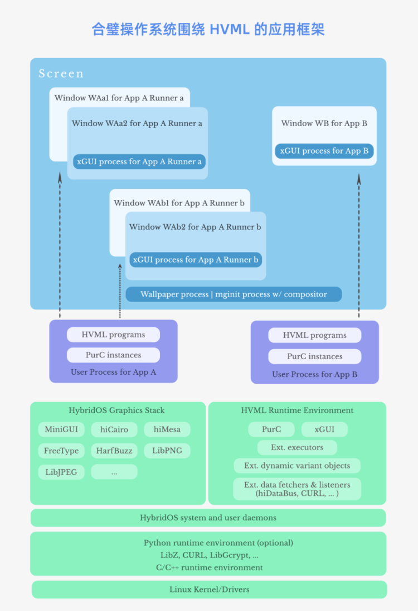
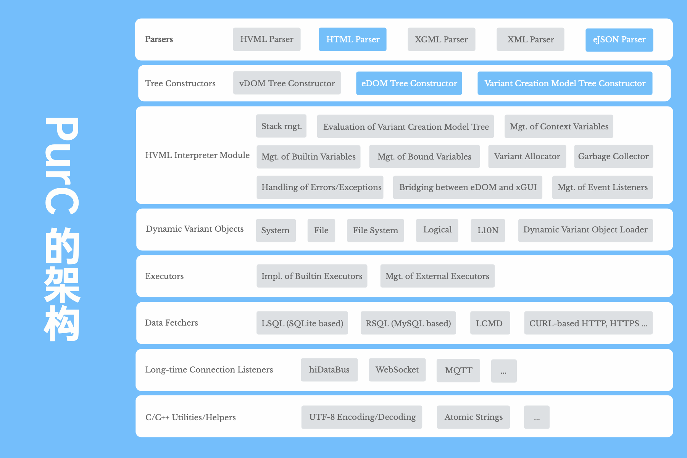

# HVML 开发月报（2021年08月）——兼谈 HVML 应用框架及解释器的架构设计

- 原创作者：魏永明
- 自媒体标题：（同标题）

__目录__

- [引言](#引言)
- [正文](#正文)
   + [基于 HVML 的应用框架](#基于-hvml-的应用框架)
   + [HVML 解释器 PurC 的架构](#hvml-解释器-purc-的架构)
   + [已完成工作内容](#已完成工作内容)
   + [下一步工作内容](#下一步工作内容)
   + [常见问题及解答](#常见问题及解答)
- [附：商标声明](#附商标声明)
- [原文链接](#原文链接)

## 引言

自笔者提出 HVML 编程语言并公开相关规范已一年有余。2021 年 7 月，我们成立了一个攻坚团队并正式开始了 HVML 解释器（PurC）的开发。从本月起，我们将通过”开源操作系统百家谈“公众号发表 HVML 的开发月报，向关注 HVML 的各位朋友汇报研发的进展情况。

第一次听说 HVML 的朋友，可以阅读如下文章以了解其背景：[《合璧操作系统的大胆技术突破：漫谈 HVML，它的由来和未来》](https://mp.weixin.qq.com/s/zOhWeY4mmwUwQvesQyIEgQ)。

## 正文

在笔者发表于 2018 年的[《三谈操作系统》](https://mp.weixin.qq.com/s/QyEopBBxm0QwLxHfFPC5RA)一文中提到，一个操作系统区别于其他操作系统最为重要的技术特征就是围绕某个特定编程语言形成的应用编程接口（API）。我将这个技术特征比喻为操作系统的基因。要设计一个全新的操作系统，就必须在某个编程语言基础上设计一套完备的、可扩展的、易用的应用编程接口，而 HVML 就是笔者为正在开发中的下一代操作系统——合璧操作系统——设计的全新编程语言。

一年前，笔者在虚拟 DOM 思想的基础上，设计了 HVML，并公开了 HVML 语言的技术规范文档和两项专利申请文档。经过若干次修订，HVML 语言规范的 1.0 版本呼之欲出，有兴趣的读者可以点击如下链接：

<https://gitlab.fmsoft.cn/hvml/hvml-docs/blob/master/zh/hvml-spec-v1.0-zh.md>

本文作为 HVML 开发月报的第一期，主要包括如下内容：

- 基于 HVML 的应用框架
- HVML 解释器 PurC 的架构设计
- 已完成的工作描述及下一步计划
- 常见问题及解答

为更好地理解笔者设计 HVML 的初衷以及 HVML 可能带来的变化或者变革，我们正在整理一份访谈稿，将在近期于本公众号发表，欢迎关注。如果读者有任何疑问，也欢迎在评论区留言。

### 基于 HVML 的应用框架

在传统的应用框架中，比如在嵌入式平台上使用 C 语言在 MiniGUI 平台上开发， 在 Windows 平台上使用 C++ 或 C# 语言开发，还是在 Linux 桌面上使用 C/C++ 语言采用 Gtk+/Qt 这类 Toolkit 函数库，抑或在 Android 上使用 Java 编程语言等等，其使用的应用框架无外乎直接使用 C、C++、Java、C# 等编程语言，借助某个 UI 工具库来创建界面，然后在事件循环中处理用户交互产生的各种事件。这就是传统的事件驱动模型。

但 HVML 提供了一个完全不一样的应用框架。

在完整的基于 HVML 的应用框架中，包含一个独立运行的图形用户界面渲染引擎，开发者通过撰写 HVML 程序来操控渲染引擎，而 HVML 程序在 HVML 解释器中运行，并可以和其他已有的编程语言运行时环境绑定起来，接收由其他编程语言程序生成的数据，并按照 HVML 程序的指令，将其转换为图形用户界面的描述信息或者变更信息。通过这样的设计，我们将所有涉及到图形用户界面的应用程序分开成两个松散的模块：

1. 一个和 GUI 无关的数据处理模块，开发者可以使用任何其熟悉的编程语言和开发工具开发这个模块。比如，涉及到人工智能处理时，开发者选择 Python；在 Python 代码中，除了装载 HVML 程序之外，开发者无需考虑任何和界面渲染及交互相关的东西，比如创建一个按钮或者点击一个菜单后完成某项工作等等，开发者只需要在 Python 代码中准备好渲染界面所需要的数据即可。

2. 一个或者多个使用 HVML 语言编写的程序（HVML 程序），用来完成对用户界面的操控。HVML 程序根据数据处理模块提供的数据生成用户界面的描述信息，并根据用户的交互或者从数据处理模块中获得的计算结果来更新用户界面，或者根据用户的交互驱动数据处理模块完成某些工作。

通过这样的设计，HVML 应用框架将操控 GUI 的代码从原先调用 C、C++、Java、C# 接口的模式中解放了出来，转而使用 HVML 代码来处理。而 HVML 使用类似 HTML 的描述式语言来操控 GUI 元素，通过隐藏大量细节，降低了直接使用低级编程语言操控 GUI 带来的复杂度。

在我们的 HVML 应用框架实现中，包括如下两个主要的组件：

1. 一个支持 CSS 3、可解析和渲染 XGML、HTML、SVG、MathML 标签语言的用户代理（亦即界面渲染器），名曰 `the X graphics user interface engine`，中文名`埃克斯图形用户界面引擎`，简称 `xGUI`。这个组件根据 HVML 解释器生成的文档或者文档的变化信息渲染文档内容，更新文档内容并和用户交互。

2. 一个基于 C/C++ 实现的 HVML 解释器，名曰 `Purring Cat`，中文名称`呼噜猫`，简称 `PurC`。这个组件加载并解析 HVML 程序，然后以特有的方式解释运行 HVML 程序，并生成使用 HTML、XGML、XML 等标签语言描述的文档或文档的变化信息，然后交由 HTML/XGML/XML 用户代理进行渲染。解释器同时监听来自用户代理的交互事件并进行处理。HVML 程序的执行路径，取决于应用的数据模块生成的数据和用户代理发送来的交互事件数据，也就是说，HVML 程序是数据驱动（data-driven）执行的。

下图以合壁操作系统为例，给出了基于 HVML 的应用框架两个主要组件和系统其他部分之间的关系。

  
_合璧操作系统围绕 HVML 的应用框架_

要点如下：

1. 任意一个基于 HVML 的合壁操作系统应用，可创建一个或多个行者（Runner），每个行者可创建一个 PurC 实例，每个 PurC 实例对应一个 HVML 会话，而每个会话中可创建一个或多个窗口，在这些窗口中渲染某个 HVML 程序生成的界面描述文档。每个 PurC 实例，或者每个 HVML 会话对应一个独立的 xGUI 进程。如图中所示 Window WAa1 和 Window WAb2，是 App A 的两个 PurC 实例创建的两个窗口。

2. 应用的用户进程，通过 PurC 执行 HVML 程序，并调用外部执行器，或使用外部定义的动态变体（variant）对象，或通过外部数据源获得数据。

需要说明的是，HVML 应用框架是跨平台的，可用于桌面应用（Linux、Windows、macOS）、智能手机应用（Android、iOS）以及嵌入式应用的开发。

### HVML 解释器 PurC 的架构

  
_HVML 解释器 PurC 的架构_

从以上架构框图可以看出，PurC 包括如下几个主要的功能模块：

1. 解析器。其中包含 HVML、HTML、XGML 等的解析器：
   - HVML 解析器。
   - HTML 解析器。
   - XGML 解析器。
   - XML 解析器。
   - eJSON 解析器。
2. 树构造器。其中包含各种树的构造器：
   - vDOM 树构造器。用于构造虚拟文档对象模型（vDOM）树。vDOM 树由 HVML 解析器生成。
   - eDOM 树构造器。用于构造有效文档对象模型（eDOM）树。eDOM 树由 HTML/XGML/XML 解析器生成。
   - 变体创建模型树构造器。用于构造变体创建模型（variant creation model，VCM）树。PurC 使用变体来表达 JSON 以及扩展 JSON 值，并使用变体创建模型树来描述一个动态变体值的构造过程。HVML 解析器、XGML 解析器以及 eJSON 解析器会调用变体创建模型树构造器来构造静态或动态变体值的创建模型树。
3. HVML 解释器模块。实现了沿 vDOM 描述的执行路径执行 HVML 程序的功能，其中包括：
   - 执行栈管理。
   - 变体创建模型树的求值。
   - 定时器管理。
   - 上下文变量管理。
   - 绑定变量管理。
   - 错误和异常处理。
   - 垃圾收集器。
   - 事件监听器的管理。
   - eDOM 和 xGUI 之间的桥梁通讯。
4. 动态变体对象管理，其中包括内置动态变体对象的实现。
   - `_SYSTEM`：系统功能。
   - `_MATH`：数学运算。
   - `_L`：逻辑运算。
   - `_T`：用于实现字符串的本地化替换。
   - `_STR`：用于字符串操作和格式化。
   - `_FS`：文件系统。
   - `_FILE`：文件读写操作。
5. 执行器模块。主要包括：
   - 内建执行器的管理。
   - 外部执行器的管理。
6. 数据获取器。主要包括：
   - LCMD Schema 实现。这是合璧操作系统在开发 hiWebKit 过程中提出的通过执行本地命令行获取数据的一个协议。
   - LSQL Schema 实现。这是合璧操作系统在开发 hiWebKit 过程中提出的通过执行 SQL 语句从本地数据库中获取查询结果的一个协议。
   - RSQL Schema 实现。这是合璧操作系统在开发 hiWebKit 过程中提出的通过执行 SQL 语句从远程数据库中获取查询结果的一个协议。
   - HTTP 等协议。
7. 长连接监听器。主要支持如下长连接协议：
   - hiDataBus。合璧操作系统提出的数据总线协议。
   - WebSocket。Web 套接字。
   - MQTT。物联网消息传输协议，实现了消息的订阅和发布功能。
8. C/C++ 工具和辅助函数。主要包括：
   - AVL 树、红黑树、等基础数据结构接口。
   - 变体构造和管理。
   - 抽象读写流接口。
   - UTF-8 编码处理。
   - 其他。

### 已完成工作内容

2021 年 7 月，在研发团队的努力下，我们完成了如下工作：

1. 基于 CMake 的构建系统。相关代码派生自 WebKit 开源项目。
1. 常用的 C 基础数据结构。如平衡二叉树（AVL）、键值列表（KVList）、基于红黑树的映射（map）等。
1. 一个抽象的读写流接口。可将固定内存区域、变长内存区域、文件、套接字等抽象为统一的流式读写对象。该流式读写对象，是 PurC 中各解析器和串行化接口使用的输入和输出对象。
1. 变体。用于表达数值、布尔值、字符串、数组、对象等的抽象数据结构，对应于我们熟知的 JSON 表达。但在 PurC 的实现中，我们额外增加了如下几种数据类型：
   - 有符号 64 位长整型。
   - 无符号 64 位长整型。
   - 长双精度浮点数。
   - 字节序列。用于容纳二进制数据。
   - 动态数值。用于实现 HVML 规范定义的动态 JSON 对象。
   - 原生对象。用于实现 HVML 规范定义的抽象数据结构，如打开的文件句柄。
   - 集合。类似数组的容器数据类型，但集合中每项数据均不同于其他数据，即每项元素的数值具有唯一性。
1. 变体创建模型树。变体创建模型树是对变体以及动态变体创建过程的一个抽象描述。
1. eJSON 解析器。eJSON 解析器解析 eJSON 并生成一个变体创建模型树。eJSON 是对 JSON 的一个扩展， 其要点有：
   - 允许较为随意的语法，如：
      + 当对象（object）的键名由 ASCII 字母打头，且仅包含 ASCII 字母、数字、减号、下划线时，可省略键名两边的引号。
      + 对象（object）中的最后一个键值对，数组（array）的最后一个单元之后，可包含逗号`,`。
   - 使用如下后缀来明确表示数值（number）的类型：
      + 有符号长整型（64 位）：`-34567890L`
      + 无符号长整型（64 位）：`-34567890UL`
      + 单精度浮点数：`-34567890F`
      + 双精度浮点数：`-34567890FL`
   - 增加字节序列类型，使用 `bx`、`bb`、`b64` 等前缀，分别表示十六进制表达、二进制表达和 Base64 编码。
   - 可使用 `"""` 定义多行文本字符串，且保留其中的空格、制表符（`\t`）、单引号（`'`）或者不连续出现三次的双引号（`"`）等，无需使用转义符号。
   - 键名、字符串，可使用单引号（`'`）或者双引号（`"`）包围，使用单引号时，字符串中的双引号不需要转义处理。
1. eDOM 树构造器。用于创建和管理 eDOM 树的模块。相关代码派生自开源项目 Lexbor。
1. HTML 解析器。解析 HTML 文档或者文档片段，构建 eDOM 树。相关代码派生自开源项目 Lexbor。
1. 以上模块的单元测试程序。尤其是：
   - 针对变体构造欧快的测试程序。
   - 针对 eJSON 解析器的近 400 条测试用例。
   - 针对 HTML 解析器的测试程序。

注：在上面的 PurC 架构框图中，已经完成的部分用绿色表示。

### 下一步工作内容

研发团队已经开始了 HVML 解析器以及 vDOM 构造器的开发，预计 2021 年 9 月初完成。

### 常见问题及解答

Q：在哪里可以看到 PurC 和 xGUI 的源代码。

A：PurC 和 xGUI 仍然处在开发状态，暂时不向公众开放其代码仓库。但您可以申请围观。

Q：未来会开源 PurC 和 xGUI 吗？

A：会的，而且我们会使用商业友好的宽松许可证（如 LGPL）发布 PurC 和 xGUI。

Q：我可以加入 PurC 或者 xGUI 的开发吗？

A：我们欢迎有能力的开发者以兼职形式加入 PurC 或者 xGUI 的开发，飞漫软件会为您的付出支付报酬。有意向的开发者，可通过本公众号后台留下联系方式，公众号小编会联系您。

Q：我是一名大学生，目前还没有足够的经验胜任编码工作，能否参与到项目的非编码工作中？

A：可以的。您可以参与到测试用例的编写当中，比如针对 eJSON 和 HTML 解析器的测试用例，或者一些示例程序等。

Q：如何赞助 HVML 相关的项目？

A：个人打赏性质的赞助，您可以点击文后的原文链接。大额的赞助，可通过本公众号后台留下联系方式，公众号小编会联系您。

Q：如何申请围观？

A：围观者可以获得内部设计文档以及代码仓库的只读访问权限，但要求对相关软件的设计以及编码提出建设性的意见或建议。如有兴趣，可通过本公众号后台留下联系方式，公众号小编会联系您。

## 附：商标声明

本文提到的产品、技术或者术语名称，涉及北京飞漫软件技术有限公司在中国或其他地区注册的如下商标：

1) 飛漫

2) FMSoft

3) 合璧

4) HybridOS

5) HybridRun

6) MiniGUI

6) xGUI

7) miniStudio

8) HVML

9) 呼噜猫

10) Purring Cat

11) PurC

## 原文链接

<https://store.fmsoft.cn/campaign/denoteoss-lt>

