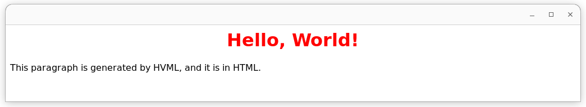

# 在 HVML 程序中嵌入 Python

2023 年 3 月，HVML 社区发布了 HVML 开源解释器 PurC 的 0.9.8 版本，其中增加了对 Python 的支持。

使用这一增强，我们可以非常方便地在 HVML 程序中调用 Python 模块，利用 Python 生态中的丰富软件包或模块开发自己的 HVML 应用。与此同时，由 HVML 提供的跨平台、统一 GUI/CLI 应用开发框架以及跨端运行的能力，将弥补 Python 生态和 Web 生态之间几十年来难以跨越的鸿沟，从而极大提升 Python 应用的表现力以及和用户交互的能力。

本文通过一个内嵌 Python 实现三维动画随机游走功能的 HVML 程序，介绍了这一增强的典型应用场景：科学计算可视化。

## 准备工作

截止目前，HVML 解释器 PurC 和图形渲染器 xGUI Pro 均支持在 Linux 或 macOS 桌面上运行。为执行本文提到的 Python 代码，需要提前安装好 Python 3.9+（Linux）或 Python 3.11+（macOS）运行时环境、开发时环境以及相关模块。

比如，在 Ubuntu Linux 20.04 或以上系统中，首先安装常用的开发工具（如 git、make 等），然后使用如下命令：

```console
$ sudo apt install python3 python3-pip python3-dev
$ sudo apt install libwebkit2gtk-4.0-dev
$ pip3 install numpy matplotlib
```

在 macOS 上，首先确保已安装 xCode 或者 xCode Command Line Tools，然后安装 macPorts。有关 macPorts 的安装，可访问 macPorts 官网：<https://www.macports.org>。

之后，在 macOS 的终端程序中，通过 macPorts 的 `port` 命令安装 Python 的运行时环境、开发时环境以及相关模块：

```console
$ sudo port install python311 py-pip
$ sudo port install webkit2-gtk-devel
$ sudo port install xorg-server
$ sudo pip3 install numpy matplotlib
```

目前，需要开发者自行编译 HVML 的解释器 PurC 和图形渲染器 xGUI Pro。在做好以上准备工作之后，请访问如下开源代码仓库获取源代码并根据其中的描述构建这两款软件：

- PurC：<https://github.com/HVML/PurC>
- xGUI Pro：<https://github.com/HVML/xGUI-Pro>

为构建上述软件，您可能还需要安装如下开发工具或函数库：

1. 跨平台构建系统生成器：CMake 3.15 或更高版本
1. 兼容 C11 和 CXX17 的编译器：GCC 8+ 或 Clang 6+
1. Zlib 1.2.0 或更高版本
1. Glib 2.44.0 或更高版本
1. BISON 3.0 或更高版本
1. FLEX 2.6.4 或更高版本
1. Ncurses 5.0 或更高版本（可选；`purc` 中的 Foil 渲染器需要此函数库）

请使用 Linux 发行版提供的包管理工具或者 macPorts 安装以上软件，并确保使用正确的版本。

下面是针对 macOS 系统的一些补充说明：

- HVML 解释器需要 Python 3.9 以上版本来支持和 Python 代码的互操作，而在 macOS 上通过 macPorts 安装 Python 3.11 的原因，主要是为了避免和 xCode Command Line Tools 中包含的 Python 3.9 相冲突。
- 在使用 macPorts 构建 PurC 和 xGUI Pro 时，一定要通过 CMake 的 `-DCMAKE_INSTALL_PREFIX=/opt/local` 选项指定 PurC 和 xGUI Pro 的安装前缀为 `/opt/local`；若使用默认的 `/usr/local` 安装前缀，会出现找不到头文件的情形。
- 在 macOS 上，如果不使用图形渲染器 xGUI Pro，而只使用 PurC 中内建的字符渲染器 Foil，也可以使用 Homebrew 系统来构建 PurC，而无需构建 xGUI Pro。但若要构建 xGUI Pro，则必须使用 macPorts。这主要是因为 Homebrew 未提供 WebKit2Gtk3 软件包。
- 在 macOS 上使用 macPorts 安装了 `xorg-server` 后，需要重新登录才能生效。
- 在 macOS 上编译 xGUI Pro 后，您需要手工在构建目录的 `lib/webext` 子目录下，创建一个后缀名为 `.so` 的符号链接指向构建好的 WebKit 扩展库：

```console
$ ln -s libWebExtensionHVML.so libWebExtensionHVML.dylib
```

## 快速了解 HVML

已经了解 HVML 特点的读者可以跳过本节。

HVML 和其他编程语言之间的主要差异，在于 HVML 使用了类似 HTML 的标记语言来定义一个程序，故而被称为“可编程标记语言”。

我们用 HVML 解释器 PurC 来运行这段 HVML 程序：

```hvml
<hvml target="html">

    $STREAM.stdout.writelines('Hello, world!')

    <body>
        <h1 style="color:red;text-align:center">Hello, World!</h1>
        <p>This paragraph is generated by HVML, and it is in HTML.</p>
    </body>
</hvml>
```

假定我们将上述这段程序保存为 `hello-world.hvml` 文件。如果我们不带任何参数在系统终端中运行 PurC 解释器的命令行程序 `purc`，则会获得如下结果：

```console
$ purc hello-world.hvml
Hello, world!
```

我们看到终端上只是多了一条输出：`Hello, world!`。你大概可以想象到，这条输出是由 `$STREAM.stdout.writelines('Hello, world!')` 这条语句产生的，如同我们在 Python 程序中调用 `print()` 函数。

而如果我们调用 `purc` 时使用 `-c thread` 选项，则会得到如下结果：

```console
$ purc -c thread hello-world.hvml
Hello, world!

                                Hello, World!

    This paragraph is generated by HVML, and it is in HTML.

```

显然，相比第一次执行，我们看到了更多的内容。在支持颜色的终端程序中，你可以看到 `Hello, World!` 是红色的，而且居中显示。很明显，这些内容本质上是由 HVML 程序中夹杂的 `h1`、`p` 等元素定义的内容。我们还使用了 CSS 样式来定义了 `h1` 元素的颜色（`color:red`）和文本居中对齐（`text-align:center`）。

和其他编程语言不同，HVML 将 `h1` 和 `p` 等元素视作动作执行，会将其内容插入到一个结构化的文档当中。而使用其他编程语言，我们可能需要通过特定的接口完成这些工作，比如在 Python 中使用类似 Jinja2 的模板引擎。

这说明了 HVML 的第一个重要特征：内建的结构化文档生成和操作能力。尽管在不使用 `-c thread` 选项时，我们看不到文档，但仍然可以通过 `-v` 选项让 `purc` 输出对应的文档结构：

```console
$ purc -v hello-world.hvml
purc 0.9.8
Copyright (C) 2022, 2023 FMSoft Technologies.
License GPLv3+: GNU GPL version 3 or later <http://gnu.org/licenses/gpl.html>
This is free software: you are free to change and redistribute it.
There is NO WARRANTY, to the extent permitted by law.

Executing HVML program from `file:///srv/devel/hvml/purc/build/hello-world.hvml`...
Hello, world!

The main coroutine exited.
>> The document generated:

<html>
  <head>
  </head>
  <body>
    <h1 style="color:red;text-align:center">Hello, World!
    </h1>
    <p>This paragraph is generated by HVML, and it is in HTML.
    </p>
  </body>
</html>

>> The executed result:
14
```

以上的例子同时说明了 HVML 的第二个重要特征：解释器和渲染器分离。

当我们在执行 `purc` 命令时不使用 `-c thread` 选项，就会默认使用一个称为 `headless` 的渲染器。顾名思义，这个渲染器会丢弃任何程序生成的文档内容。因此，我们看不到 `h1`、`p` 等元素定义的内容，而只能看到使用 `$STREAM.stdout.writelines()` 方法输出到终端上的内容。当我们使用 `-c thread` 选项执行 `purc` 命令时，将会使用内建于 `purc` 的一个字符渲染器，名叫 `Foil`（取“二向箔”之意）。和网页浏览器的工作原理类似，Foil 渲染器将解析这个 HVML 程序生成的 HTML 文档，并根据 CSS 样式信息格式化其中的内容。

你一定能想到，如果我们使用本文一开始提到的 xGUI Pro 图形渲染器，则可以在图形窗口中看到上述文档的内容。事实的确如此。启动 xGUI Pro，并在执行 `purc` 时将 `-c thread` 选项更换成 `-c socekt` 选项，便可以在窗口中看到以上内容。但是，因为这个程序在输出了文档后立即退出，所以窗口会一闪而过。因此，我们还需要做一些额外的工作，在其中添加一些代码。

```hvml
<hvml target="html">

    $STREAM.stdout.writelines('Hello, world!')

    <body>
        <h1 style="color:red;text-align:center">Hello, World!</h1>
        <p>This paragraph is generated by HVML, and it is in HTML.</p>

        <test with $L.streq('caseless', $RDR.state.comm, 'socket') >
            <observe on $CRTN for 'rdrState:pageClosed'>
                <exit with "User Closed" />
            </observe>
        </test>
    </body>
</hvml>
```

之后我们首先启动 xGUI Pro：

```console
$ xguipro
```

然后切换到另一个终端上使用 `-c socket` 执行 `purc` 命令：

```console
$ purc -c socket hello-world.hvml
Hello, world!
```

该命令将创建一个窗口，其中图形化展示上述的代码生成的内容。见下图。



当我们关闭该窗口后，上述 `purc` 命令才会退出。而如果我们使用 `-c thread` 选项执行上述 HVML 程序，则执行效果和之前一样：程序会立即退出。显然，我们新增的如下代码起了作用：

```hvml
        <test with $L.streq('caseless', $RDR.state.comm, 'socket') >
            <observe on $CRTN for 'rdrState:pageClosed'>
                <exit with "User Closed" />
            </observe>
        </test>
```

和 `h1` 和 `p` 等元素不同，新增的代码使用 `test`、`observe` 和 `exit` 这三个英文动词单词定义的元素，我们称之为“动作元素”。顾名思义，动作元素定义程序的动作。比如 `test` 定义一个测试，而其中的属性 `with` 指定了用于测试的条件。类似地，`observe` 定义了一个观察（监听器），该监听器在数据 `$CTRN` 上监听 `rdrState:pageClosed` 事件，并在该事件到达时执行 `exit` 定义的动作，即退出该程序。

读者很容易想到，上面的代码中的 `$L`、`$RDR`、`$CRTN` 等使用前缀 `$` 的词元，表示一个变量。而习惯上使用全大写字母的变量，是系统定义的变量。这三个变量分别表示专门用于逻辑运算的对象、当前连接的渲染器以及当前执行的协程。在上面的代码中，通过访问 `$RDR.state`，我们可以获得当前渲染器的状态信息，而其上的 `comm` 属性，表示当前 HVML 程序和渲染器的通讯方法，对应的便是 `purc` 命令行中 `-c` 选项指定的 `thread` 或者 `socket`。

因此，以上新增代码的作用是：若当前渲染器的通讯方式为 `socket`，则监听当前协程的 `rdrState:pageClosed` 事件，当获得该事件时，终止当前协程的执行。

这给出了 HVML 的第三个重要特征：事件驱动。

除了以上三个重要特征之外，HVML 还针对模板处理、多协程、并发等现代编程技术提供了支持。更多详情，可参阅如下文章：

- [漫谈 HVML，它的由来和未来](a-brief-introduction-to-hvml-zh.md)
- [30 分钟学会 HVML 编程](learn-hvml-programming-in-30-minutes-zh.md)

## 可装载动态对象 PY

在 PurC 0.9.8 版本中，对 Python 的支持被实现为 HVML 的一个外部动态变体对象 `$PY`，利用该对象提供的功能，我们可以在 HVML 程序中完成如下功能：

1. 装载指定的 Python 模块并可在其上访问或调用已装载模块提供的子模块、属性或函数。
1. 执行一段 Python 代码、一个 Python 脚本或者一个指定的模块，并获得结果。
1. 编译一段 Python 代码，之后可在编译后的 Python 代码对象上，在不同的上下文环境中对其进行求值并获得求值结果。
1. 可将 HVML 字符串、数组、元组、集合、对象等数据转换为 Python 的内部对象，然后在其上执行这些 Python 内部对象支持的方法，或使用这些对象调用其他 Python 模块或函数。
1. 将 Python 内部对象转换为对应的 HVML 数据，或者获取对应的字符串表达。

## 示例程序：计算圆周率

HVML 的解释器和渲染器分离设计，为我们的 GUI/CLI 设计带来非常多的便利。一方面，如内建的 Foil 字符渲染器和 xGUI Pro 图形渲染器表现的那样，我们可以通过 HVML 统一 CLI（命令行交互）和 GUI（图形用户交互）的开发，也就是说，今后在开发命令行程序时，也可以使用 HTML、CSS 等 Web 技术来表现内容并完成和用户的交互。另一方面，我们可以将渲染器运行在远程设备上，从而获得让一个应用程序跨端（cross-end）执行的能力。

## 示例程序：三维随机游走

### 原始 Python 程序及其功能

<https://matplotlib.org/stable/gallery/animation/random_walk.html#sphx-glr-gallery-animation-random-walk-py>

```python
import numpy as np
import matplotlib.pyplot as plt
import matplotlib.animation as animation

# Fixing random state for reproducibility
np.random.seed(19680801)


def random_walk(num_steps, max_step=0.05):
    """Return a 3D random walk as (num_steps, 3) array."""
    start_pos = np.random.random(3)
    steps = np.random.uniform(-max_step, max_step, size=(num_steps, 3))
    walk = start_pos + np.cumsum(steps, axis=0)
    return walk


def update_lines(num, walks, lines):
    for line, walk in zip(lines, walks):
        # NOTE: there is no .set_data() for 3 dim data...
        line.set_data(walk[:num, :2].T)
        line.set_3d_properties(walk[:num, 2])
    return lines


# Data: 40 random walks as (num_steps, 3) arrays
num_steps = 30
walks = [random_walk(num_steps) for index in range(40)]

# Attaching 3D axis to the figure
fig = plt.figure()
ax = fig.add_subplot(projection="3d")

# Create lines initially without data
lines = [ax.plot([], [], [])[0] for _ in walks]

# Setting the axes properties
ax.set(xlim3d=(0, 1), xlabel='X')
ax.set(ylim3d=(0, 1), ylabel='Y')
ax.set(zlim3d=(0, 1), zlabel='Z')

# Creating the Animation object
ani = animation.FuncAnimation(
    fig, update_lines, num_steps, fargs=(walks, lines), interval=100)

plt.show()
```

### 改造 Python 代码并内嵌到 HVML 程序中

### 动画和交互

### 完整代码

```hvml
<!DOCTYPE hvml SYSTEM "f: PY">
<hvml target="html">
    <head>
        <title>Embedded Python in HVML: Animated 3D Random Walk</title>

        <!-- import the Bootstrap assets built in the renderer -->
        <link rel="stylesheet" href="//localhost/_renderer/_builtin/-/assets/bootstrap-5.1.3-dist/css/bootstrap.min.css" />
        <link rel="stylesheet" href="//localhost/_renderer/_builtin/-/assets/bootstrap-icons-1.8.3/bootstrap-icons.css" />

        <update on $TIMERS to 'unite'>
            [
                { "id" : "clock", "interval" : 100, "active" : "yes" },
            ]
        </update>
    </head>

    <body>
        <init as 'pyCode'>
'''
import numpy as np
import matplotlib.pyplot as plt

# Fixing random state for reproducibility
np.random.seed(myseed)

def random_walk(num_steps, max_step=0.05):
    """Return a 3D random walk as (num_steps, 3) array."""
    start_pos = np.random.random(3)
    steps = np.random.uniform(-max_step, max_step, size=(num_steps, 3))
    walk = start_pos + np.cumsum(steps, axis=0)
    return walk

def update_lines(num, walks, lines):
    for line, walk in zip(lines, walks):
        # NOTE: there is no .set_data() for 3 dim data...
        line.set_data(walk[:num, :2].T)
        line.set_3d_properties(walk[:num, 2])

def update_walks(num_steps):
    np.random.seed(myseed)
    return [random_walk(num_steps) for index in range(40)]

# Data: 40 random walks as (num_steps, 3) arrays
num_steps = 30
walks = update_walks(num_steps)

# Attaching 3D axis to the figure
fig = plt.figure()
ax = fig.add_subplot(projection="3d")

# Create lines initially without data
lines = [ax.plot([], [], [])[0] for _ in walks]

# Setting the axes properties
ax.set(xlim3d=(0, 1), xlabel='X')
ax.set(ylim3d=(0, 1), ylabel='Y')
ax.set(zlim3d=(0, 1), zlabel='Z')
'''
        </init>

        <choose on true  >
            {{
                 $PY.global(! 'myseed', $SYS.time );
                 $PY.run($pyCode, 'source')
            }}
            <catch for `ExternalFailure`>
                <exit with "A Python exception raised: $PY.except" />
            </catch>
        </choose>

        <div class="px-4 my-5 border-bottom">
            <div class="text-center">
                <h1>Embeding Python in HVML: Animated 3D Random Walk<br/>
                <small class="text-muted">Powered by NumPy and Matplotlib</small></h1>
            </div>
        </div>

        <div class="container" id='myNS'>
            <div class="border border-3 pt-3 pb-3">

                <div class="col" >
                    <div class="text-center">
                        
                    </div>

                    <init as 'step' at '#myNS' with 0L />
                    <observe on $TIMERS for 'expired:clock'>
                        <inherit>
                            {{
                                    $STREAM.stdout.writelines("Going to handle Frame {$step}...");
                                    $PY.global.update_lines($step, $PY.global.walks, $PY.global.lines);
                                    $PY.global.fig.canvas.draw_idle();
                                    $PY.global.fig.savefig("frame-{$step}.svg");
                                    $STREAM.stdout.writelines("File frame-{$step}.svg generated")
                            }}
                        </inherit>

                        <update on '#theFigure' at 'attr.src' with "hvml://localhost/_system/_filesystem/-$SYS.cwd/frame-{$step}.svg?once=yes" />
                        <init as 'step' at '#myNS' with $DATA.arith('+', $step, 1) />
                        <test with $L.gt($step, 30) >
                            <update on $TIMERS to 'subtract' with = [{ id : 'clock' }] />
                        </test>
                    </observe>

                    <catch for `ExternalFailure`>
                        <p>A Python exception raised: $PY.except</p>
                    </catch>
                </div>

                <div class="col">
                    <div class="d-grid gap-2 col-10 mx-auto">
                        <button class="btn btn-outline-primary btn-for-input" id="runAgain" value="Run again" hvml-events="click" type="button">Run Again</button>
                    </div>
                </div>

                <observe on '#runAgain' for 'click'>
                    <inherit>
                        {{
                            $PY.global.update_walks($DATA.arith('*', $step, 2))
                        }}
                    </inherit>
                    <init as 'step' at '#myNS' with 0L />
                    <update on $TIMERS to 'unite' with [{ "id" : "clock", "interval" : 100, "active" : "yes" }] />
                </observe>
            </div>
        </div>

        <div class="container">
            <footer class="d-flex flex-wrap justify-content-between align-items-center py-3 my-4 border-top">
                <div class="col-md-4 d-flex align-items-center">
                    <a href="https://hvml.fmsoft.cn" class="mb-3 me-2 mb-md-0 text-muted text-decoration-none lh-1">
                        
                    </a>
                    <span class="mb-3 mb-md-0 text-muted">© 2023 HVML Community</span>
                </div>

                <ul class="nav col-md-4 justify-content-end list-unstyled d-flex">
                    <li class="ms-3"><a class="text-muted" href="https://github.com/HVML"><i class="bi bi-github"></i></a></li>
                    <li class="ms-3"><a class="text-muted" href="https://store.fmsoft.cn/campaign/denoteoss-lt"><i class="bi bi-coin"></i></a></li>
                    <li class="ms-3"><a class="text-muted" href="mailto:hvml@fmsoft.cn"><i class="bi bi-envelope-heart-fill"></i></a></li>
                </ul>
            </footer>
        </div>
        <observe on $CRTN for "rdrState:pageClosed">
            <exit with 'Ok' />
        </observe>
    </body>
</hvml>
```

## 结语

