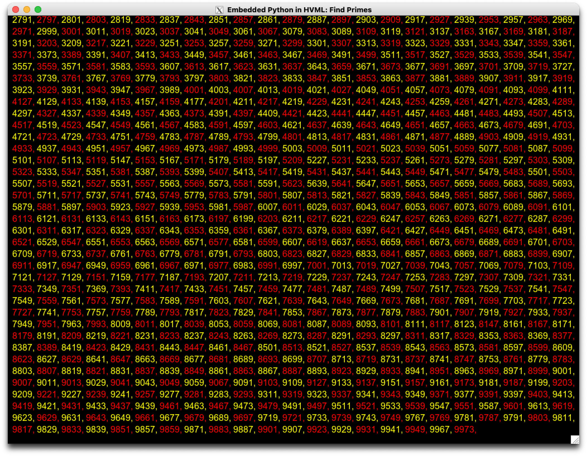

# 在 HVML 程序中嵌入 Python

- 作者：魏永明
- 日期：2023 年 3 月

**目录**

[//]:# (START OF TOC)

- [准备工作](#准备工作)
- [快速了解 HVML](#快速了解-hvml)
- [可装载动态对象 PY](#可装载动态对象-py)
- [示例程序：寻找素数](#示例程序寻找素数)
- [示例程序：三维随机游走](#示例程序三维随机游走)
- [结语](#结语)

[//]:# (END OF TOC)
2023 年 3 月，HVML 社区发布了 HVML 开源解释器 PurC 的 0.9.8 版本，其中增加了对 Python 的支持。

使用这一增强，我们可以非常方便地在 HVML 程序中调用 Python 模块，利用 Python 生态中的丰富软件包或模块开发自己的 HVML 应用。与此同时，由 HVML 提供的跨平台、统一 GUI/CLI 应用开发框架以及跨端运行的能力，将弥补 Python 生态和 Web 生态之间几十年来难以跨越的鸿沟，从而极大提升 Python 应用的表现力以及和用户交互的能力。

本文通过一个内嵌 Python 实现三维动画随机游走功能的 HVML 程序，介绍了这一增强的典型应用场景：科学计算可视化。

## 准备工作

截止目前，HVML 解释器 PurC 和图形渲染器 xGUI Pro 均支持在 Linux 或 macOS 桌面上运行。为执行本文提到的 Python 代码，需要提前安装好 Python 3.9+（Linux）或 Python 3.11+（macOS）运行时环境、开发时环境以及相关模块。

比如，在 Ubuntu Linux 20.04 或以上系统中，首先安装常用的开发工具（如 git、make 等），然后使用如下命令：

```console
$ sudo apt install python3 python3-pip python3-dev
$ sudo apt install libwebkit2gtk-4.0-dev
$ pip3 install numpy matplotlib
```

在 macOS 上，首先确保已安装 xCode 或者 xCode Command Line Tools，然后安装 macPorts。有关 macPorts 的安装，可访问 macPorts 官网：<https://www.macports.org>。

之后，在 macOS 的终端程序中，通过 macPorts 的 `port` 命令安装 Python 的运行时环境、开发时环境以及相关模块：

```console
$ sudo port install python311 py-pip
$ sudo port install webkit2-gtk-devel
$ sudo port install xorg-server
$ sudo pip3 install numpy matplotlib
```

目前，需要开发者自行编译 HVML 的解释器 PurC 和图形渲染器 xGUI Pro。在做好以上准备工作之后，请访问如下开源代码仓库获取源代码并根据其中的描述构建这两款软件：

- PurC：<https://github.com/HVML/PurC>
- xGUI Pro：<https://github.com/HVML/xGUI-Pro>

为构建上述软件，您可能还需要安装如下开发工具或函数库：

1. 跨平台构建系统生成器：CMake 3.15 或更高版本
1. 兼容 C11 和 CXX17 的编译器：GCC 8+ 或 Clang 6+
1. Zlib 1.2.0 或更高版本
1. Glib 2.44.0 或更高版本
1. BISON 3.0 或更高版本
1. FLEX 2.6.4 或更高版本
1. Ncurses 5.0 或更高版本（可选；`purc` 中的 Foil 渲染器需要此函数库）

请使用 Linux 发行版提供的包管理工具或者 macPorts 安装以上软件，并确保使用正确的版本。

下面是针对 macOS 系统的一些补充说明：

- HVML 解释器需要 Python 3.9 以上版本来支持和 Python 代码的互操作，而在 macOS 上通过 macPorts 安装 Python 3.11 的原因，主要是为了避免和 xCode Command Line Tools 中包含的 Python 3.9 相冲突。
- 在使用 macPorts 构建 PurC 和 xGUI Pro 时，一定要通过 CMake 的 `-DCMAKE_INSTALL_PREFIX=/opt/local` 选项指定 PurC 和 xGUI Pro 的安装前缀为 `/opt/local`；若使用默认的 `/usr/local` 安装前缀，会出现找不到头文件的情形。
- 在 macOS 上，如果不使用图形渲染器 xGUI Pro，而只使用 PurC 中内建的字符渲染器 Foil，也可以使用 Homebrew 系统来构建 PurC，而无需构建 xGUI Pro。但若要构建 xGUI Pro，则必须使用 macPorts。这主要是因为 Homebrew 未提供 WebKit2Gtk3 软件包。
- 在 macOS 上使用 macPorts 安装了 `xorg-server` 后，需要重新登录才能生效。
- 在 macOS 上编译 xGUI Pro 后，您需要手工在构建目录的 `lib/webext` 子目录下，创建一个后缀名为 `.so` 的符号链接指向构建好的 WebKit 扩展库：

```console
$ ln -s libWebExtensionHVML.so libWebExtensionHVML.dylib
```

## 快速了解 HVML

已经了解 HVML 特点的读者可以跳过本节。

HVML 和其他编程语言之间的主要差异，在于 HVML 使用了类似 HTML 的标记语言来定义一个程序，故而被称为“可编程标记语言”。

我们用 HVML 解释器 PurC 来运行这段 HVML 程序：

```hvml
<hvml target="html">

    $STREAM.stdout.writelines('Hello, world!')

    <body>
        <h1 style="color:red;text-align:center">Hello, World!</h1>
        <p>This paragraph is generated by HVML, and it is in HTML.</p>
    </body>
</hvml>
```

假定我们将上述这段程序保存为 `hello-world.hvml` 文件。如果我们不带任何参数在系统终端中运行 PurC 解释器的命令行程序 `purc`，则会获得如下结果：

```console
$ purc hello-world.hvml
Hello, world!
```

我们看到终端上只是多了一条输出：`Hello, world!`。你大概可以想象到，这条输出是由 `$STREAM.stdout.writelines('Hello, world!')` 这条语句产生的，如同我们在 Python 程序中调用 `print()` 函数。

而如果我们调用 `purc` 时使用 `-c thread` 选项，则会得到如下结果：

```console
$ purc -c thread hello-world.hvml
Hello, world!

                                Hello, World!

    This paragraph is generated by HVML, and it is in HTML.

```

在笔者的 Linux 系统上，效果如下图所示：


显然，相比第一次执行，我们看到了更多的内容。在支持颜色的终端程序中，你可以看到 `Hello, World!` 是红色的，而且居中显示。很明显，这些内容本质上是由 HVML 程序中夹杂的 `h1`、`p` 等元素定义的内容。我们还使用了 CSS 样式来定义了 `h1` 元素的颜色（`color:red`）和文本居中对齐（`text-align:center`）。

和其他编程语言不同，HVML 将 `h1` 和 `p` 等元素视作动作执行，会将其内容插入到一个结构化的文档当中。而使用其他编程语言，我们可能需要通过特定的接口完成这些工作，比如在 Python 中使用类似 Jinja2 的模板引擎。

这说明了 HVML 的第一个重要特征：内建的结构化文档生成和操作能力。尽管在不使用 `-c thread` 选项时，我们看不到文档，但仍然可以通过 `-v` 选项让 `purc` 输出对应的文档结构：

```console
$ purc -v hello-world.hvml
purc 0.9.8
Copyright (C) 2022, 2023 FMSoft Technologies.
License GPLv3+: GNU GPL version 3 or later <http://gnu.org/licenses/gpl.html>
This is free software: you are free to change and redistribute it.
There is NO WARRANTY, to the extent permitted by law.

Executing HVML program from `file:///srv/devel/hvml/purc/build/hello-world.hvml`...
Hello, world!

The main coroutine exited.
>> The document generated:

<html>
  <head>
  </head>
  <body>
    <h1 style="color:red;text-align:center">Hello, World!
    </h1>
    <p>This paragraph is generated by HVML, and it is in HTML.
    </p>
  </body>
</html>

>> The executed result:
14
```

以上的例子同时说明了 HVML 的第二个重要特征：解释器和渲染器分离。

当我们在执行 `purc` 命令时不使用 `-c thread` 选项，就会默认使用一个称为 `headless` 的渲染器。顾名思义，这个渲染器会丢弃任何程序生成的文档内容。因此，我们看不到 `h1`、`p` 等元素定义的内容，而只能看到使用 `$STREAM.stdout.writelines()` 方法输出到终端上的内容。当我们使用 `-c thread` 选项执行 `purc` 命令时，将会使用内建于 `purc` 的一个字符渲染器，名叫 `Foil`（取“二向箔”之意）。和网页浏览器的工作原理类似，Foil 渲染器将解析这个 HVML 程序生成的 HTML 文档，并根据 CSS 样式信息格式化其中的内容。

你一定能想到，如果我们使用本文一开始提到的 xGUI Pro 图形渲染器，则可以在图形窗口中看到上述文档的内容。事实的确如此。启动 xGUI Pro，并在执行 `purc` 时将 `-c thread` 选项更换成 `-c socekt` 选项，便可以在窗口中看到以上内容。但是，因为这个程序在输出了文档后立即退出，所以窗口会一闪而过。因此，我们还需要做一些额外的工作，在其中添加一些代码。

```hvml
<hvml target="html">

    $STREAM.stdout.writelines('Hello, world!')

    <body>
        <h1 style="color:red;text-align:center">Hello, World!</h1>
        <p>This paragraph is generated by HVML, and it is in HTML.</p>

        <test with $L.streq('caseless', $RDR.state.comm, 'socket') >
            <observe on $CRTN for 'rdrState:pageClosed'>
                <exit with "User Closed" />
            </observe>
        </test>
    </body>
</hvml>
```

之后我们首先启动 xGUI Pro：

```console
$ xguipro
```

然后切换到另一个终端上使用 `-c socket` 执行 `purc` 命令：

```console
$ purc -c socket hello-world.hvml
Hello, world!
```

该命令将创建一个窗口，其中图形化展示上述的代码生成的内容。见下图。


当我们关闭该窗口后，上述 `purc` 命令才会退出。而如果我们使用 `-c thread` 选项执行上述 HVML 程序，则执行效果和之前一样：程序会立即退出。显然，我们新增的如下代码起了作用：

```hvml
        <test with $L.streq('caseless', $RDR.state.comm, 'socket') >
            <observe on $CRTN for 'rdrState:pageClosed'>
                <exit with "User Closed" />
            </observe>
        </test>
```

和 `h1` 和 `p` 等元素不同，新增的代码使用 `test`、`observe` 和 `exit` 这三个英文动词单词定义的元素，我们称之为“动作元素”。顾名思义，动作元素定义程序的动作。比如 `test` 定义一个测试，而其中的属性 `with` 指定了用于测试的条件。类似地，`observe` 定义了一个观察（监听器），该监听器在数据 `$CTRN` 上监听 `rdrState:pageClosed` 事件，并在该事件到达时执行 `exit` 定义的动作，即退出该程序。

读者很容易想到，上面的代码中的 `$L`、`$RDR`、`$CRTN` 等使用前缀 `$` 的词元，表示一个变量。而习惯上使用全大写字母的变量，是系统定义的变量。这三个变量分别表示专门用于逻辑运算的对象、当前连接的渲染器以及当前执行的协程。在上面的代码中，通过访问 `$RDR.state`，我们可以获得当前渲染器的状态信息，而其上的 `comm` 属性，表示当前 HVML 程序和渲染器的通讯方法，对应的便是 `purc` 命令行中 `-c` 选项指定的 `thread` 或者 `socket`。

因此，以上新增代码的作用是：若当前渲染器的通讯方式为 `socket`，则监听当前协程的 `rdrState:pageClosed` 事件，当获得该事件时，终止当前协程的执行。

这给出了 HVML 的第三个重要特征：事件驱动。

除了以上三个重要特征之外，HVML 还对复合求值表达式、模板定义和置换、异常处理、多协程、并发等现代编程技术提供了支持。更多详情，可参阅如下文章：

- [漫谈 HVML，它的由来和未来](a-brief-introduction-to-hvml-zh.md)
- [30 分钟学会 HVML 编程](learn-hvml-programming-in-30-minutes-zh.md)

## 可装载动态对象 PY

在 PurC 0.9.8 版本中，对 Python 的支持被实现为 HVML 的一个外部动态变体对象 `$PY`，利用该对象提供的功能，我们可以在 HVML 程序中完成如下功能：

1. 使用 `$PY.import()` 方法，可装载指定的 Python 模块并可在其上访问或调用已装载模块提供的子模块、属性或函数。
1. 使用 `$PY.run()` 方法，可执行一段 Python 代码、一个 Python 脚本或者一个指定的模块，并获得结果。
1. 使用 `$PY.compile()` 方法，可编译一段 Python 代码，之后可在编译得到的 Python 代码对象上，在不同的上下文环境中对其进行求值并获得求值结果。
1. 使用 `$PY.pythonize()` 方法，可将 HVML 字符串、数组、元组、集合、对象等数据转换为 Python 的内部对象，然后在其上执行这些 Python 内部对象支持的方法，或使用这些对象调用其他 Python 模块或函数。
1. 使用 `$PY.stringify()` 方法，可将 Python 内部对象转换为对应的 HVML 数据，或者获取对应的字符串表达，其作用类似 Python 的 `str()` 函数。
1. 使用 `$PY.global` 属性，可通过其获取器或者设置器访问 Python 内置 `__main__` 模块的全局变量。
1. 使用 `$PY.local` 属性，可通过其获取器或者设置器访问 Python 内置 `__main__` 模块的局部变量。注意，局部变量名字空间将优先于全局变量。

下面我们使用一些 HVML 的复合混合求值表达式（Compound Hybrid Evaluating Expression，CHEE）来说明 `$PY` 的用法。

```hee
{{
    $PY.import('math');
    $PY.math.pow(2, 3)
}}
```

以上 CHEE 首先导入了 `math` 模块，然后调用了 `math` 模块的 `pow` 函数，其结果为 8。

```hee
{{
    $PY.import('datetime', ['datetime:dt', 'timedelta:td']);
    $PY.stringify($PY.dt.fromtimestamp(1429417200.0))
}}
```

以上 CHEE 的第一条语句从 `datetime` 包中导入了子模块 `datetime` 和 `timedelta`，并分别命名为 `dt` 和 `td`。这条语句和 Python 的如下语句等价：

```python
from datetime import datetime as dt, timedelta as td
```

以上 CHEE 的第二条语句根据给定的时间戳构造了一个 `datetime` 对象，然后在对象上使用 `$PY.stringify` 函数将其字符串化，其结果应该是：'2015-04-19 12:20:00'。

```hee
{{
    $PY.local.x(! [1, 2, 2, 3] );
    $PY.local.x.reverse();
    $PY.local.x()()
}}
```

以上 CHEE 的第一条语句使用一个数组设置了一个名为 `x` 的局部变量，之后在其上调用了 Python 的针对 List 的 `reverse()` 方法，然后使用 `$PY.local.x()()` 这一用法调用了 `x` 本身的获取器，这将返回 Python List 对象对应的 HVML 数据。因此，上述 CHEE 的执行结果是 [3, 2, 2, 1]。注意，`$PY.local.x()` 返回的是一个代表 Python 复杂对象的 HVML 原生实体（native entity），在这个原生实体上再次调用其默认获取器，即 `$PY.local.x()()`，会执行数据类型的转换，将 Python 的 Unicode 字符串、字节数组（bytes 或 byte array）、列表（List）、字典（dictionary）、集合（set）构建为对应的 HVML 数据类型，分别是字符串（string）、字节序列（byte sequence）、数组（array）、对象（array）和一般性集合（generic set）。如果不做此类转换，这些 Python 对象在 HVML 中以原生实体动态对象的方式表达。而 Python 中的 None、True、False、整数和浮点数，则不做此类处理，直接等价于 HVML 的 null、true、false、longint 和 number 数据类型。对无法执行转换的情形，比如一个自定义的 Python 类对象，在其上执行默认的获取器，将等价于在其上调用 Python 的 `str()` 函数。

```hee
{{
    $PY.run('x = pow(2, 3)');
    $PY.global.x;
}}
```

以上 CHEE 的第一条语句执行了一段 Python 代码，该代码将 `pow(2, 3)` 的结果赋给了全局变量 `x`。在 HVML 程序中，我们可以使用 `$PY` 的 `global` 属性访问全局变量。故而上述 CHEE 的求值结果就是 Python 中全局变量 `x` 的值：8。

显然，通过 `$PY` 变量构造我们期望的混合求值表达式，将其用于 HVML 元素的属性值或者动作元素的内容，即可非常方便地将 Python 代码嵌入到 HVML 中，从而充分利用 Python 生态中丰富的模块及其功能。

在查看内嵌 Python 的 HVML 程序之前，我们再来看看 Python 异常的处理。在执行 Python 代码或者调用 CPython 提供的接口时出现异常，HVML 会统一报告 `ExternalFailure` 异常，进一步的 Python 异常名称则由 `$PY.except` 给出。如下例所示：

```hee
{{
    $PY.run('2 / 0');
    $PY.except
}}
```

上面的 CHEE 首先运行 Python 命令 `2 / 0`，这会抛出异常。如果我们捕获了该异常，然后再访问 `$PY.except`，将得到字符串：`ZeroDivisionError`。这是 Python 的标准错误名称。

## 示例程序：寻找素数

这一小节给出一个寻找素数的 HVML 程序，该程序使用了 Python 编写的一个函数：

```python
def find_next_prime(start):
    if start < 2:
        start = 2

    while True:
        start += 1
        for j in range(2, start + 1):
            if start % j == 0:
                break
        if j == start:
            return start
```

该函数名为 `find_next_prim`，如其名称所暗示，该函数返回比给定的参数大的第一个素数。比如，我们传入 2，将返回 3，而传入 5 将返回 7。

现在，我们尝试将该函数内嵌到 HVML 中，并使用 HTML 的 `ul` 和 `li` 元素列出调用上述 Python 函数获得的小于 200 的所有素数。代码如下，请注意其中的注释。

```hvml
<!--
    由于 $PY 被实现为一个可装载的动态对象，故而需要使用 DOCTYPE 的
    SYSTEM 标识符装载该动态对象并将其绑定到 PY 变量上。
-->
<!DOCTYPE hvml SYSTEM "f: PY">
<hvml target="html">
    <head>
        <title>Embedded Python in HVML: Find Primes</title>
    </head>

    <body>
        <!--
            init 定义使用其内容，用 HVML ''' 语法定义了一个原样保留的字符串，
            并绑定到 pyCode 变量上。
            注意，我们也可以使用 init 元素的 from 属性，从指定的文件中初始化
            pyCode 变量的内容，从而无需硬编码这段 Python 函数内容到 HVML 程序中。
        -->
        <init as 'pyCode'>
'''
def find_next_prime(start):
    if start < 2:
        start = 2

    while True:
        start += 1
        for j in range(2, start + 1):
            if start % j == 0:
                break
        if j == start:
            return start
'''
        </init>

        <!--
            我们利用 `inherit` 动作元素的内容执行了一条混合求值表达式。
            该表达式执行 pyCode 变量中包含的 Python 代码。
            注意，我们可以可以直接执行 Python 文件中的代码：

                $PY.run('<the Python script file name>', 'file')
        -->
        <inherit>
            {{ $PY.run($pyCode, 'source') }}

            <!--
                我们利用 `catch` 动作元素捕获在执行上述 Python 代码时可能出现的异常。
            -->
            <catch for `ExternalFailure`>
                <exit with "A Python exception raised: $PY.except" />
            </catch>
        </inherit>

        <h1>Embeding Python in HVML: Find Primes</h1>

        <ul>
            <!--
                这里利用 iterate 动作元素执行迭代，类似其他编程语言的 for 循环。
                该迭代的初始输入数据为 2L。迭代的停止条件由 onlyif 属性的表达式决定：$L.lt($0~, 100L)。
                其中 $0~ 表示当前的迭代输入数据；若当前的迭代输入数据 $0~ 大于等于 100L 时，
                该表达式的求值结果为 false，整个迭代结束。
                每次迭代时，输入数据将作为结果执行 iterate 中的其他元素。
                若整个迭代未结束，则会在每次迭代后对 with 属性指定的表达式 `$PY.global.find_next_prime($0<)` 进行求值。
                由于设定了 nosetotail（表示“首尾相接”）副词属性，with 属性的结果将被当做
                下一次迭代的输入数据。
            -->
            <iterate on 2L onlyif $L.lt($0<, 100L)
                    with $PY.global.find_next_prime($0<) nosetotail >

                <!--
                    在当前文档位置插入一个 li 元素，其内容为 $?，即上个动作元素的执行结果，
                    也就是每次迭代的结果。
                -->
                <li>$?</li>
            </iterate>
        </ul>

        <!--
            根据渲染器类型监听并处理 `rdrState:pageClosed` 事件。
        -->
        <test with $L.streq('caseless', $RDR.state.comm, 'socket') >
            <observe on $CRTN for "rdrState:pageClosed">
                <exit with 'Ok' />
            </observe>
        </test>
    </body>
</hvml>
```

如果我们执行上述 HVML 程序，并使用 Foil 字符渲染器，将列出小于 100 的所有素数，如下图所示。


如果我们要列出小于 1000L 的所有素数，以上程序当然也可以正常运行，但每行显示一个素数显然太浪费空间。因此，我们对上述代码生成文档部分稍作修改，使用 `p` 元素替代 `ul` 元素，使用 `span` 替代 `li` 元素，并交错使用不同的颜色来展示这些素数：

```hvml
        <!-- 使用 p 和 span 元素列出小于 10000L 的所有素数。 -->
        <p id="myNS">
            <iterate on 2L onlyif $L.lt($0~, 10000L)
                    with $PY.global.find_next_prime($0~) nosetotail >
                <test with $DATA.arith('%', $%, 2L)>
                    <init as 'color' at '#myNS' with 'yellow' />
                    <differ>
                        <init as 'color' at '#myNS' with 'red' />
                    </differ>
                </test>
                <span style="color:$color">$?, </span>
            </iterate>
        </p>
```

如果我们执行上述 HVML 程序，并使用 Foil 字符渲染器，将以紧凑形式列出小于 1000L 的所有素数，如下图所示（屏幕所限，仅显示后半部分）：


如果我们使用 xGUI Pro 图形渲染器，其效果如下所示（我们通过 `style="background-color:black"` 将 `p` 元素的背景颜色设置为黑色）：



以上例子给出了在 HVML 中嵌入式 Python 程序的巨大好处：利用 HVML 我们可以使用描述式的 HTML 和 CSS 来轻松定义 Python 程序的执行结果。

同时，HVML 的解释器和渲染器分离设计，为我们的 GUI/CLI 设计带来非常多的便利。如内建的 Foil 字符渲染器和 xGUI Pro 图形渲染器表现的那样，我们可以通过 HVML 统一 CLI（命令行交互）和 GUI（图形用户交互）的开发。换句话说，今后我们在开发命令行程序时，也可以使用 HTML、CSS 等 Web 技术来展现内容并完成和用户的交互，而无需通过复杂而不易调试的方式来控制字符的颜色、对齐等。更进一步，我们可以将渲染器运行在远程设备上，从而获得让一个应用程序跨端（cross-end）执行的能力。有兴趣的读者可以尝试使用 xGUI Pro 提供的 Web Socket 通讯能力。

## 示例程序：三维随机游走

### 原始 Python 程序及其功能

<https://matplotlib.org/stable/gallery/animation/random_walk.html#sphx-glr-gallery-animation-random-walk-py>

```python
import numpy as np
import matplotlib.pyplot as plt
import matplotlib.animation as animation

# Fixing random state for reproducibility
np.random.seed(19680801)


def random_walk(num_steps, max_step=0.05):
    """Return a 3D random walk as (num_steps, 3) array."""
    start_pos = np.random.random(3)
    steps = np.random.uniform(-max_step, max_step, size=(num_steps, 3))
    walk = start_pos + np.cumsum(steps, axis=0)
    return walk


def update_lines(num, walks, lines):
    for line, walk in zip(lines, walks):
        # NOTE: there is no .set_data() for 3 dim data...
        line.set_data(walk[:num, :2].T)
        line.set_3d_properties(walk[:num, 2])
    return lines


# Data: 40 random walks as (num_steps, 3) arrays
num_steps = 30
walks = [random_walk(num_steps) for index in range(40)]

# Attaching 3D axis to the figure
fig = plt.figure()
ax = fig.add_subplot(projection="3d")

# Create lines initially without data
lines = [ax.plot([], [], [])[0] for _ in walks]

# Setting the axes properties
ax.set(xlim3d=(0, 1), xlabel='X')
ax.set(ylim3d=(0, 1), ylabel='Y')
ax.set(zlim3d=(0, 1), zlabel='Z')

# Creating the Animation object
ani = animation.FuncAnimation(
    fig, update_lines, num_steps, fargs=(walks, lines), interval=100)

plt.show()
```

### 改造 Python 代码并内嵌到 HVML 程序中

### 动画和交互

### 完整代码

```hvml
<!DOCTYPE hvml SYSTEM "f: PY">
<hvml target="html">
    <head>
        <title>Embedded Python in HVML: Animated 3D Random Walk</title>

        <!-- import the Bootstrap assets built in the renderer -->
        <link rel="stylesheet" href="//localhost/_renderer/_builtin/-/assets/bootstrap-5.1.3-dist/css/bootstrap.min.css" />
        <link rel="stylesheet" href="//localhost/_renderer/_builtin/-/assets/bootstrap-icons-1.8.3/bootstrap-icons.css" />

        <update on $TIMERS to 'unite'>
            [
                { "id" : "clock", "interval" : 100, "active" : "yes" },
            ]
        </update>
    </head>

    <body>
        <init as 'pyCode'>
'''
import numpy as np
import matplotlib.pyplot as plt

# Fixing random state for reproducibility
np.random.seed(myseed)

def random_walk(num_steps, max_step=0.05):
    """Return a 3D random walk as (num_steps, 3) array."""
    start_pos = np.random.random(3)
    steps = np.random.uniform(-max_step, max_step, size=(num_steps, 3))
    walk = start_pos + np.cumsum(steps, axis=0)
    return walk

def update_lines(num, walks, lines):
    for line, walk in zip(lines, walks):
        # NOTE: there is no .set_data() for 3 dim data...
        line.set_data(walk[:num, :2].T)
        line.set_3d_properties(walk[:num, 2])

def update_walks(num_steps):
    np.random.seed(myseed)
    return [random_walk(num_steps) for index in range(40)]

# Data: 40 random walks as (num_steps, 3) arrays
num_steps = 30
walks = update_walks(num_steps)

# Attaching 3D axis to the figure
fig = plt.figure()
ax = fig.add_subplot(projection="3d")

# Create lines initially without data
lines = [ax.plot([], [], [])[0] for _ in walks]

# Setting the axes properties
ax.set(xlim3d=(0, 1), xlabel='X')
ax.set(ylim3d=(0, 1), ylabel='Y')
ax.set(zlim3d=(0, 1), zlabel='Z')
'''
        </init>

        <choose on true  >
            {{
                 $PY.global(! 'myseed', $SYS.time );
                 $PY.run($pyCode, 'source')
            }}
            <catch for `ExternalFailure`>
                <exit with "A Python exception raised: $PY.except" />
            </catch>
        </choose>

        <div class="px-4 my-5 border-bottom">
            <div class="text-center">
                <h1>Embeding Python in HVML: Animated 3D Random Walk<br/>
                <small class="text-muted">Powered by NumPy and Matplotlib</small></h1>
            </div>
        </div>

        <div class="container" id='myNS'>
            <div class="border border-3 pt-3 pb-3">

                <div class="col" >
                    <div class="text-center">
                        
                    </div>

                    <init as 'step' at '#myNS' with 0L />
                    <observe on $TIMERS for 'expired:clock'>
                        <inherit>
                            {{
                                    $STREAM.stdout.writelines("Going to handle Frame {$step}...");
                                    $PY.global.update_lines($step, $PY.global.walks, $PY.global.lines);
                                    $PY.global.fig.canvas.draw_idle();
                                    $PY.global.fig.savefig("frame-{$step}.svg");
                                    $STREAM.stdout.writelines("File frame-{$step}.svg generated")
                            }}
                        </inherit>

                        <update on '#theFigure' at 'attr.src' with "hvml://localhost/_system/_filesystem/-$SYS.cwd/frame-{$step}.svg?once=yes" />
                        <init as 'step' at '#myNS' with $DATA.arith('+', $step, 1) />
                        <test with $L.gt($step, 30) >
                            <update on $TIMERS to 'subtract' with = [{ id : 'clock' }] />
                        </test>
                    </observe>

                    <catch for `ExternalFailure`>
                        <p>A Python exception raised: $PY.except</p>
                    </catch>
                </div>

                <div class="col">
                    <div class="d-grid gap-2 col-10 mx-auto">
                        <button class="btn btn-outline-primary btn-for-input" id="runAgain" value="Run again" hvml-events="click" type="button">Run Again</button>
                    </div>
                </div>

                <observe on '#runAgain' for 'click'>
                    <inherit>
                        {{
                            $PY.global.update_walks($DATA.arith('*', $step, 2))
                        }}
                    </inherit>
                    <init as 'step' at '#myNS' with 0L />
                    <update on $TIMERS to 'unite' with [{ "id" : "clock", "interval" : 100, "active" : "yes" }] />
                </observe>
            </div>
        </div>

        <div class="container">
            <footer class="d-flex flex-wrap justify-content-between align-items-center py-3 my-4 border-top">
                <div class="col-md-4 d-flex align-items-center">
                    <a href="https://hvml.fmsoft.cn" class="mb-3 me-2 mb-md-0 text-muted text-decoration-none lh-1">
                        
                    </a>
                    <span class="mb-3 mb-md-0 text-muted">© 2023 HVML Community</span>
                </div>

                <ul class="nav col-md-4 justify-content-end list-unstyled d-flex">
                    <li class="ms-3"><a class="text-muted" href="https://github.com/HVML"><i class="bi bi-github"></i></a></li>
                    <li class="ms-3"><a class="text-muted" href="https://store.fmsoft.cn/campaign/denoteoss-lt"><i class="bi bi-coin"></i></a></li>
                    <li class="ms-3"><a class="text-muted" href="mailto:hvml@fmsoft.cn"><i class="bi bi-envelope-heart-fill"></i></a></li>
                </ul>
            </footer>
        </div>
        <observe on $CRTN for "rdrState:pageClosed">
            <exit with 'Ok' />
        </observe>
    </body>
</hvml>
```

## 结语

