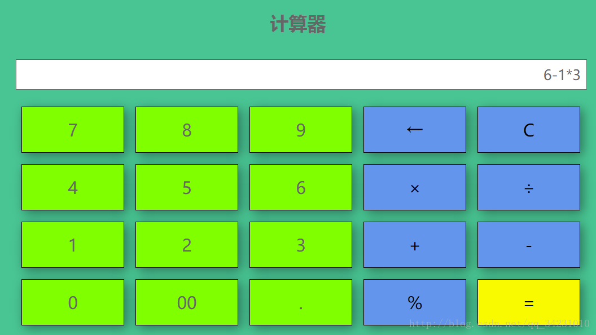

# 用 HVML 写一个计算器

本文用一个实际的例子描写了如何使用 HVML 一步步编写一个简单的计算器。

- [Web 版本](#web-版本)
- [一些说明](#一些说明)
- [数据驱动生成 HTML 内容](#数据驱动生成-html-内容)
- [响应式输出](#响应式输出)
- [处理按钮事件](#处理按钮事件)
- [交互过程的细节处理](#交互过程的细节处理)
- [完整的计算器程序源代码](#完整的计算器程序源代码)

## Web 版本

我们以 CSDN 上一个 [Web 版计算器示例](https://blog.csdn.net/qq_34231010/article/details/77431070)作为开头，以方便理解需求。

这一 Web 版本的计算器，其运行原理如下：

1. 维护一个用户输入的运算表达式字符串，如 `50 * 3 - 20`；
1. 当用户点击 `=` 按钮时，使用 JavaScript 的内置 `eval` 函数来对运算表达式求值。

该示例在单个 HTML 文件中同时包含了 CSS 和 JavaScript 脚本代码，我们将其复制到本文中，以方便读者阅读，希望原作者不要告侵权。

```html
<!DOCTYPE html>
<html>
    <head>
        <meta charset="UTF-8">
        <title>计算器</title>

        <style type="text/css">
            body{
                padding: 0;margin: 0;
                background-color:#49C593 ;
            }
            #calculator{
                position: absolute;
                width: 1200px;height: 620px;
                left: 50%;top: 50%;
                margin-left: -600px;
                margin-top: -310px;
            }
            #calculator #c_title {
                margin: auto;
                /*margin-left: 300px;*/
                width: 800px;
                height: 80px;
            }
            #calculator #c_title h2{
                text-align: center;
                font-size: 33px;font-family: "微软雅黑";color: #666;
                line-height: 30px;
            }
            #c_text{
                width: 1000px;
                margin: auto;
            }
            #calculator #c_text #text{
                /*margin-left: 200px;*/
                padding-right: 10px;
                width: 1000px;
                height: 50px;
                font-size: 25px;font-family: "微软雅黑";color: #666666;
                text-align: right;border: 1px white;
                border: double 1px;
            }
            #calculator #c_value{
                width: 1080px;height: 408px;
                /*margin-left: 160px;*/
                margin: 20px auto;
            }
            #calculator #c_value ul{
                margin: 0;
            }
            #calculator #c_value ul li{
                margin: 10px;
                list-style: none;float: left;
                width: 180px;height: 80px;line-height: 80px;
                text-align: center;background-color: chartreuse;
                border: 1px solid black;
                font-size: 30px;font-family: "微软雅黑";color: #666;
                box-shadow: 5px 5px 30px rgba(0,0,0,0.4);
                -webkit-user-select: none;
                -ms-user-select: none;
                -moz-user-select: none;
            }
            #calculator #c_value ul li:active{
                background-color: white;
            }
            #calculator #c_value ul li:hover{
                opacity:0.8;
                cursor:pointer;
            }
            #calculator #c_value ul .c_blue{
                background-color: cornflowerblue;color: #000000;
            }
            #calculator #c_value ul .c_yellow{
                background-color: #f9f900;color: #000000;
            }
        </style>

        <script type="text/javascript">
            var IsClear = false;
            var cal = "";
            function get(key){
                var str = document.getElementById("text").value;
                if(IsClear){
                    str = "0";
                    IsClear = false;
                }
                if(str.length < 20){
                    str = (str == "0" ? "" : str);
                    if(str == "" && key == '00'){
                        str = "0";
                    }else{
                        str += key;
                    }
                }
                document.getElementById("text").value = str;
            }
            function goBack(){
                var str = document.getElementById("text").value;
                str = str.subSTR.0,str.length-1);
                if(str=="") str="0";
                document.getElementById("text").value = str;
            }
            function clearText(){
                document.getElementById("text").value = "0";
            }
            function eq(){
                IsClear = true;
                var str = document.getElementById("text").value;
                var result = eval(str)
                if(result == "Infinity"){
                    result = "输入有误";
                }
                document.getElementById("text").value = result;
            }
        </script>
    </head>

    <body>
        <div id="calculator">
            <div id="c_title"><h2>计算器</h2></div>
            <div id="c_text">
                <input type="text" id="text" value="0" readonly="readonly" />
            </div>
            <div id="c_value">
                <ul>
                    <li onclick="get(7)">7</li>
                    <li onclick="get(8)">8</li>
                    <li onclick="get(9)">9</li>
                    <li onclick="goBack()" class="c_blue">←</li>
                    <li onclick="clearText()" class="c_blue">C</li>
                    <li onclick="get(4)">4</li>
                    <li onclick="get(5)">5</li>
                    <li onclick="get(6)">6</li>
                    <li onclick="get('*')" class="c_blue">×</li>
                    <li onclick="get('/')" class="c_blue">÷</li>
                    <li onclick="get(1)">1</li>
                    <li onclick="get(2)">2</li>
                    <li onclick="get(3)">3</li>
                    <li onclick="get('+')" class="c_blue">+</li>
                    <li onclick="get('-')" class="c_blue">-</li>
                    <li onclick="get(0)">0</li>
                    <li onclick="get('00')">00</li>
                    <li onclick="get('.')">.</li>
                    <li onclick="get('%')" class="c_blue">%</li>
                    <li onclick="eq()" class="c_yellow">=</li>
                </ul>
            </div>
        </div>
    </body>
</html>
```

该页面被渲染后的效果如下图所示：



## 一些说明

上面的 HTML 代码，编写得算不上特别优美，比如大量使用了 `id` 属性，而其实使用 `class` 属性更为合适。

我们不打算仔细改造这些细节之处，所以最终的 HVML 程序中，会保留在头部声明的 `style` 标签内容，但由于内容过多，我们会省略其中的样式信息。

## 数据驱动生成 HTML 内容

首先，我们看到原始 HTML 中有 12 个用来输入数字的按钮，以及八个用于表示四则运算、删除字符、清零的功能按钮。我们可以使用 HVML 的 `iterate` 动作标签完成这些重复性的 HTML 内容的生成。为此，我们首先准备一个全局的数据：

```hvml
<!DOCTYPE hvml>
<hvml target="html" lang="en">
    <head>
        <title>计算器</title>
        <style type="text/css">
            ...
        </style>

        <init as="buttons">
            [
                { "idx":"0",    "id": "btn_7",      "exp": "7",    "letters": "7",     "class": "btn number"                   },
                { "idx":"1",    "id": "btn_8",      "exp": "8",    "letters": "8",     "class": "btn number"                   },
                { "idx":"2",    "id": "btn_9",      "exp": "9",    "letters": "9",     "class": "btn number"                   },
                { "idx":"3",    "id": "btn_back",   "exp": "←",    "letters": "←",     "class": "c_blue backspace"             },
                { "idx":"4",    "id": "btn_clear",  "exp": "C",    "letters": "C",     "class": "c_blue clear"                 },
                { "idx":"5",    "id": "btn_4",      "exp": "4",    "letters": "4",     "class": "btn number"                   },
                { "idx":"6",    "id": "btn_5",      "exp": "5",    "letters": "5",     "class": "btn number"                   },
                { "idx":"7",    "id": "btn_6",      "exp": "6",    "letters": "6",     "class": "btn number"                   },
                { "idx":"8",    "id": "btn_mul",    "exp": "*",    "letters": "x",     "class": "btn c_blue multiplication"    },
                { "idx":"9",    "id": "btn_div",    "exp": "/",    "letters": "÷",     "class": "btn c_blue division"          },
                { "idx":"10",   "id": "btn_1",      "exp": "1",    "letters": "1",     "class": "btn number"                   },
                { "idx":"11",   "id": "btn_2",      "exp": "2",    "letters": "2",     "class": "btn number"                   },
                { "idx":"12",   "id": "btn_3",      "exp": "3",    "letters": "3",     "class": "btn number"                   },
                { "idx":"13",   "id": "btn_plus",   "exp": "+",    "letters": "+",     "class": "btn c_blue plus"              },
                { "idx":"14",   "id": "btn_sub",    "exp": "-",    "letters": "-",     "class": "btn c_blue subtraction"       },
                { "idx":"15",   "id": "btn_0",      "exp": "0",    "letters": "0",     "class": "btn number"                   },
                { "idx":"16",   "id": "btn_00",     "exp": "00",   "letters": "00",    "class": "btn number"                   },
                { "idx":"17",   "id": "btn_dot",    "exp": ".",    "letters": ".",     "class": "btn number"                   },
                { "idx":"18",   "id": "btn_pct",    "exp": "%",    "letters": "%",     "class": "btn c_blue percent"           },
                { "idx":"19",   "id": "btn_eq",     "exp": "=",    "letters": "=",     "class": "c_yellow equal"               },
            ]
        </init>
    </head>

    <body>
        ...
    </body>
</hvml>
```

我们在全局的 `buttons` 这个 JSON 对象数组上执行迭代，即可生成所有的按钮。注意，为方便其后的编程，我们为不同种类的按钮新增了一个用于功能的类名，如 `number`、`plus` 等。

对应的 HVML `body` 标签内容如下：

```hvml
    <body>
        <div id="calculator">

            <div id="c_title">
                <h2 id="c_title">$T.get('HVML Calculator')
                    <small>$T.get('Current Time: ')<span id="clock">$DATETIME.time_prt()</span></small>
                </h2>

                <observe on="$TIMERS" for="expired:clock">
                    <update on="#clock" at="textContent" with="$DATETIME.time_prt()" />
                </observe>
            </div>

            <div id="c_text">
                <input type="text" id="expression" value="0" readonly="readonly" />
            </div>

            <div id="c_value">
                <archetype name="button">
                    <li class="$?.class" id="$?.id" value="$?.idx" hvml-events="click">$?.letters</li>
                </archetype>

                <ul>
                    <iterate on="$buttons">
                        <update on="$@" to="append" with="$button" />
                        <except type="NoData" raw>
                            <p>Bad data!</p>
                        </except>
                    </iterate>
                </ul>
            </div>

        ...
```

注意，在上述代码中，除了使用了 HVML `iterate` 动作标签之外，我们还使用了 `archetype` 标签，用于定义一个 HTML 片段模板。

## 处理表达式输入

随着用户点击按钮，解释器输出框中的内容将随之改变。为此，我们设定一个全局的字符串变量，用于保存计算器输出框中的字符串，当用户点击按钮时，该字符串的值将发生变化，而计算器输出框中显示的内容也将相应发生变化。

这一改变涉及两处：

- 在头部新增一个全局的 `myResult` 变量。
- 监听具有类名 `.btn` 元素之 `click` 事件，更新表达式并重置输入框的文本内容。

如下所示：

```hvml
    <head>

        ...

        <init as="myResult">
            {
                exp: "",
                expr: "",
            }
        </init>
    </head>

    <body>
        <div id="calculator">
            ...
        </div>

        <observe on=".btn" for="click">
            <update on="$myResult" at=".exp" with="$STR.join($myResult.exp, $buttons[$?.targetValue].letters)" />
            <update on="$myResult" at=".expr" with="$STR.join($myResult.expr, $buttons[$?.targetValue].exp)" />
            <update on="#expression" at="attr.value" with="$myResult.exp" />
        </observe>
    </body>
```

## 处理其他按钮事件

接下来，我们使用 HVML 的 `observe` 标签处理其他按钮上的事件。其中清除（C）按钮是最容易处理的：

```hvml
            <observe on="#btn_clear" for="click">
                <update on="$myResult" at=".exp" with="" />
                <update on="$myResult" at=".expr" with="" />
                <update on="#expression" at="attr.value" with="0" />
            </observe>
```

回退（backspace）按钮的处理，要稍微麻烦一些。对字符串操作，我们通常使用由 HVML 解释器实现的内置动态对象（如 `$STR`），通过调用该对象提供的动态方法 `substr` 实现：

```hvml
            <observe on="#btn_back" for="click">
                <update on="$myResult" at=".exp" with="$STR.substr($myResult.exp, 0, -1)" />
                <update on="$myResult" at=".expr" with="$STR.substr($myResult.expr, 0, -1)" />
                <test with="$myResult.exp">
                    <update on="#expression" at="attr.value" with="$myResult.exp" />

                    <differ>
                        <update on="#expression" at="attr.value" with="0" />
                    </differ>
                </test>
            </observe>
```

对 `=` 按钮的处理，我们直接使用预定义变量 `$MATH` 提供的 `eval` 方法：

```hvml
            <observe on="#btn_eq" for="click">
                <choose on="$MATH.eval($myResult.expr)">
                    <update on="#expression" at="attr.value" with="$?" />
                    <catch for='*'>
                        <update on="#expression" at="attr.value" with="ERR" />
                    </catch>
                </choose>
            </observe>

```

## 完整的计算器程序源代码

见下面的代码清单。

注：为节省篇幅，我们把 CSS 部分保存到了单独的外部文件中。

```hvml
<!DOCTYPE hvml SYSTEM 'f: MATH'>
<hvml target="html" lang="en">
    <head>
        <base href="$CRTN.base(! 'http://files.fmsoft.cn/calculator/' )" />

        <update on="$T.map" from="assets/{$SYS.locale}.json" to="merge" />

        <init as="myResult">
            {
                exp: "",
                expr: "",
            }
        </init>

        <init as="buttons">
            [
                { "idx":"0",    "id": "btn_7",      "exp": "7",    "letters": "7",     "class": "btn number"                   },
                { "idx":"1",    "id": "btn_8",      "exp": "8",    "letters": "8",     "class": "btn number"                   },
                { "idx":"2",    "id": "btn_9",      "exp": "9",    "letters": "9",     "class": "btn number"                   },
                { "idx":"3",    "id": "btn_back",   "exp": "←",    "letters": "←",     "class": "c_blue backspace"             },
                { "idx":"4",    "id": "btn_clear",  "exp": "C",    "letters": "C",     "class": "c_blue clear"                 },
                { "idx":"5",    "id": "btn_4",      "exp": "4",    "letters": "4",     "class": "btn number"                   },
                { "idx":"6",    "id": "btn_5",      "exp": "5",    "letters": "5",     "class": "btn number"                   },
                { "idx":"7",    "id": "btn_6",      "exp": "6",    "letters": "6",     "class": "btn number"                   },
                { "idx":"8",    "id": "btn_mul",    "exp": "*",    "letters": "x",     "class": "btn c_blue multiplication"    },
                { "idx":"9",    "id": "btn_div",    "exp": "/",    "letters": "÷",     "class": "btn c_blue division"          },
                { "idx":"10",   "id": "btn_1",      "exp": "1",    "letters": "1",     "class": "btn number"                   },
                { "idx":"11",   "id": "btn_2",      "exp": "2",    "letters": "2",     "class": "btn number"                   },
                { "idx":"12",   "id": "btn_3",      "exp": "3",    "letters": "3",     "class": "btn number"                   },
                { "idx":"13",   "id": "btn_plus",   "exp": "+",    "letters": "+",     "class": "btn c_blue plus"              },
                { "idx":"14",   "id": "btn_sub",    "exp": "-",    "letters": "-",     "class": "btn c_blue subtraction"       },
                { "idx":"15",   "id": "btn_0",      "exp": "0",    "letters": "0",     "class": "btn number"                   },
                { "idx":"16",   "id": "btn_00",     "exp": "00",   "letters": "00",    "class": "btn number"                   },
                { "idx":"17",   "id": "btn_dot",    "exp": ".",    "letters": ".",     "class": "btn number"                   },
                { "idx":"18",   "id": "btn_pct",    "exp": "%",    "letters": "%",     "class": "btn c_blue percent"           },
                { "idx":"19",   "id": "btn_eq",     "exp": "=",    "letters": "=",     "class": "c_yellow equal"               },
            ]
        </init>

        <title>$T.get('HVML Calculator')</title>

        <update on="$TIMERS" to="unite">
            [
                { "id" : "clock", "interval" : 1000, "active" : "yes" },
            ]
        </update>

        <link rel="stylesheet" type="text/css" href="assets/calculator.css" />
        <style>
            #expression {
                /*margin-left: 200px;*/
                padding-right: 10px;
                width: 1000px;
                height: 50px;
                font-size: 25px;font-family: "微软雅黑";color: #666666;
                text-align: right;border: 1px white;
                border: double 1px;
            }
        </style>
    </head>

    <body>
        <div id="calculator">

            <div id="c_title">
                <h2 id="c_title">$T.get('HVML Calculator')
                    <small>$T.get('Current Time: ')<span id="clock">$DATETIME.time_prt()</span></small>
                </h2>

                <observe on="$TIMERS" for="expired:clock">
                    <update on="#clock" at="textContent" with="$DATETIME.time_prt()" />
                </observe>
            </div>

            <div id="c_text">
                <input type="text" id="expression" value="0" readonly="readonly" />
            </div>

            <div id="c_value">
                <archetype name="button">
                    <li class="$?.class" id="$?.id" value="$?.idx" hvml-events="click">$?.letters</li>
                </archetype>

                <ul>
                    <iterate on="$buttons">
                        <update on="$@" to="append" with="$button" />
                        <except type="NoData" raw>
                            <p>Bad data!</p>
                        </except>
                    </iterate>
                </ul>
            </div>

            <observe on="#btn_clear" for="click">
                <update on="$myResult" at=".exp" with="" />
                <update on="$myResult" at=".expr" with="" />
                <update on="#expression" at="attr.value" with="0" />
            </observe>

            <observe on="#btn_back" for="click">
                <update on="$myResult" at=".exp" with="$STR.substr($myResult.exp, 0, -1)" />
                <update on="$myResult" at=".expr" with="$STR.substr($myResult.expr, 0, -1)" />
                <test with="$myResult.exp">
                    <update on="#expression" at="attr.value" with="$myResult.exp" />

                    <differ>
                        <update on="#expression" at="attr.value" with="0" />
                    </differ>
                </test>
            </observe>

            <observe on="#btn_eq" for="click">
                <choose on="$MATH.eval($myResult.expr)">
                    <update on="#expression" at="attr.value" with="$?" />
                    <catch for='*'>
                        <update on="#expression" at="attr.value" with="ERR" />
                    </catch>
                </choose>
            </observe>

            <observe on=".btn" for="click">
                <update on="$myResult" at=".exp" with="$STR.join($myResult.exp, $buttons[$?.targetValue].letters)" />
                <update on="$myResult" at=".expr" with="$STR.join($myResult.expr, $buttons[$?.targetValue].exp)" />
                <update on="#expression" at="attr.value" with="$myResult.exp" />
            </observe>
        </div>
    </body>

</hvml>
```
