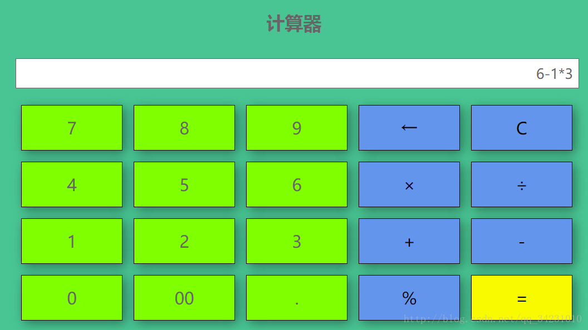

# 用 HVML 写一个计算器

本文用一个实际的例子描写了如何使用 HVML 一步步编写一个简单的计算器。

- [Web 版本](#web-版本)
- [一些说明](#一些说明)
- [数据驱动生成 HTML 内容](#数据驱动生成-html-内容)
- [响应式输出](#响应式输出)
- [处理按钮事件](#处理按钮事件)
- [交互过程的细节处理](#交互过程的细节处理)
- [完整的计算器程序源代码](#完整的计算器程序源代码)

## Web 版本

我们以 CSDN 上一个 [Web 版计算器示例](https://blog.csdn.net/qq_34231010/article/details/77431070)作为开头，以方便理解需求。

这一 Web 版本的计算器，其运行原理如下：

1. 维护一个用户输入的运算表达式字符串，如 `50 * 3 - 20`；
1. 当用户点击 `=` 按钮时，使用 JavaScript 的内置 `eval` 函数来对运算表达式求值。

该示例在单个 HTML 文件中同时包含了 CSS 和 JavaScript 脚本代码，我们将其复制到本文中，以方便读者阅读，希望原作者不要告侵权。

```html
<!DOCTYPE html>
<html>
    <head>
        <meta charset="UTF-8">
        <title>计算器</title>

        <style type="text/css">
            body{
                padding: 0;margin: 0;
                background-color:#49C593 ;
            }
            #calculator{
                position: absolute;
                width: 1200px;height: 620px;
                left: 50%;top: 50%;
                margin-left: -600px;
                margin-top: -310px;
            }
            #calculator #c_title {
                margin: auto;
                /*margin-left: 300px;*/
                width: 800px;
                height: 80px;
            }
            #calculator #c_title h2{
                text-align: center;
                font-size: 33px;font-family: "微软雅黑";color: #666;
                line-height: 30px;
            }
            #c_text{
                width: 1000px;
                margin: auto;
            }
            #calculator #c_text #text{
                /*margin-left: 200px;*/
                padding-right: 10px;
                width: 1000px;
                height: 50px;
                font-size: 25px;font-family: "微软雅黑";color: #666666;
                text-align: right;border: 1px white;
                border: double 1px;
            }
            #calculator #c_value{
                width: 1080px;height: 408px;
                /*margin-left: 160px;*/
                margin: 20px auto;
            }
            #calculator #c_value ul{
                margin: 0;
            }
            #calculator #c_value ul li{
                margin: 10px;
                list-style: none;float: left;
                width: 180px;height: 80px;line-height: 80px;
                text-align: center;background-color: chartreuse;
                border: 1px solid black;
                font-size: 30px;font-family: "微软雅黑";color: #666;
                box-shadow: 5px 5px 30px rgba(0,0,0,0.4);
                -webkit-user-select: none;
                -ms-user-select: none;
                -moz-user-select: none;
            }
            #calculator #c_value ul li:active{
                background-color: white;
            }
            #calculator #c_value ul li:hover{
                opacity:0.8;
                cursor:pointer;
            }
            #calculator #c_value ul .c_blue{
                background-color: cornflowerblue;color: #000000;
            }
            #calculator #c_value ul .c_yellow{
                background-color: #f9f900;color: #000000;
            }
        </style>

        <script type="text/javascript">
            var IsClear = false;
            var cal = "";
            function get(key){
                var str = document.getElementById("text").value;
                if(IsClear){
                    str = "0";
                    IsClear = false;
                }
                if(str.length < 20){
                    str = (str == "0" ? "" : str);
                    if(str == "" && key == '00'){
                        str = "0";
                    }else{
                        str += key;
                    }
                }
                document.getElementById("text").value = str;
            }
            function goBack(){
                var str = document.getElementById("text").value;
                str = str.subSTR.0,str.length-1);
                if(str=="") str="0";
                document.getElementById("text").value = str;
            }
            function clearText(){
                document.getElementById("text").value = "0";
            }
            function eq(){
                IsClear = true;
                var str = document.getElementById("text").value;
                var result = eval(str)
                if(result == "Infinity"){
                    result = "输入有误";
                }
                document.getElementById("text").value = result;
            }
        </script>
    </head>

    <body>
        <div id="calculator">
            <div id="c_title"><h2>计算器</h2></div>
            <div id="c_text">
                <input type="text" id="text" value="0" readonly="readonly" />
            </div>
            <div id="c_value">
                <ul>
                    <li onclick="get(7)">7</li>
                    <li onclick="get(8)">8</li>
                    <li onclick="get(9)">9</li>
                    <li onclick="goBack()" class="c_blue">←</li>
                    <li onclick="clearText()" class="c_blue">C</li>
                    <li onclick="get(4)">4</li>
                    <li onclick="get(5)">5</li>
                    <li onclick="get(6)">6</li>
                    <li onclick="get('*')" class="c_blue">×</li>
                    <li onclick="get('/')" class="c_blue">÷</li>
                    <li onclick="get(1)">1</li>
                    <li onclick="get(2)">2</li>
                    <li onclick="get(3)">3</li>
                    <li onclick="get('+')" class="c_blue">+</li>
                    <li onclick="get('-')" class="c_blue">-</li>
                    <li onclick="get(0)">0</li>
                    <li onclick="get('00')">00</li>
                    <li onclick="get('.')">.</li>
                    <li onclick="get('%')" class="c_blue">%</li>
                    <li onclick="eq()" class="c_yellow">=</li>
                </ul>
            </div>
        </div>
    </body>
</html>
```

该页面被渲染后的效果如下图所示：



## 一些说明

上面的 HTML 代码，编写得算不上特别优美，比如大量使用了 `id` 属性，而其实使用 `class` 属性更为合适。

我们不打算仔细改造这些细节之处，所以最终的 HVML 程序中，会保留在头部声明的 `style` 标签内容，但由于内容过多，我们会省略其中的样式信息。

另外，HVML 的一个重要目标是内嵌的 JavaScript 代码，故而也不会在头部包含 JavaScript 代码。

## 数据驱动生成 HTML 内容

首先，我们看到原始 HTML 中有 12 个用来输入数字的按钮，以及八个用于表示四则运算、删除字符、清零的功能按钮。我们可以使用 HVML 的 `iterate` 动作标签完成这些重复性的 HTML 内容的生成。为此，我们首先准备一个全局的数据：

```html
<!DOCTYPE hvml>
<hvml target="html" script="python" lang="en">
    <head>
        <title>计算器</title>
        <style type="text/css">
            ...
        </style>

        <init as="buttons">
            [
                { "letters": "7", "class": "number" },
                { "letters": "8", "class": "number" },
                { "letters": "9", "class": "number" },
                { "letters": "←", "class": "c_blue backspace" },
                { "letters": "C", "class": "c_blue clear" },
                { "letters": "4", "class": "number" },
                { "letters": "5", "class": "number" },
                { "letters": "6", "class": "number" },
                { "letters": "×", "class": "c_blue multiplication" },
                { "letters": "÷", "class": "c_blue division" },
                { "letters": "1", "class": "number" },
                { "letters": "2", "class": "number" },
                { "letters": "3", "class": "number" },
                { "letters": "+", "class": "c_blue plus" },
                { "letters": "-", "class": "c_blue subtraction" },
                { "letters": "0", "class": "number" },
                { "letters": "00", "class": "number" },
                { "letters": ".", "class": "number" },
                { "letters": "%", "class": "c_blue percent" },
                { "letters": "=", "class": "c_yellow equal" },
            ]
        </init>
    </head>

    <body>
        ...
    </body>
</hvml>
```

我们在全局的 `buttons` 这个 JSON 对象数组上执行迭代，即可生成所有的按钮。注意，为方便其后的编程，我们为不同种类的按钮新增了一个用于功能的类名，如 `number`、`plus` 等。

对应的 HVML `body` 标签内容如下：

```html
    <body>
        <div id="calculator">

            <div id="c_title">
                <h2>计算器</h2>
            </div>

            <div id="c_text">
                <input type="text" id="text" value="0" readonly="readonly" />
            </div>

            <div id="c_value">
                <archetype name="button">
                    <li class="$?.class">$?.letters</li></li>
                </archetype>

                <ul>
                    <iterate on="$buttons">
                        <update on="$@" to="append" with="$button" />
                        <error>
                            <p>Bad data!</p>
                        </error>
                        <except>
                            <p>Bad data!</p>
                        </except>
                    </iterate>
                </ul>
            </div>

        </div>
    </body>
```

注意，在上述代码中，除了使用了 HVML `iterate` 动作标签之外，我们还使用了 `archetype` 标签，用于定义一个 HTML 片段模板。

## 响应式输出

随着用户点击按钮，解释器输出框中的内容将随之改变。为此，我们设定一个全局的字符串变量，用于保存计算器输出框中的字符串，当用户点击按钮时，该字符串的值将发生变化，而计算器输出框中显示的内容也将相应发生变化。

这一改变涉及两处：
- 在头部新增一个全局的 `expression` 变量。
- 修改 `input` 标签。

如下所示：

```html
    <head>

        ...

        <init as="expression">0</init>
    </head>

    <body>
        <div id="calculator">

            <div id="c_title">
                <h2>计算器</h2>
            </div>

            <div id="c_text">
                <input type="text" id="text" value="$expression" readonly="readonly" />
                <bind on="$expression" as="listener_exp">
                    <observe on="$listener_exp" for="change">
                        <update on="#text" at="attr.value" with="$listener_exp.eval" />
                    </observe>
                </bind>
            </div>

            ...

        </div>
    </body>
```

## 处理按钮事件

接下来，我们使用 HVML 的 `observe` 标签处理按钮事件，并重置 `expression` 变量的值。首先清除（C）按钮，是最容易处理的：

```hvml
        <observe on=".clear" for="click">
            <init as="expression">0</init>
        </observe>
```

其次是 1、2、3 等数字按钮，我们先简化处理，每次在表达式之后追加按钮元素的文本内容：

```hvml
        <observe on=".letters" for="click">
            <init as="expression" with="$expression$@.textContent" />
        </observe>
```

上述 HVML 代码，在 `letters` 类按钮收到 `click` 事件时执行，最终在原先的 `$expression` 变量上追加了发生该事件的按钮（由内置变量 `$@` 指代）的 `textContent` 属性值。

其他按钮功能，比如回退（backspace），要稍微麻烦一些，是因为 HVML 语言本身未定义字符串的操作方法。对字符串操作，我们通常使用由 HVML 解释器实现的内置动态 JSON 对象（如 `$STR.），通过调用该对象提供的动态方法构件 JSON 求值表达式来实现。

假定我们使用 HVML 解释器提供了一个内置的动态 JSON 对象 `$STR.，该对象提供了常见的字符串操作方法。比如本文中要用到的方法：

- `strip`：用于删除字符串尾部的一个或者多个字符。
- `strcat`：用于在一个已有字符串中追加另一个字符串。
- `strlen`：用于返回一个字符串的长度（字符个数）。

那么，我们可以使用如下的代码来处理 `←`（回退）按钮上的单击事件：

```html
        <observe on=".backspace" for="click">
            <init as="expression" with="$STR.strip($expression, 1)" />
        </observe>
```

对 `=` 按钮的处理，我们可以使用外部脚本实现一个相当于 JavaScript `eval` 功能的外部执行器，提供给 `choose` 标签使用：

```html
        <observe on=".equal" for="click">
            <choose on="$expression" by="CLASS: CEval">
                <init as="expression" with="$?" />
            </choose>
        </observe>
```

本例中，我们使用 Python 脚本，因此，我们可以如下实现 `CEval` 这个外部选择器：

```python
class CEval (HVMLChooser):
    def __init__ (self):
        pass

    def choose (self, on_value, in_value):
        return eval (on_value)
```

和 Web 版本的实现类似，这里我们直接使用 Python 的 `eval` 函数来对运算表达式求值。

如果我们将 `eval` 这类函数的功能实现为全局动态对象（`$MATH`）的一个方法，则相应的代码可简化为：

```html
        <observe on=".equal" for="click">
            <init as="expression" with="$MATH.eval($expression)" />
        </observe>
```

## 交互过程的细节处理

在上面的代码中，我们没有处理用户单击按钮时，对运算表达式正确性的基本判断，另外，我们也忽略了各种可能的错误情形，比如求值表达式错误，或者被零除等。在本节中，我们加上相关的代码。

```html
        <observe on=".letters" for="click">
            <test on="$expression">
                <match for="LIKE 'err*'" exclusively>
                    <init at="expression" with="$@.textContent" />
                </match>
                <match for="ANY">
                    <init at="expression" with="$expression$@.textContent" />
                </match>
            </test>
        </observe>
```

在上述代码中，当运算表达式求值错误的情况下，会显示 `ERROR`，此时将替换表达式字符串变量的值为按钮元素对应的文本内容。

对回退按钮，我们增加一个当前表达式字符串长度的判断，并在当前长度为 1 时，始终重置为 `0`：

```html
        <observe on=".backspace" for="click">
            <test on="$STR.strlen($expression)">
                <match for="EQ 1" exclusively>
                    <init as="expression" with="0" />
                </match>
                <match for="ANY">
                    <init as="expression" with="$STR.strip($expression, 1)" />
                </match>
            </test>
        </observe>
```

而在等号按钮的处理中，我们增加了对异常的捕获处理（注意，`catch` 是新增的用来捕获异常的动作标签）：

```html
        <observe on=".equal" for="click">
            <init as="expression" with="$MATH.eval($expression)">
                <catch for="*">
                    <init as="expression" with="ERROR" />
                </catch>
            </init>
        </observe>
```

## 完整的计算器程序源代码

见下面的代码清单。

注：为节省篇幅，我们把 CSS 部分保存到了单独的外部文件中。

```html
<!DOCTYPE hvml>
<hvml target="html" script="python" lang="en">
    <head>
        <title>计算器</title>

        <link rel="stylesheet" href="https://github.com/HVML/hvml-docs/raw/master/zh/calculator.css" />

        <init as="buttons">
            [
                { "letters": "7", "class": "number" },
                { "letters": "8", "class": "number" },
                { "letters": "9", "class": "number" },
                { "letters": "←", "class": "c_blue backspace" },
                { "letters": "C", "class": "c_blue clear" },
                { "letters": "4", "class": "number" },
                { "letters": "5", "class": "number" },
                { "letters": "6", "class": "number" },
                { "letters": "×", "class": "c_blue multiplication" },
                { "letters": "÷", "class": "c_blue division" },
                { "letters": "1", "class": "number" },
                { "letters": "2", "class": "number" },
                { "letters": "3", "class": "number" },
                { "letters": "+", "class": "c_blue plus" },
                { "letters": "-", "class": "c_blue subtraction" },
                { "letters": "0", "class": "number" },
                { "letters": "00", "class": "number" },
                { "letters": ".", "class": "number" },
                { "letters": "%", "class": "c_blue percent" },
                { "letters": "=", "class": "c_yellow equal" },
            ]
        </init>

        <init as="expression">0</init>
    </head>

    <body>
        <div id="calculator">

            <div id="c_title">
                <h2>计算器</h2>
            </div>

            <div id="c_text">
                <input type="text" id="text" value="$expression" readonly="readonly" />
                <bind on="$expression" as="listener_exp">
                    <observe on="$listener_exp" for="change">
                        <update on="#text" at="attr.value" with="$listener_exp.eval" />
                    </observe>
                </bind>
            </div>

            <div id="c_value">
                <archetype name="button">
                    <li class="$?.class">$?.letters</li></li>
                </archetype>

                <ul>
                    <iterate on="$buttons">
                        <update on="$@" to="append" with="$button" />
                        <error>
                            <p>Bad data!</p>
                        </error>
                    </iterate>
                </ul>
            </div>

        </div>

        <observe on=".clear" for="click">
            <init as="expression" with="0" />
        </observe>

        <observe on=".number" for="click">
            <test on="$expression">
                <match for="LIKE 'ERR*'" exclusively>
                    <init as="expression" with="$@.textContent" />
                </match>
                <match for="ANY">
                    <init as="expression" with="$expression$@.textContent" />
                </match>
            </test>
        </observe>

        <observe on=".backspace" for="click">
            <test on="$STR.strlen($expression)">
                <match for="EQ 1" exclusively>
                    <init as="expression" with="0" />
                </match>
                <match for="ANY">
                    <init as="expression" with="$STR.strip($expression, 1)" />
                </match>
            </test>
        </observe>

        <observe on=".equal" for="click">
            <init as="expression" with="$MATH.eval($expression)">
                <catch for="*">
                    <init as="expression" with="ERROR" />
                </catch>
            </init>
        </observe>

    </body>
</hvml>
```
